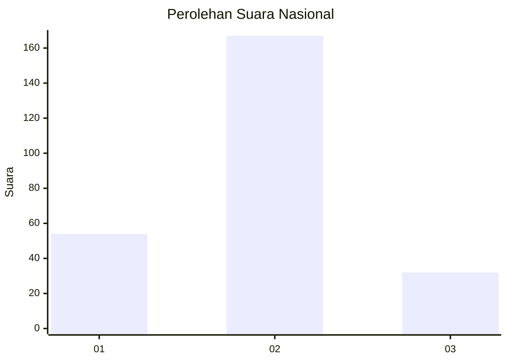
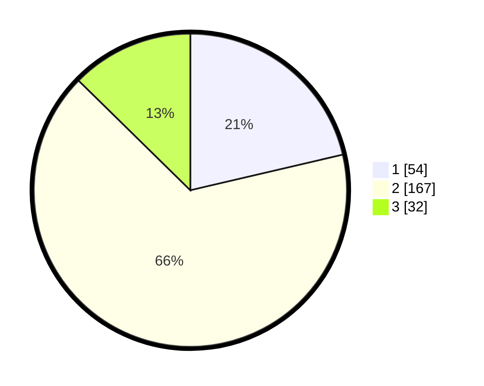

# Hasil

## Grafik

## Tabel

| No. | Nama Paslon    | Suara | Suara (raw) | Persentase |
|:--- |:-------------- | -----:| -----------:| ----------:|
| 1   | ANIES MUHAIMIN | 54    | [54][p-1]   | 21,34      |
| 2   | PRABOWO GIBRAN | 167   | [167][p-2]  | 66,01      |
| 3   | GANJAR MAHFUD  | 32    | [32][p-3]   | 12,65      |

[p-1]: https://github.com/gigit-pemilu/pemilu-2024/blob/main/pilpres/hitung-suara/sub/96-papua-barat-daya/sub/03-raja-ampat/sub/15-waigeo-barat-kepulauan/sub/2005-gag/sub/002-tps/sub/paslon-1.txt
[p-2]: https://github.com/gigit-pemilu/pemilu-2024/blob/main/pilpres/hitung-suara/sub/96-papua-barat-daya/sub/03-raja-ampat/sub/15-waigeo-barat-kepulauan/sub/2005-gag/sub/002-tps/sub/paslon-2.txt
[p-3]: https://github.com/gigit-pemilu/pemilu-2024/blob/main/pilpres/hitung-suara/sub/96-papua-barat-daya/sub/03-raja-ampat/sub/15-waigeo-barat-kepulauan/sub/2005-gag/sub/002-tps/sub/paslon-3.txt

## Foto C Plano

https://sirekap-obj-formc.kpu.go.id/aa11/pemilu/ppwp/96/03/15/20/05/9603152005002-20240215-022533--d4338aec-d000-416f-b75a-c9fb03922c3a.jpg

https://sirekap-obj-formc.kpu.go.id/aa11/pemilu/ppwp/96/03/15/20/05/9603152005002-20240215-022548--2072d863-f56a-4121-af96-8a0595072fe6.jpg

https://sirekap-obj-formc.kpu.go.id/aa11/pemilu/ppwp/96/03/15/20/05/9603152005002-20240215-022623--15b5833d-b056-445a-9453-d1606dde1d66.jpg

## Metadata

| Key        | Value               |
| ---------- | ------------------- |
| Time Stamp | 2024-02-16 08:30:27 |

