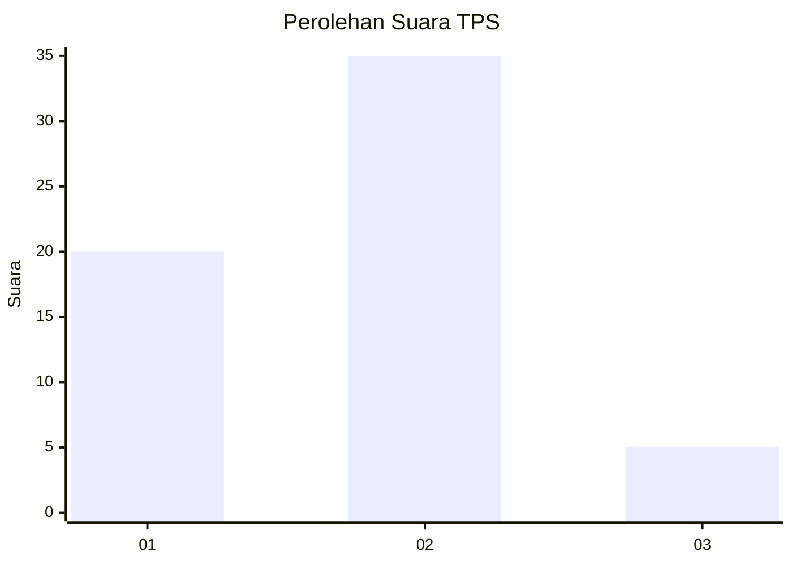
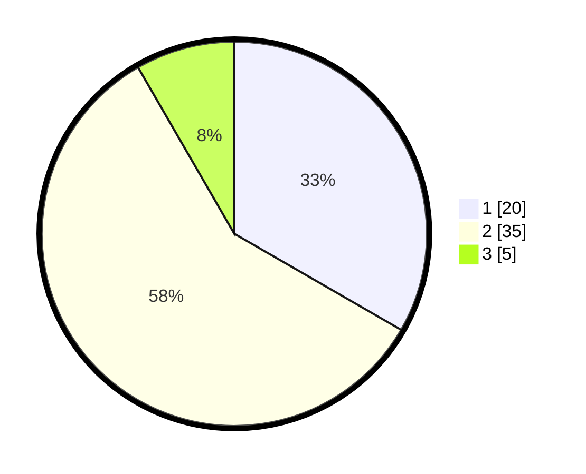

# Hasil

## Grafik

## Tabel

| No. | Nama Paslon    | Suara | Suara (raw) | Persentase |
|:--- |:-------------- | -----:| -----------:| ----------:|
| 1   | ANIES MUHAIMIN | 20    | [20][p-1]   | 33,33      |
| 2   | PRABOWO GIBRAN | 35    | [35][p-2]   | 58,33      |
| 3   | GANJAR MAHFUD  | 5     | [5][p-3]    | 8,33       |

[p-1]: https://github.com/gigit-pemilu/pemilu-2024-96-papua-barat-daya/blob/main/pilpres/hitung-suara/sub/96-papua-barat-daya/sub/03-raja-ampat/sub/15-waigeo-barat-kepulauan/sub/2005-gag/sub/003-tps/sub/paslon-1.txt
[p-2]: https://github.com/gigit-pemilu/pemilu-2024-96-papua-barat-daya/blob/main/pilpres/hitung-suara/sub/96-papua-barat-daya/sub/03-raja-ampat/sub/15-waigeo-barat-kepulauan/sub/2005-gag/sub/003-tps/sub/paslon-2.txt
[p-3]: https://github.com/gigit-pemilu/pemilu-2024-96-papua-barat-daya/blob/main/pilpres/hitung-suara/sub/96-papua-barat-daya/sub/03-raja-ampat/sub/15-waigeo-barat-kepulauan/sub/2005-gag/sub/003-tps/sub/paslon-3.txt

## Foto C Plano

https://sirekap-obj-formc.kpu.go.id/b4ad/pemilu/ppwp/96/03/15/20/05/9603152005003-20240215-210517--118254f0-7317-4ac2-b91f-44b6bad1ce82.jpg

https://sirekap-obj-formc.kpu.go.id/b4ad/pemilu/ppwp/96/03/15/20/05/9603152005003-20240215-193519--b4843a8e-7874-4580-905e-bea64d599387.jpg

https://sirekap-obj-formc.kpu.go.id/b4ad/pemilu/ppwp/96/03/15/20/05/9603152005003-20240215-193208--a17237c0-b66d-4ac6-aba2-5ce85d4ca854.jpg

## Metadata

| Key        | Value               |
| ---------- | ------------------- |
| Time Stamp | 2024-02-16 08:30:27 |

