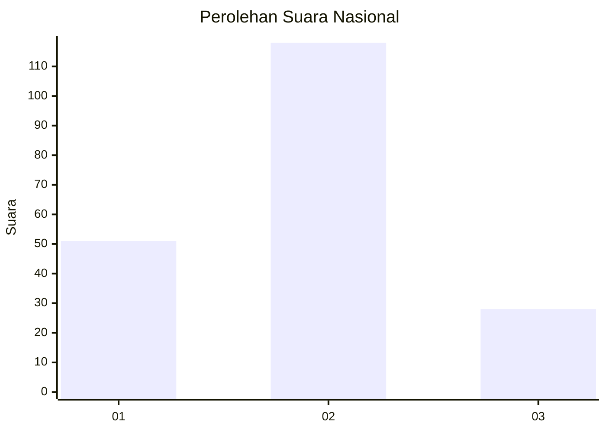
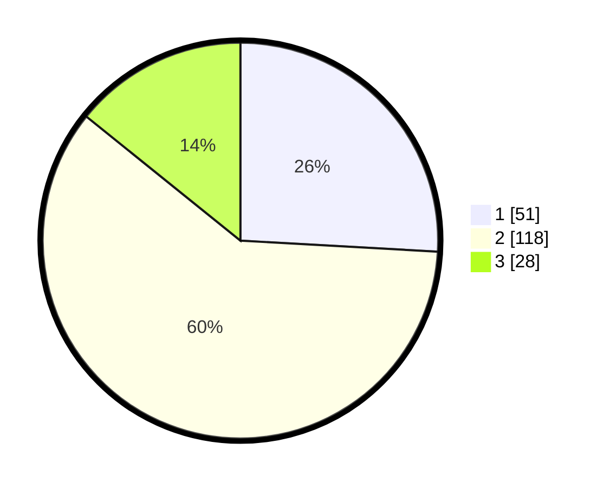

# Hasil

## Grafik

## Tabel

| No. | Nama Paslon    | Suara | Suara (raw) | Persentase |
|:--- |:-------------- | -----:| -----------:| ----------:|
| 1   | ANIES MUHAIMIN | 51    | [51][p-1]   | 25,89      |
| 2   | PRABOWO GIBRAN | 118   | [118][p-2]  | 59,90      |
| 3   | GANJAR MAHFUD  | 28    | [28][p-3]   | 14,21      |

[p-1]: https://github.com/gigit-pemilu/pemilu-2024/blob/main/pilpres/hitung-suara/sub/96-papua-barat-daya/sub/03-raja-ampat/sub/18-kota-waisai/sub/1001-waisai/sub/003-tps/sub/paslon-1.txt
[p-2]: https://github.com/gigit-pemilu/pemilu-2024/blob/main/pilpres/hitung-suara/sub/96-papua-barat-daya/sub/03-raja-ampat/sub/18-kota-waisai/sub/1001-waisai/sub/003-tps/sub/paslon-2.txt
[p-3]: https://github.com/gigit-pemilu/pemilu-2024/blob/main/pilpres/hitung-suara/sub/96-papua-barat-daya/sub/03-raja-ampat/sub/18-kota-waisai/sub/1001-waisai/sub/003-tps/sub/paslon-3.txt

## Foto C Plano

https://sirekap-obj-formc.kpu.go.id/6945/pemilu/ppwp/96/03/18/10/01/9603181001003-20240215-061821--c974995b-db49-4aaa-8da5-1a5755cadfc5.jpg

https://sirekap-obj-formc.kpu.go.id/6945/pemilu/ppwp/96/03/18/10/01/9603181001003-20240215-062122--7c1b20eb-0768-4233-91ce-1c0259bf0690.jpg

https://sirekap-obj-formc.kpu.go.id/6945/pemilu/ppwp/96/03/18/10/01/9603181001003-20240215-062824--ffe441ee-0043-46c3-8855-3e4a85790833.jpg

## Metadata

| Key        | Value               |
| ---------- | ------------------- |
| Time Stamp | 2024-02-16 08:30:27 |

