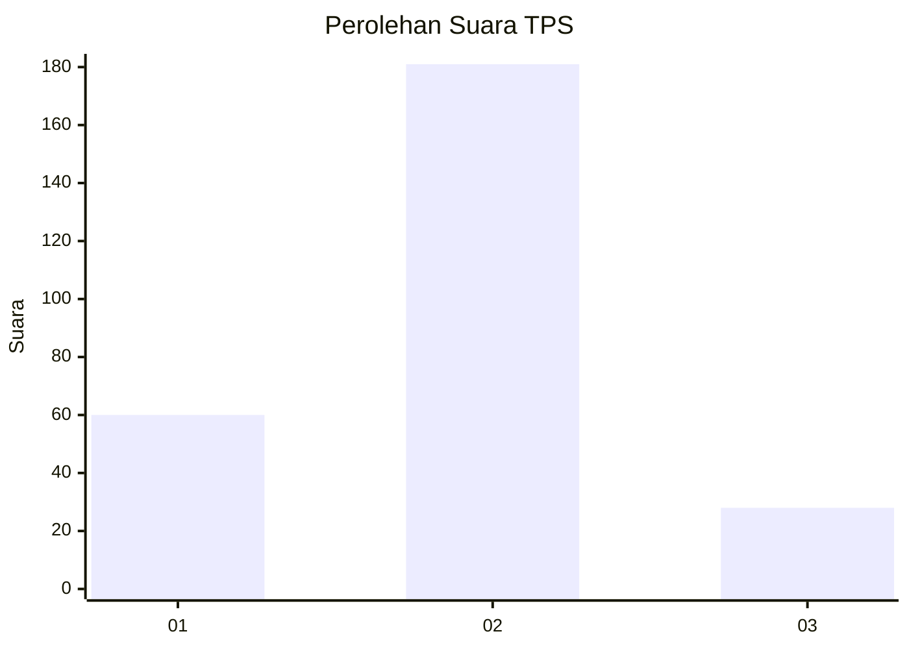

# Hasil

## Grafik

## Tabel

| No. | Nama Paslon    | Suara | Suara (raw) | Persentase |
|:--- |:-------------- | -----:| -----------:| ----------:|
| 1   | ANIES MUHAIMIN | 60    | [60][p-1]   | 22,30      |
| 2   | PRABOWO GIBRAN | 181   | [181][p-2]  | 67,29      |
| 3   | GANJAR MAHFUD  | 28    | [28][p-3]   | 10,41      |

[p-1]: https://github.com/gigit-pemilu/pemilu-2024-96-papua-barat-daya/blob/main/pilpres/hitung-suara/sub/96-papua-barat-daya/sub/03-raja-ampat/sub/18-kota-waisai/sub/1002-sapordanco/sub/005-tps/sub/paslon-1.txt
[p-2]: https://github.com/gigit-pemilu/pemilu-2024-96-papua-barat-daya/blob/main/pilpres/hitung-suara/sub/96-papua-barat-daya/sub/03-raja-ampat/sub/18-kota-waisai/sub/1002-sapordanco/sub/005-tps/sub/paslon-2.txt
[p-3]: https://github.com/gigit-pemilu/pemilu-2024-96-papua-barat-daya/blob/main/pilpres/hitung-suara/sub/96-papua-barat-daya/sub/03-raja-ampat/sub/18-kota-waisai/sub/1002-sapordanco/sub/005-tps/sub/paslon-3.txt

## Foto C Plano

https://sirekap-obj-formc.kpu.go.id/b0a6/pemilu/ppwp/96/03/18/10/02/9603181002005-20240215-091855--0fabcf3c-4647-41cd-9bb6-72d460bdc714.jpg

https://sirekap-obj-formc.kpu.go.id/b0a6/pemilu/ppwp/96/03/18/10/02/9603181002005-20240215-130813--c0bb57be-b5fb-4803-9f69-2d9cbad1c46e.jpg

https://sirekap-obj-formc.kpu.go.id/b0a6/pemilu/ppwp/96/03/18/10/02/9603181002005-20240215-130915--146e3274-02a4-4a04-a82c-32ed1f59e968.jpg

## Metadata

| Key        | Value               |
| ---------- | ------------------- |
| Time Stamp | 2024-02-16 08:30:27 |

