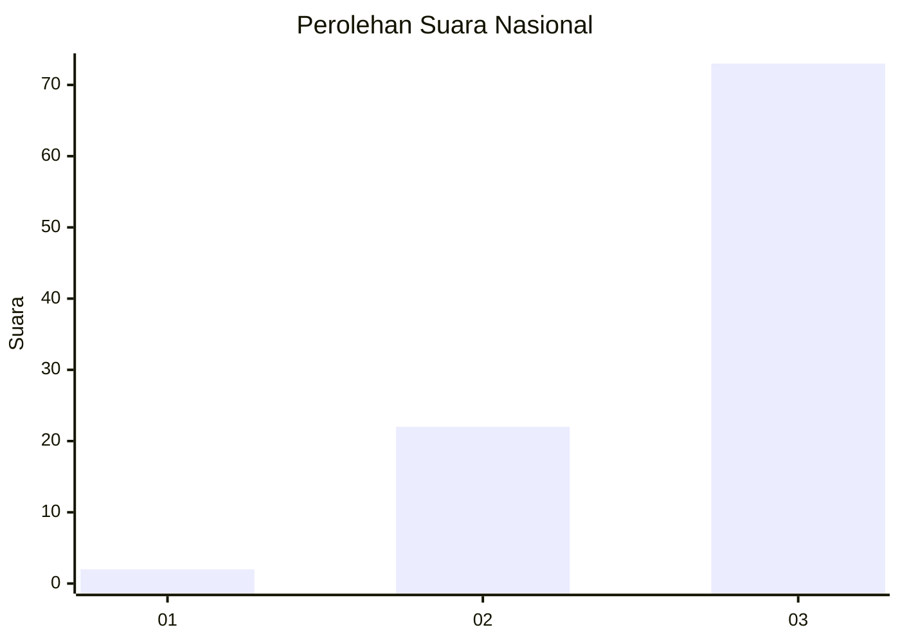
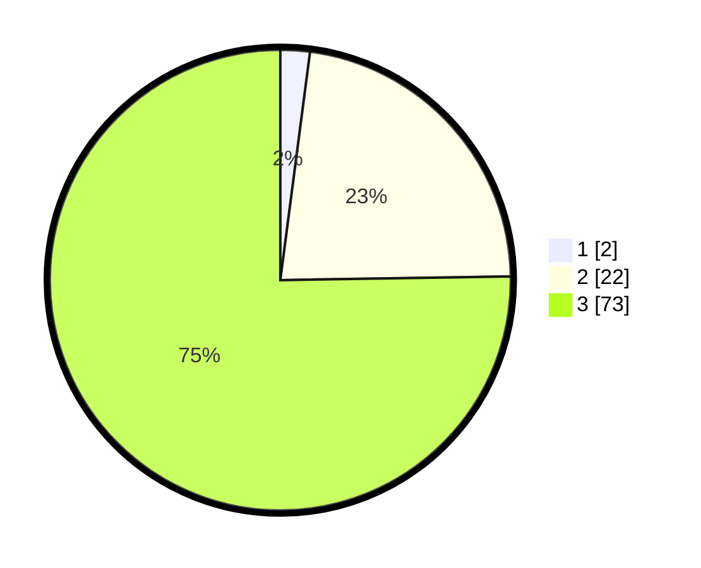

# Hasil

## Grafik

## Tabel

| No. | Nama Paslon    | Suara | Suara (raw) | Persentase |
|:--- |:-------------- | -----:| -----------:| ----------:|
| 1   | ANIES MUHAIMIN | 2     | [2][p-1]    | 2,06       |
| 2   | PRABOWO GIBRAN | 22    | [22][p-2]   | 22,68      |
| 3   | GANJAR MAHFUD  | 73    | [73][p-3]   | 75,26      |

[p-1]: https://github.com/gigit-pemilu/pemilu-2024/blob/main/pilpres/hitung-suara/sub/96-papua-barat-daya/sub/03-raja-ampat/sub/19-tiplol-mayalibit/sub/2006-warimak/sub/001-tps/sub/paslon-1.txt
[p-2]: https://github.com/gigit-pemilu/pemilu-2024/blob/main/pilpres/hitung-suara/sub/96-papua-barat-daya/sub/03-raja-ampat/sub/19-tiplol-mayalibit/sub/2006-warimak/sub/001-tps/sub/paslon-2.txt
[p-3]: https://github.com/gigit-pemilu/pemilu-2024/blob/main/pilpres/hitung-suara/sub/96-papua-barat-daya/sub/03-raja-ampat/sub/19-tiplol-mayalibit/sub/2006-warimak/sub/001-tps/sub/paslon-3.txt

## Foto C Plano

https://sirekap-obj-formc.kpu.go.id/1918/pemilu/ppwp/96/03/19/20/06/9603192006001-20240221-232551--98d03af2-3368-4253-abb7-01fba6ec005c.jpg

https://sirekap-obj-formc.kpu.go.id/1918/pemilu/ppwp/96/03/19/20/06/9603192006001-20240221-232620--0eabdaa7-0bb3-4e93-941d-eef9a76b94de.jpg

https://sirekap-obj-formc.kpu.go.id/1918/pemilu/ppwp/96/03/19/20/06/9603192006001-20240221-232640--ba0cf6fa-e77a-482e-90ca-47363b8b564a.jpg

## Metadata

| Key        | Value               |
| ---------- | ------------------- |
| Time Stamp | 2024-02-24 22:31:28 |

