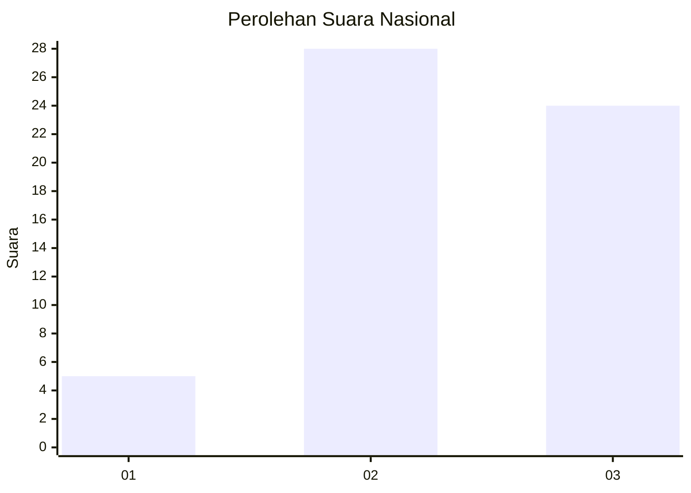
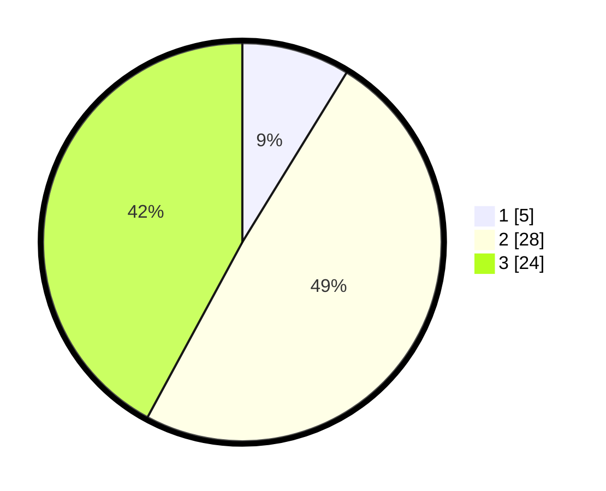

# Hasil

## Grafik

## Tabel

| No. | Nama Paslon    | Suara | Suara (raw) | Persentase |
|:--- |:-------------- | -----:| -----------:| ----------:|
| 1   | ANIES MUHAIMIN | 5     | [5][p-1]    | 8,77       |
| 2   | PRABOWO GIBRAN | 28    | [28][p-2]   | 49,12      |
| 3   | GANJAR MAHFUD  | 24    | [24][p-3]   | 42,11      |

[p-1]: https://github.com/gigit-pemilu/pemilu-2024/blob/main/pilpres/hitung-suara/sub/96-papua-barat-daya/sub/04-tambrauw/sub/01-fef/sub/2006-sikor/sub/001-tps/sub/paslon-1.txt
[p-2]: https://github.com/gigit-pemilu/pemilu-2024/blob/main/pilpres/hitung-suara/sub/96-papua-barat-daya/sub/04-tambrauw/sub/01-fef/sub/2006-sikor/sub/001-tps/sub/paslon-2.txt
[p-3]: https://github.com/gigit-pemilu/pemilu-2024/blob/main/pilpres/hitung-suara/sub/96-papua-barat-daya/sub/04-tambrauw/sub/01-fef/sub/2006-sikor/sub/001-tps/sub/paslon-3.txt

## Foto C Plano

https://sirekap-obj-formc.kpu.go.id/ff1f/pemilu/ppwp/96/04/01/20/06/9604012006001-20240215-092216--fae20b4e-4162-4c20-a5e1-325317c94460.jpg

https://sirekap-obj-formc.kpu.go.id/ff1f/pemilu/ppwp/96/04/01/20/06/9604012006001-20240215-092437--45fddb7d-6fd2-4c96-9665-b82f16f754be.jpg

https://sirekap-obj-formc.kpu.go.id/ff1f/pemilu/ppwp/96/04/01/20/06/9604012006001-20240215-092805--91a85a58-7a21-4096-acca-ac8bfa68979d.jpg

## Metadata

| Key        | Value               |
| ---------- | ------------------- |
| Time Stamp | 2024-02-16 08:30:27 |

## DATA PEMILIH TETAP

Jumlah pemilih dalam DPT: **58**.
 * L: **31**.
 * P: **27**.

## DATA PENGGUNA HAK PILIH

Jumlah pengguna hak pilih dalam DPT: **58**.
 * L: **31**.
 * P: **27**.

Jumlah pengguna hak pilih dalam DPTb: **0**.
 * L: **0**.
 * P: **0**.

Jumlah pengguna hak pilih dalam DPK: **0**.
 * L: **0**.
 * P: **0**.

Jumlah pengguna hak pilih: **58**.
 * L: **31**.
 * P: **27**.

## JUMLAH SUARA SAH DAN TIDAK SAH

JUMLAH SELURUH SUARA SAH: **57**.

JUMLAH SUARA TIDAK SAH: **1**.

