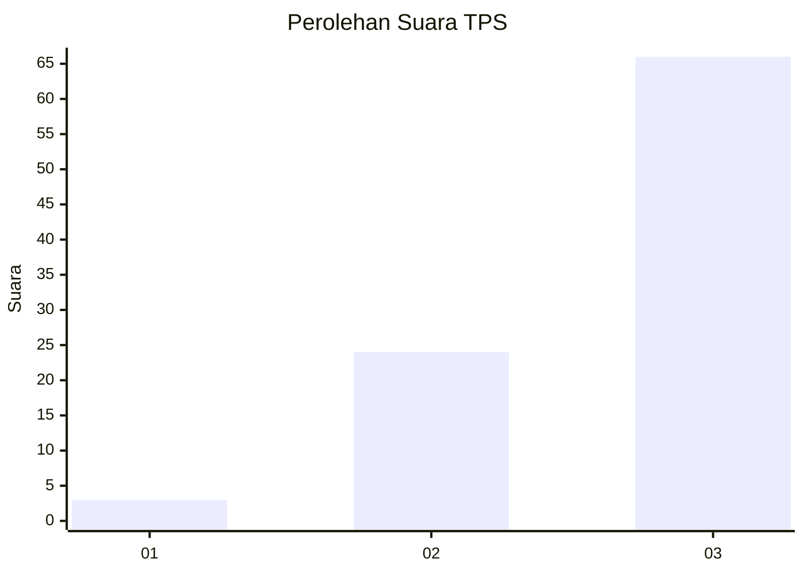
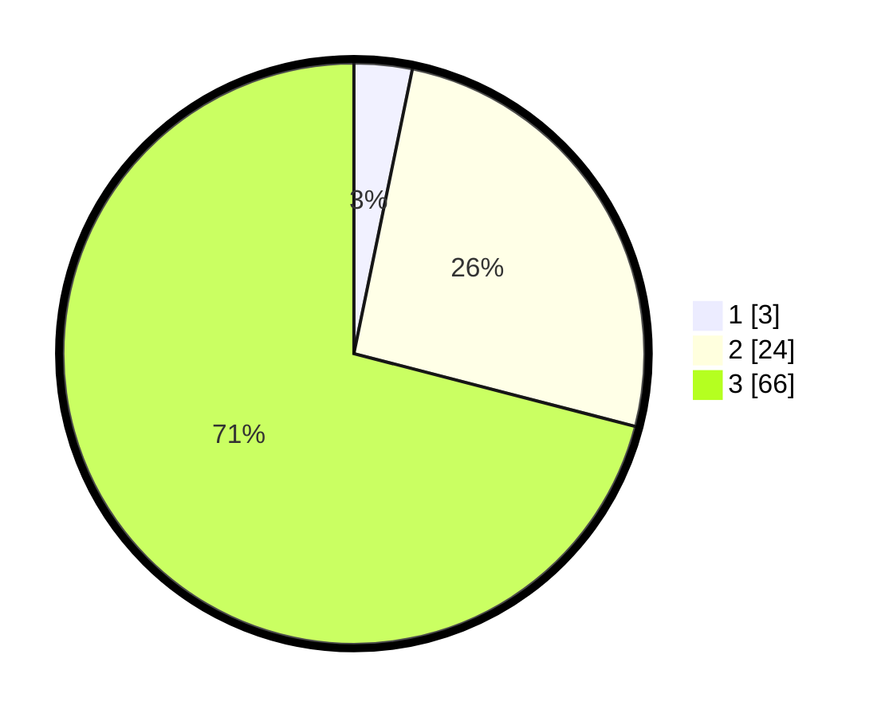

# Hasil

## Grafik

## Tabel

| No. | Nama Paslon    | Suara | Suara (raw) | Persentase |
|:--- |:-------------- | -----:| -----------:| ----------:|
| 1   | ANIES MUHAIMIN | 3     | [3][p-1]    | 3,23       |
| 2   | PRABOWO GIBRAN | 24    | [24][p-2]   | 25,81      |
| 3   | GANJAR MAHFUD  | 66    | [66][p-3]   | 70,97      |

[p-1]: https://github.com/gigit-pemilu/pemilu-2024-96-papua-barat-daya/blob/main/pilpres/hitung-suara/sub/96-papua-barat-daya/sub/04-tambrauw/sub/12-mubrani/sub/2006-meriambeker/sub/001-tps/sub/paslon-1.txt
[p-2]: https://github.com/gigit-pemilu/pemilu-2024-96-papua-barat-daya/blob/main/pilpres/hitung-suara/sub/96-papua-barat-daya/sub/04-tambrauw/sub/12-mubrani/sub/2006-meriambeker/sub/001-tps/sub/paslon-2.txt
[p-3]: https://github.com/gigit-pemilu/pemilu-2024-96-papua-barat-daya/blob/main/pilpres/hitung-suara/sub/96-papua-barat-daya/sub/04-tambrauw/sub/12-mubrani/sub/2006-meriambeker/sub/001-tps/sub/paslon-3.txt

## Foto C Plano

https://sirekap-obj-formc.kpu.go.id/36ac/pemilu/ppwp/96/04/12/20/06/9604122006001-20240214-131611--0250bbc9-8ff6-474a-a1d8-6395c1af7a73.jpg

https://sirekap-obj-formc.kpu.go.id/36ac/pemilu/ppwp/96/04/12/20/06/9604122006001-20240214-131723--bb6745e9-53ee-4ddb-b5cf-0395f7de2bdd.jpg

https://sirekap-obj-formc.kpu.go.id/36ac/pemilu/ppwp/96/04/12/20/06/9604122006001-20240214-131746--a43808c6-2c6d-440d-baa2-f9aa6644798e.jpg

## Metadata

| Key        | Value               |
| ---------- | ------------------- |
| Time Stamp | 2024-02-15 22:00:27 |

