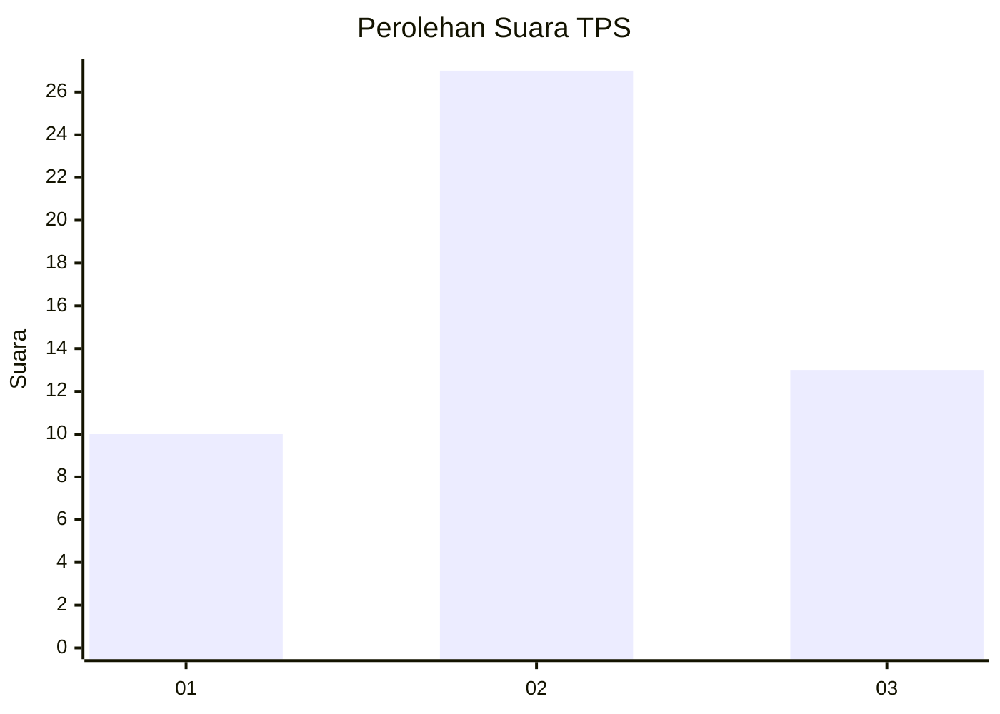
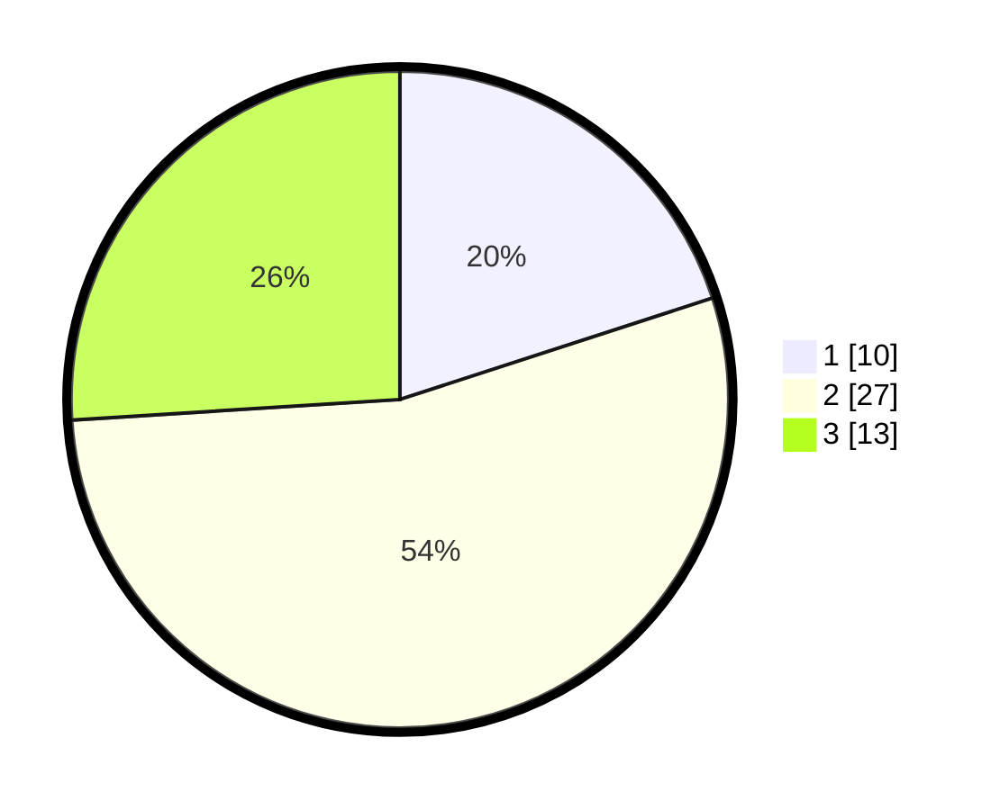

# Hasil

## Grafik

## Tabel

| No. | Nama Paslon    | Suara | Suara (raw) | Persentase |
|:--- |:-------------- | -----:| -----------:| ----------:|
| 1   | ANIES MUHAIMIN | 10    | [10][p-1]   | 20,00      |
| 2   | PRABOWO GIBRAN | 27    | [27][p-2]   | 54,00      |
| 3   | GANJAR MAHFUD  | 13    | [13][p-3]   | 26,00      |

[p-1]: https://github.com/gigit-pemilu/pemilu-2024-96-papua-barat-daya/blob/main/pilpres/hitung-suara/sub/96-papua-barat-daya/sub/04-tambrauw/sub/19-wilhem-roumbouts/sub/2003-araf-mafat/sub/001-tps/sub/paslon-1.txt
[p-2]: https://github.com/gigit-pemilu/pemilu-2024-96-papua-barat-daya/blob/main/pilpres/hitung-suara/sub/96-papua-barat-daya/sub/04-tambrauw/sub/19-wilhem-roumbouts/sub/2003-araf-mafat/sub/001-tps/sub/paslon-2.txt
[p-3]: https://github.com/gigit-pemilu/pemilu-2024-96-papua-barat-daya/blob/main/pilpres/hitung-suara/sub/96-papua-barat-daya/sub/04-tambrauw/sub/19-wilhem-roumbouts/sub/2003-araf-mafat/sub/001-tps/sub/paslon-3.txt

## Foto C Plano

https://sirekap-obj-formc.kpu.go.id/07a6/pemilu/ppwp/96/04/19/20/03/9604192003001-20240215-095351--96fc7631-d8ff-4850-9f57-86113fef8669.jpg

https://sirekap-obj-formc.kpu.go.id/07a6/pemilu/ppwp/96/04/19/20/03/9604192003001-20240215-095914--4c98d93e-49bf-48c2-8e7f-a6833327ccac.jpg

https://sirekap-obj-formc.kpu.go.id/07a6/pemilu/ppwp/96/04/19/20/03/9604192003001-20240215-100228--a014c819-ea14-49c6-aa96-f352be466eaf.jpg

## Metadata

| Key        | Value               |
| ---------- | ------------------- |
| Time Stamp | 2024-02-16 12:51:22 |

## DATA PEMILIH TETAP

Jumlah pemilih dalam DPT: **50**.
 * L: **27**.
 * P: **23**.

## DATA PENGGUNA HAK PILIH

Jumlah pengguna hak pilih dalam DPT: **50**.
 * L: **27**.
 * P: **23**.

Jumlah pengguna hak pilih dalam DPTb: **0**.
 * L: **0**.
 * P: **0**.

Jumlah pengguna hak pilih dalam DPK: **0**.
 * L: **0**.
 * P: **0**.

Jumlah pengguna hak pilih: **50**.
 * L: **27**.
 * P: **23**.

## JUMLAH SUARA SAH DAN TIDAK SAH

JUMLAH SELURUH SUARA SAH: **50**.

JUMLAH SUARA TIDAK SAH: **0**.

JUMLAH SELURUH SUARA SAH DAN SUARA TIDAK SAH: **0**.

