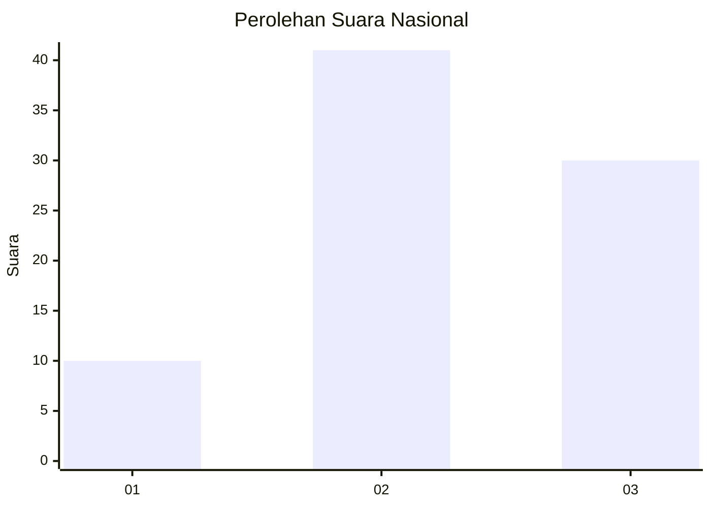
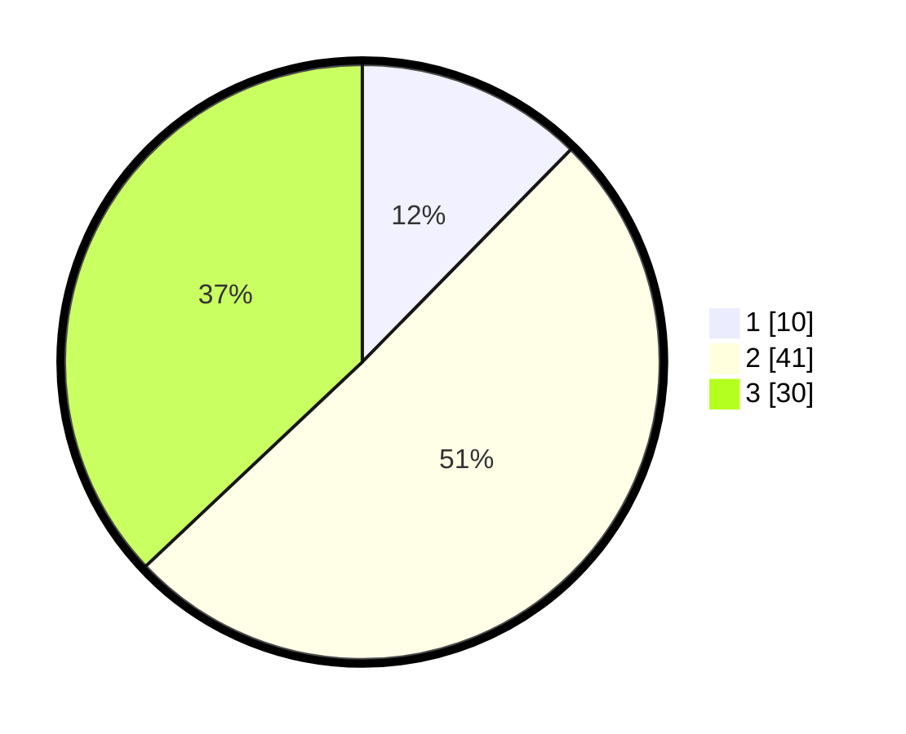

# Hasil

## Grafik

## Tabel

| No. | Nama Paslon    | Suara | Suara (raw) | Persentase |
|:--- |:-------------- | -----:| -----------:| ----------:|
| 1   | ANIES MUHAIMIN | 10    | [10][p-1]   | 12,35      |
| 2   | PRABOWO GIBRAN | 41    | [41][p-2]   | 50,62      |
| 3   | GANJAR MAHFUD  | 30    | [30][p-3]   | 37,04      |

[p-1]: https://github.com/gigit-pemilu/pemilu-2024/blob/main/pilpres/hitung-suara/sub/96-papua-barat-daya/sub/05-maybrat/sub/06-aitinyo/sub/2014-sowai-sau/sub/001-tps/sub/paslon-1.txt
[p-2]: https://github.com/gigit-pemilu/pemilu-2024/blob/main/pilpres/hitung-suara/sub/96-papua-barat-daya/sub/05-maybrat/sub/06-aitinyo/sub/2014-sowai-sau/sub/001-tps/sub/paslon-2.txt
[p-3]: https://github.com/gigit-pemilu/pemilu-2024/blob/main/pilpres/hitung-suara/sub/96-papua-barat-daya/sub/05-maybrat/sub/06-aitinyo/sub/2014-sowai-sau/sub/001-tps/sub/paslon-3.txt

## Foto C Plano

https://sirekap-obj-formc.kpu.go.id/5b44/pemilu/ppwp/96/05/06/20/14/9605062014001-20240216-100726--d31140f0-a417-4fd9-9d33-63ffc46a9832.jpg

https://sirekap-obj-formc.kpu.go.id/5b44/pemilu/ppwp/96/05/06/20/14/9605062014001-20240216-091139--c3645777-50ce-4fb7-b403-996f35aae7ec.jpg

https://sirekap-obj-formc.kpu.go.id/5b44/pemilu/ppwp/96/05/06/20/14/9605062014001-20240216-091223--4341a8fc-5b54-4d16-8cd1-cb55486ac781.jpg

## Metadata

| Key        | Value               |
| ---------- | ------------------- |
| Time Stamp | 2024-02-17 10:30:03 |

## DATA PEMILIH TETAP

Jumlah pemilih dalam DPT: **79**.
 * L: **36**.
 * P: **43**.

## DATA PENGGUNA HAK PILIH

Jumlah pengguna hak pilih dalam DPT: **79**.
 * L: **36**.
 * P: **43**.

Jumlah pengguna hak pilih dalam DPTb: **2**.
 * L: **0**.
 * P: **2**.

Jumlah pengguna hak pilih dalam DPK: **0**.
 * L: **0**.
 * P: **0**.

Jumlah pengguna hak pilih: **81**.
 * L: **36**.
 * P: **45**.

## JUMLAH SUARA SAH DAN TIDAK SAH

JUMLAH SELURUH SUARA SAH: **81**.

JUMLAH SUARA TIDAK SAH: **0**.

JUMLAH SELURUH SUARA SAH DAN SUARA TIDAK SAH: **81**.

