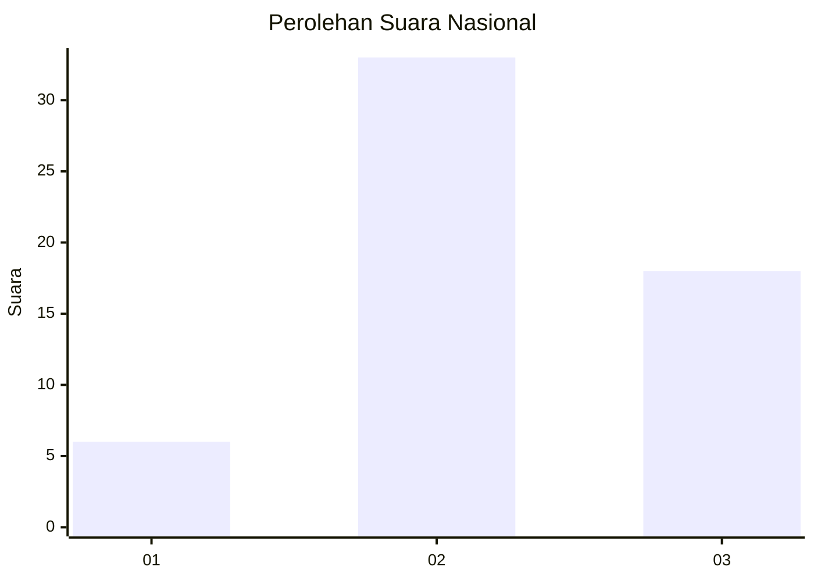
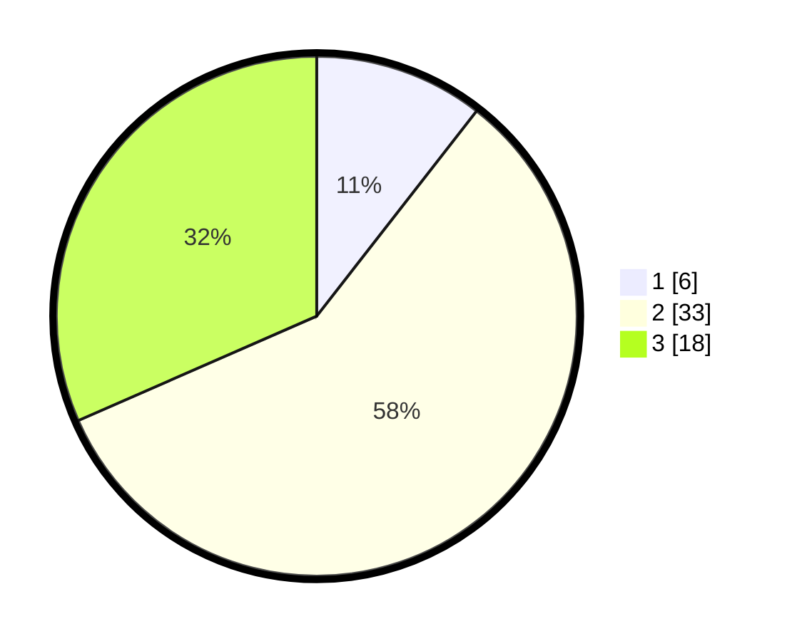

# Hasil

## Grafik

## Tabel

| No. | Nama Paslon    | Suara | Suara (raw) | Persentase |
|:--- |:-------------- | -----:| -----------:| ----------:|
| 1   | ANIES MUHAIMIN | 6     | [6][p-1]    | 10,53      |
| 2   | PRABOWO GIBRAN | 33    | [33][p-2]   | 57,89      |
| 3   | GANJAR MAHFUD  | 18    | [18][p-3]   | 31,58      |

[p-1]: https://github.com/gigit-pemilu/pemilu-2024/blob/main/pilpres/hitung-suara/sub/96-papua-barat-daya/sub/05-maybrat/sub/07-aitinyo-utara/sub/2016-bahwat/sub/001-tps/sub/paslon-1.txt
[p-2]: https://github.com/gigit-pemilu/pemilu-2024/blob/main/pilpres/hitung-suara/sub/96-papua-barat-daya/sub/05-maybrat/sub/07-aitinyo-utara/sub/2016-bahwat/sub/001-tps/sub/paslon-2.txt
[p-3]: https://github.com/gigit-pemilu/pemilu-2024/blob/main/pilpres/hitung-suara/sub/96-papua-barat-daya/sub/05-maybrat/sub/07-aitinyo-utara/sub/2016-bahwat/sub/001-tps/sub/paslon-3.txt

## Foto C Plano

https://sirekap-obj-formc.kpu.go.id/07ee/pemilu/ppwp/96/05/07/20/16/9605072016001-20240215-200254--5fe8c7f7-352a-4515-a872-ede99ef5c069.jpg

https://sirekap-obj-formc.kpu.go.id/07ee/pemilu/ppwp/96/05/07/20/16/9605072016001-20240215-201104--d63f982d-3975-4517-bda6-6fd532458667.jpg

https://sirekap-obj-formc.kpu.go.id/07ee/pemilu/ppwp/96/05/07/20/16/9605072016001-20240215-202040--21cc7129-2f43-4f86-a947-bb3713d65eac.jpg

## Metadata

| Key        | Value               |
| ---------- | ------------------- |
| Time Stamp | 2024-02-16 01:00:27 |

