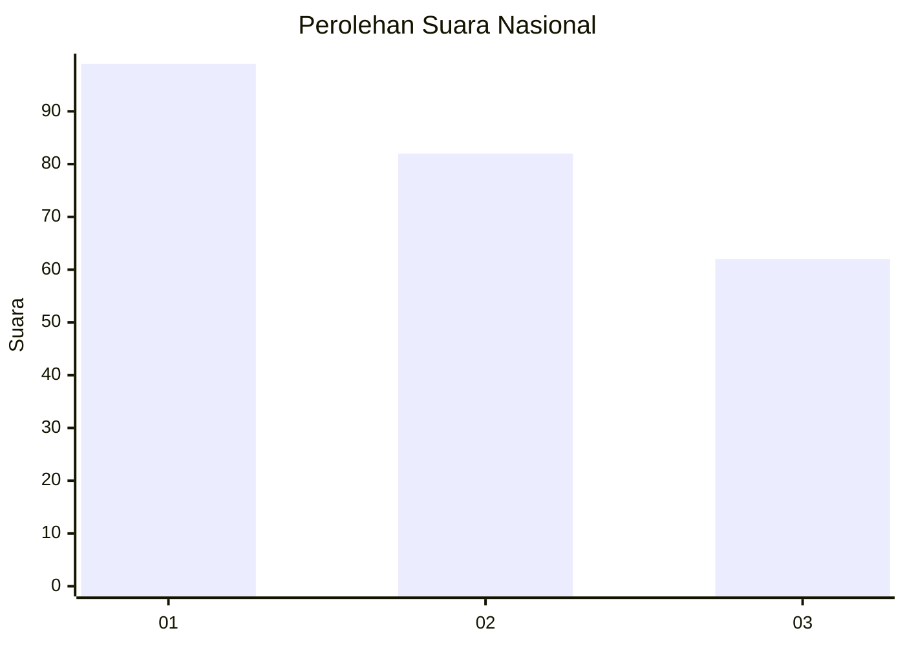
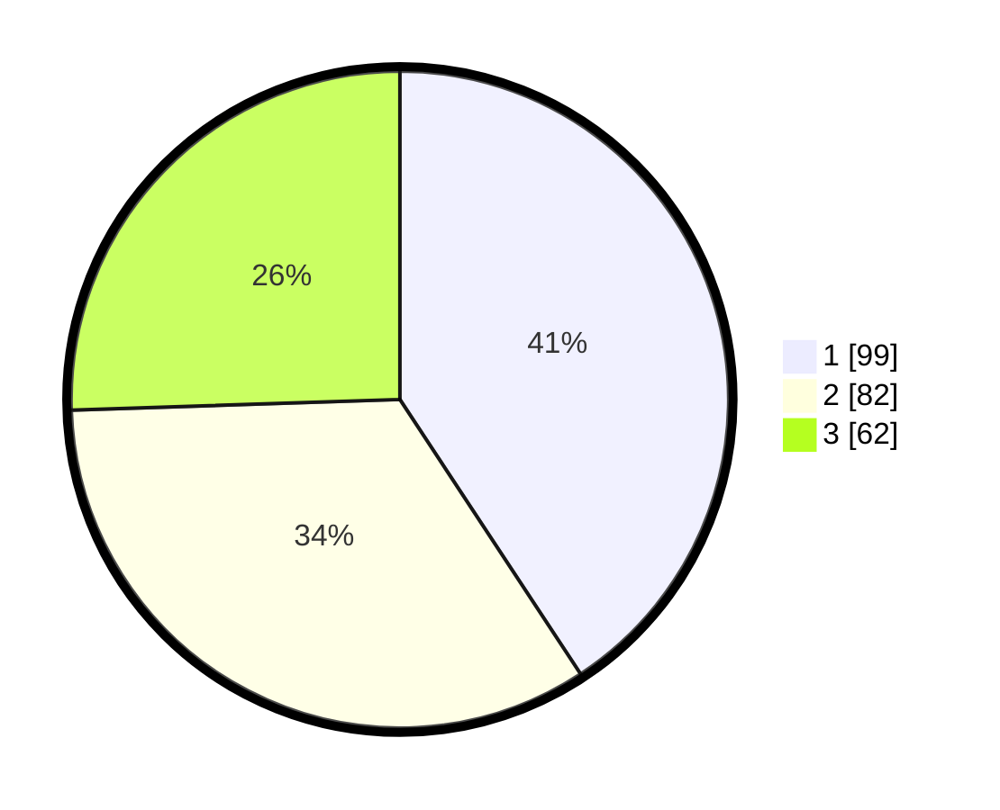

# Hasil

## Grafik

## Tabel

| No. | Nama Paslon    | Suara | Suara (raw) | Persentase |
|:--- |:-------------- | -----:| -----------:| ----------:|
| 1   | ANIES MUHAIMIN | 99    | [99][p-1]   | 40,74      |
| 2   | PRABOWO GIBRAN | 82    | [82][p-2]   | 33,74      |
| 3   | GANJAR MAHFUD  | 62    | [62][p-3]   | 25,51      |

[p-1]: https://github.com/gigit-pemilu/pemilu-2024/blob/main/pilpres/hitung-suara/sub/96-papua-barat-daya/sub/05-maybrat/sub/08-ayamaru/sub/2017-fraharo/sub/001-tps/sub/paslon-1.txt
[p-2]: https://github.com/gigit-pemilu/pemilu-2024/blob/main/pilpres/hitung-suara/sub/96-papua-barat-daya/sub/05-maybrat/sub/08-ayamaru/sub/2017-fraharo/sub/001-tps/sub/paslon-2.txt
[p-3]: https://github.com/gigit-pemilu/pemilu-2024/blob/main/pilpres/hitung-suara/sub/96-papua-barat-daya/sub/05-maybrat/sub/08-ayamaru/sub/2017-fraharo/sub/001-tps/sub/paslon-3.txt

## Foto C Plano

https://sirekap-obj-formc.kpu.go.id/0817/pemilu/ppwp/96/05/08/20/17/9605082017001-20240214-131238--0e465df5-f95b-40fa-951e-0cb0f3981b0a.jpg

https://sirekap-obj-formc.kpu.go.id/0817/pemilu/ppwp/96/05/08/20/17/9605082017001-20240214-131416--c7649d23-3518-46a6-a85f-4d4ade6660eb.jpg

https://sirekap-obj-formc.kpu.go.id/0817/pemilu/ppwp/96/05/08/20/17/9605082017001-20240214-130121--c0042c60-7fee-40c5-99a7-22c0ca796146.jpg

## Metadata

| Key        | Value               |
| ---------- | ------------------- |
| Time Stamp | 2024-02-15 15:30:25 |

