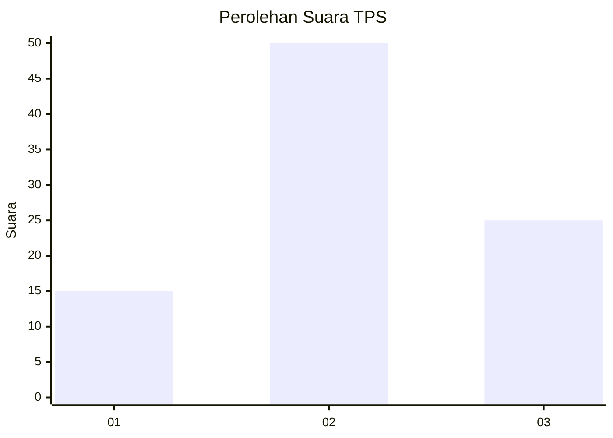
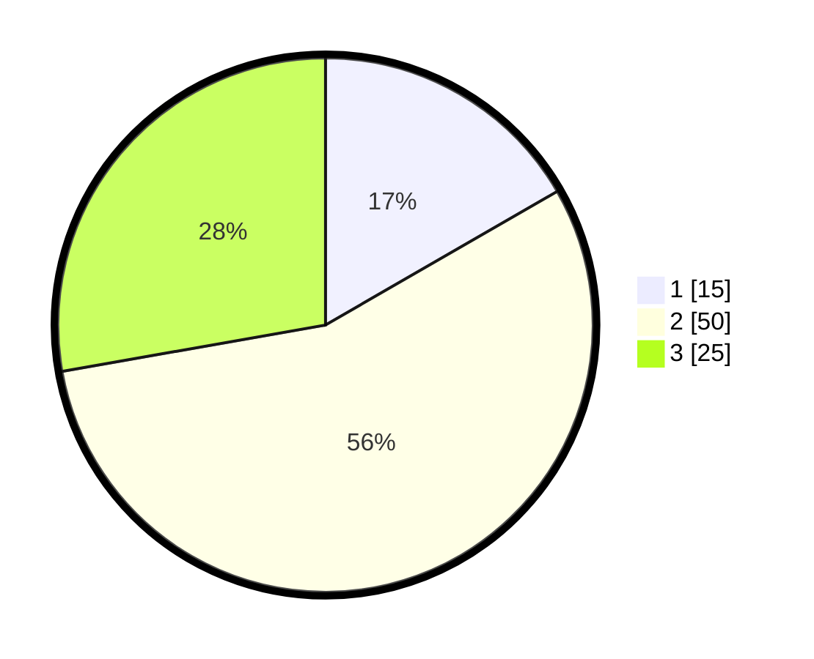

# Hasil

## Grafik

## Tabel

| No. | Nama Paslon    | Suara | Suara (raw) | Persentase |
|:--- |:-------------- | -----:| -----------:| ----------:|
| 1   | ANIES MUHAIMIN | 15    | [15][p-1]   | 16,67      |
| 2   | PRABOWO GIBRAN | 50    | [50][p-2]   | 55,56      |
| 3   | GANJAR MAHFUD  | 25    | [25][p-3]   | 27,78      |

[p-1]: https://github.com/gigit-pemilu/pemilu-2024-96-papua-barat-daya/blob/main/pilpres/hitung-suara/sub/96-papua-barat-daya/sub/05-maybrat/sub/08-ayamaru/sub/2019-twer/sub/001-tps/sub/paslon-1.txt
[p-2]: https://github.com/gigit-pemilu/pemilu-2024-96-papua-barat-daya/blob/main/pilpres/hitung-suara/sub/96-papua-barat-daya/sub/05-maybrat/sub/08-ayamaru/sub/2019-twer/sub/001-tps/sub/paslon-2.txt
[p-3]: https://github.com/gigit-pemilu/pemilu-2024-96-papua-barat-daya/blob/main/pilpres/hitung-suara/sub/96-papua-barat-daya/sub/05-maybrat/sub/08-ayamaru/sub/2019-twer/sub/001-tps/sub/paslon-3.txt

## Foto C Plano

https://sirekap-obj-formc.kpu.go.id/72c7/pemilu/ppwp/96/05/08/20/19/9605082019001-20240215-190236--920c8bdb-5d5d-4ed8-a407-edaed26be7ca.jpg

https://sirekap-obj-formc.kpu.go.id/72c7/pemilu/ppwp/96/05/08/20/19/9605082019001-20240215-190441--82814ccf-ba0a-4aa9-ad19-cd24c8fc774f.jpg

https://sirekap-obj-formc.kpu.go.id/72c7/pemilu/ppwp/96/05/08/20/19/9605082019001-20240215-190637--89db69d2-0b0c-41ff-80ff-aa8d6670dd1b.jpg

## Metadata

| Key        | Value               |
| ---------- | ------------------- |
| Time Stamp | 2024-02-15 23:29:50 |

