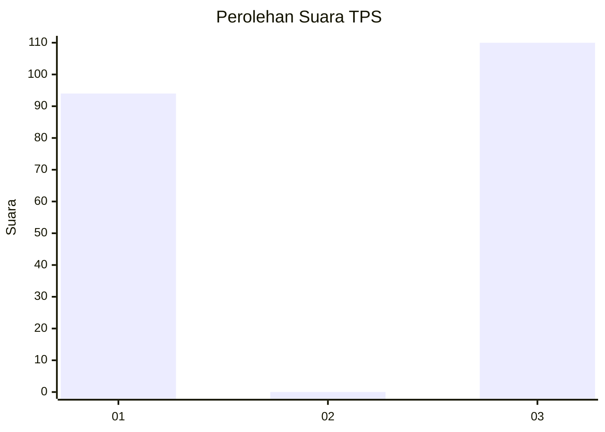
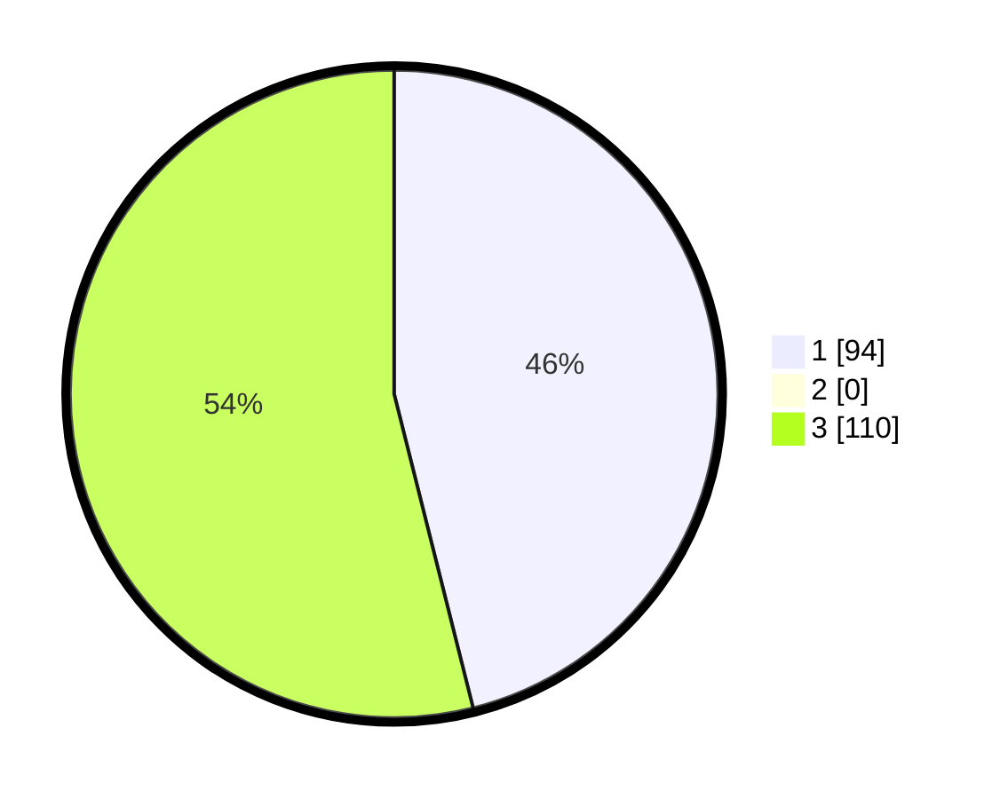

# Hasil

## Grafik

## Tabel

| No. | Nama Paslon    | Suara | Suara (raw) | Persentase |
|:--- |:-------------- | -----:| -----------:| ----------:|
| 1   | ANIES MUHAIMIN | 94    | [94][p-1]   | 46,08      |
| 2   | PRABOWO GIBRAN | 0     | [0][p-2]    | 0,00       |
| 3   | GANJAR MAHFUD  | 110   | [110][p-3]  | 53,92      |

[p-1]: https://github.com/gigit-pemilu/pemilu-2024-96-papua-barat-daya/blob/main/pilpres/hitung-suara/sub/96-papua-barat-daya/sub/05-maybrat/sub/16-ayamaru-jaya/sub/2010-woman/sub/001-tps/sub/paslon-1.txt
[p-2]: https://github.com/gigit-pemilu/pemilu-2024-96-papua-barat-daya/blob/main/pilpres/hitung-suara/sub/96-papua-barat-daya/sub/05-maybrat/sub/16-ayamaru-jaya/sub/2010-woman/sub/001-tps/sub/paslon-2.txt
[p-3]: https://github.com/gigit-pemilu/pemilu-2024-96-papua-barat-daya/blob/main/pilpres/hitung-suara/sub/96-papua-barat-daya/sub/05-maybrat/sub/16-ayamaru-jaya/sub/2010-woman/sub/001-tps/sub/paslon-3.txt

## Foto C Plano

https://sirekap-obj-formc.kpu.go.id/9f23/pemilu/ppwp/96/05/16/20/10/9605162010001-20240317-211216--723ddaf2-e0aa-4be2-b4de-81d2d103af6d.jpg

https://sirekap-obj-formc.kpu.go.id/9f23/pemilu/ppwp/96/05/16/20/10/9605162010001-20240215-093145--190fe1f9-bd87-4b92-a93d-57541622c1e2.jpg

https://sirekap-obj-formc.kpu.go.id/9f23/pemilu/ppwp/96/05/16/20/10/9605162010001-20240215-094104--0ea90226-4662-4122-88fe-e82843697f94.jpg

## Metadata

| Key        | Value               |
| ---------- | ------------------- |
| Time Stamp | 2024-03-17 21:30:00 |

