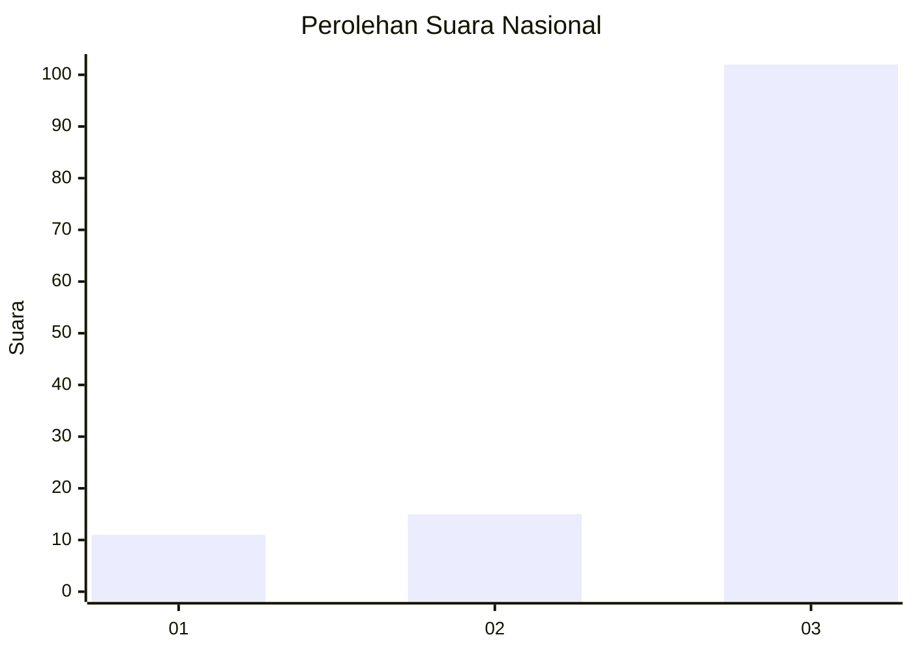
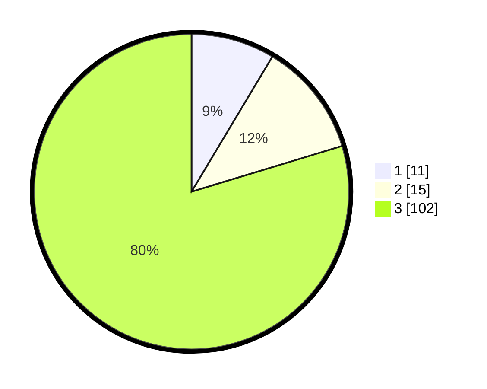

# Hasil

## Grafik

## Tabel

| No. | Nama Paslon    | Suara | Suara (raw) | Persentase |
|:--- |:-------------- | -----:| -----------:| ----------:|
| 1   | ANIES MUHAIMIN | 11    | [11][p-1]   | 8,59       |
| 2   | PRABOWO GIBRAN | 15    | [15][p-2]   | 11,72      |
| 3   | GANJAR MAHFUD  | 102   | [102][p-3]  | 79,69      |

[p-1]: https://github.com/gigit-pemilu/pemilu-2024/blob/main/pilpres/hitung-suara/sub/96-papua-barat-daya/sub/05-maybrat/sub/21-ayamaru-barat/sub/2007-sien/sub/001-tps/sub/paslon-1.txt
[p-2]: https://github.com/gigit-pemilu/pemilu-2024/blob/main/pilpres/hitung-suara/sub/96-papua-barat-daya/sub/05-maybrat/sub/21-ayamaru-barat/sub/2007-sien/sub/001-tps/sub/paslon-2.txt
[p-3]: https://github.com/gigit-pemilu/pemilu-2024/blob/main/pilpres/hitung-suara/sub/96-papua-barat-daya/sub/05-maybrat/sub/21-ayamaru-barat/sub/2007-sien/sub/001-tps/sub/paslon-3.txt

## Foto C Plano

https://sirekap-obj-formc.kpu.go.id/c952/pemilu/ppwp/96/05/21/20/07/9605212007001-20240216-111158--31832ce2-f6ef-4d39-be23-bd57d332a82e.jpg

https://sirekap-obj-formc.kpu.go.id/c952/pemilu/ppwp/96/05/21/20/07/9605212007001-20240216-111430--e9599a2b-afe3-4830-94d9-251e1820209b.jpg

## Metadata

| Key        | Value               |
| ---------- | ------------------- |
| Time Stamp | 2024-02-16 12:51:22 |

