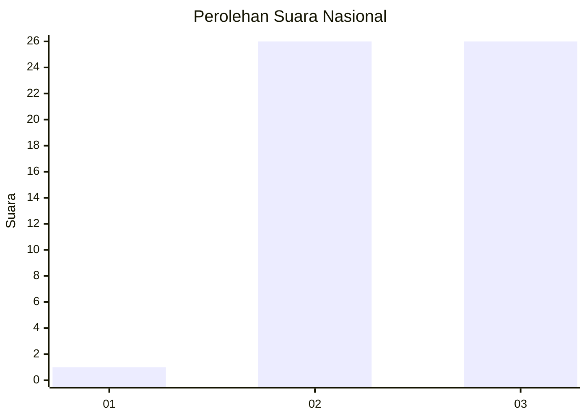
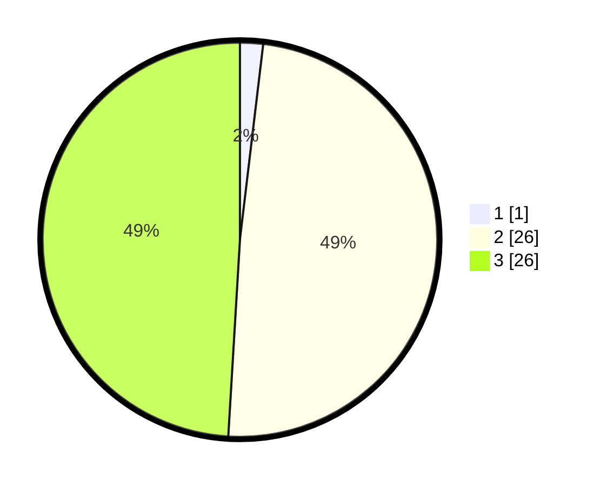

# Hasil

## Grafik

## Tabel

| No. | Nama Paslon    | Suara | Suara (raw) | Persentase |
|:--- |:-------------- | -----:| -----------:| ----------:|
| 1   | ANIES MUHAIMIN | 1     | [1][p-1]    | 1,89       |
| 2   | PRABOWO GIBRAN | 26    | [26][p-2]   | 49,06      |
| 3   | GANJAR MAHFUD  | 26    | [26][p-3]   | 49,06      |

[p-1]: https://github.com/gigit-pemilu/pemilu-2024/blob/main/pilpres/hitung-suara/sub/96-papua-barat-daya/sub/05-maybrat/sub/22-aitinyo-tengah/sub/2012-iroh-sohser/sub/001-tps/sub/paslon-1.txt
[p-2]: https://github.com/gigit-pemilu/pemilu-2024/blob/main/pilpres/hitung-suara/sub/96-papua-barat-daya/sub/05-maybrat/sub/22-aitinyo-tengah/sub/2012-iroh-sohser/sub/001-tps/sub/paslon-2.txt
[p-3]: https://github.com/gigit-pemilu/pemilu-2024/blob/main/pilpres/hitung-suara/sub/96-papua-barat-daya/sub/05-maybrat/sub/22-aitinyo-tengah/sub/2012-iroh-sohser/sub/001-tps/sub/paslon-3.txt

## Foto C Plano

https://sirekap-obj-formc.kpu.go.id/1b5e/pemilu/ppwp/96/05/22/20/12/9605222012001-20240215-105926--963da6d6-3273-4f5f-93f1-76a89f486df8.jpg

https://sirekap-obj-formc.kpu.go.id/1b5e/pemilu/ppwp/96/05/22/20/12/9605222012001-20240215-110159--b8548fe7-06ae-4b77-bd79-5b8d5d62b66a.jpg

https://sirekap-obj-formc.kpu.go.id/1b5e/pemilu/ppwp/96/05/22/20/12/9605222012001-20240215-110417--a1548009-44a4-4a3b-b272-786b98353930.jpg

## Metadata

| Key        | Value               |
| ---------- | ------------------- |
| Time Stamp | 2024-02-15 19:00:26 |

## DATA PEMILIH TETAP

Jumlah pemilih dalam DPT: **52**.
 * L: **22**.
 * P: **30**.

## DATA PENGGUNA HAK PILIH

Jumlah pengguna hak pilih dalam DPT: **52**.
 * L: **22**.
 * P: **30**.

Jumlah pengguna hak pilih dalam DPTb: **0**.
 * L: **0**.
 * P: **0**.

Jumlah pengguna hak pilih dalam DPK: **1**.
 * L: **1**.
 * P: **0**.

Jumlah pengguna hak pilih: **53**.
 * L: **23**.
 * P: **30**.

## JUMLAH SUARA SAH DAN TIDAK SAH

JUMLAH SELURUH SUARA SAH: **54**.

JUMLAH SUARA TIDAK SAH: **0**.

JUMLAH SELURUH SUARA SAH DAN SUARA TIDAK SAH: **54**.

