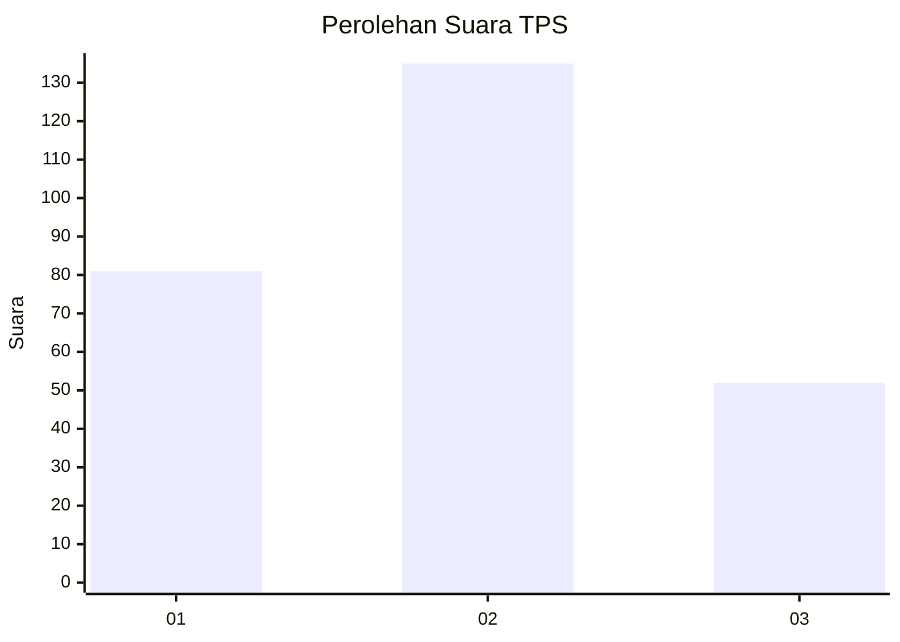
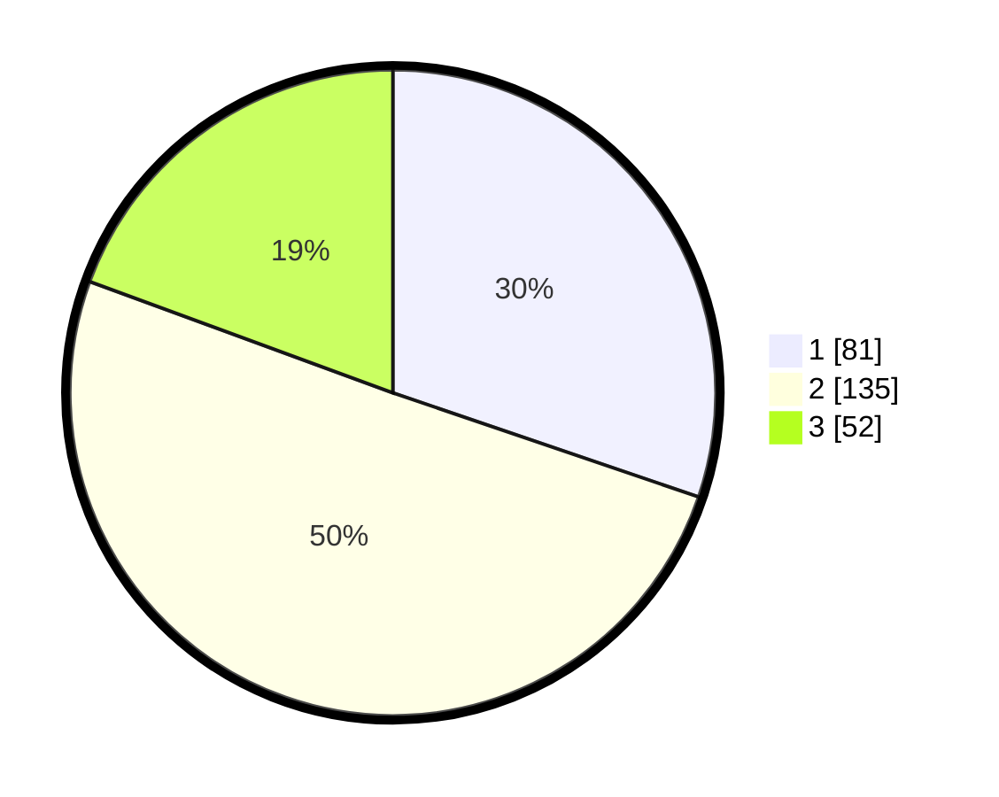

# Hasil

## Grafik

## Tabel

| No. | Nama Paslon    | Suara | Suara (raw) | Persentase |
|:--- |:-------------- | -----:| -----------:| ----------:|
| 1   | ANIES MUHAIMIN | 81    | [81][p-1]   | 30,22      |
| 2   | PRABOWO GIBRAN | 135   | [135][p-2]  | 50,37      |
| 3   | GANJAR MAHFUD  | 52    | [52][p-3]   | 19,40      |

[p-1]: https://github.com/gigit-pemilu/pemilu-2024-96-papua-barat-daya/blob/main/pilpres/hitung-suara/sub/96-papua-barat-daya/sub/71-kota-sorong/sub/01-sorong/sub/1001-remu-utara/sub/001-tps/sub/paslon-1.txt
[p-2]: https://github.com/gigit-pemilu/pemilu-2024-96-papua-barat-daya/blob/main/pilpres/hitung-suara/sub/96-papua-barat-daya/sub/71-kota-sorong/sub/01-sorong/sub/1001-remu-utara/sub/001-tps/sub/paslon-2.txt
[p-3]: https://github.com/gigit-pemilu/pemilu-2024-96-papua-barat-daya/blob/main/pilpres/hitung-suara/sub/96-papua-barat-daya/sub/71-kota-sorong/sub/01-sorong/sub/1001-remu-utara/sub/001-tps/sub/paslon-3.txt

## Foto C Plano

https://sirekap-obj-formc.kpu.go.id/fede/pemilu/ppwp/96/71/01/10/01/9671011001001-20240215-031413--5f760f83-ea48-4b56-b1a5-12e6a54a5d8e.jpg

https://sirekap-obj-formc.kpu.go.id/fede/pemilu/ppwp/96/71/01/10/01/9671011001001-20240215-031633--d0c37592-c92b-47b3-8cc6-b0f32ee16c76.jpg

https://sirekap-obj-formc.kpu.go.id/fede/pemilu/ppwp/96/71/01/10/01/9671011001001-20240215-031832--42b91e7e-e8c0-4918-9d42-36e88ace3c78.jpg

## Metadata

| Key        | Value               |
| ---------- | ------------------- |
| Time Stamp | 2024-02-24 22:31:28 |

