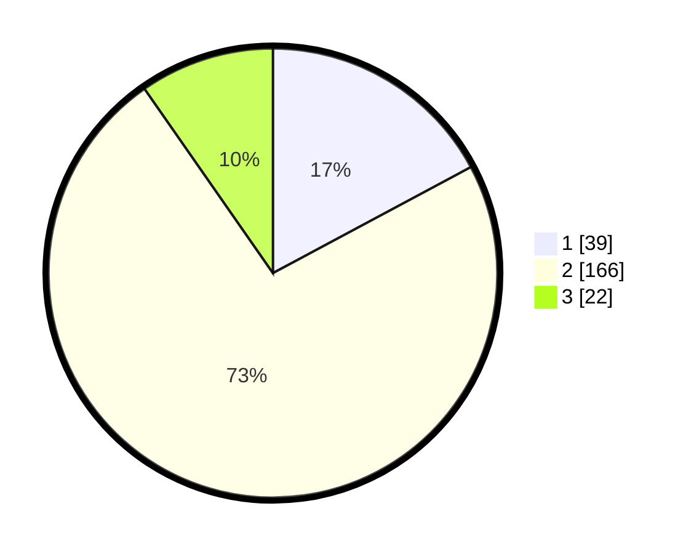

# Hasil

## Grafik

## Tabel

| No. | Nama Paslon    | Suara | Suara (raw) | Persentase |
|:--- |:-------------- | -----:| -----------:| ----------:|
| 1   | ANIES MUHAIMIN | 39    | [39][p-1]   | 17,18      |
| 2   | PRABOWO GIBRAN | 166   | [166][p-2]  | 73,13      |
| 3   | GANJAR MAHFUD  | 22    | [22][p-3]   | 9,69       |

[p-1]: https://github.com/gigit-pemilu/pemilu-2024/blob/main/pilpres/hitung-suara/sub/96-papua-barat-daya/sub/71-kota-sorong/sub/01-sorong/sub/1001-remu-utara/sub/002-tps/sub/paslon-1.txt
[p-2]: https://github.com/gigit-pemilu/pemilu-2024/blob/main/pilpres/hitung-suara/sub/96-papua-barat-daya/sub/71-kota-sorong/sub/01-sorong/sub/1001-remu-utara/sub/002-tps/sub/paslon-2.txt
[p-3]: https://github.com/gigit-pemilu/pemilu-2024/blob/main/pilpres/hitung-suara/sub/96-papua-barat-daya/sub/71-kota-sorong/sub/01-sorong/sub/1001-remu-utara/sub/002-tps/sub/paslon-3.txt

## Foto C Plano

https://sirekap-obj-formc.kpu.go.id/d0f6/pemilu/ppwp/96/71/01/10/01/9671011001002-20240215-052452--a362625b-8892-4057-9408-99f98e9c55a5.jpg

https://sirekap-obj-formc.kpu.go.id/d0f6/pemilu/ppwp/96/71/01/10/01/9671011001002-20240215-052924--464f7098-49c4-4797-be09-f3f955d15b0e.jpg

https://sirekap-obj-formc.kpu.go.id/d0f6/pemilu/ppwp/96/71/01/10/01/9671011001002-20240215-053320--bc8cef6e-e376-4dca-a936-13189f06cf29.jpg

## Metadata

| Key        | Value               |
| ---------- | ------------------- |
| Time Stamp | 2024-02-24 22:31:28 |

