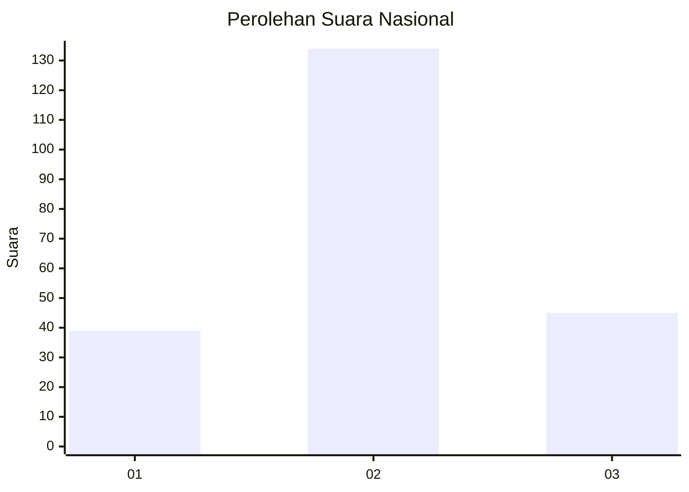
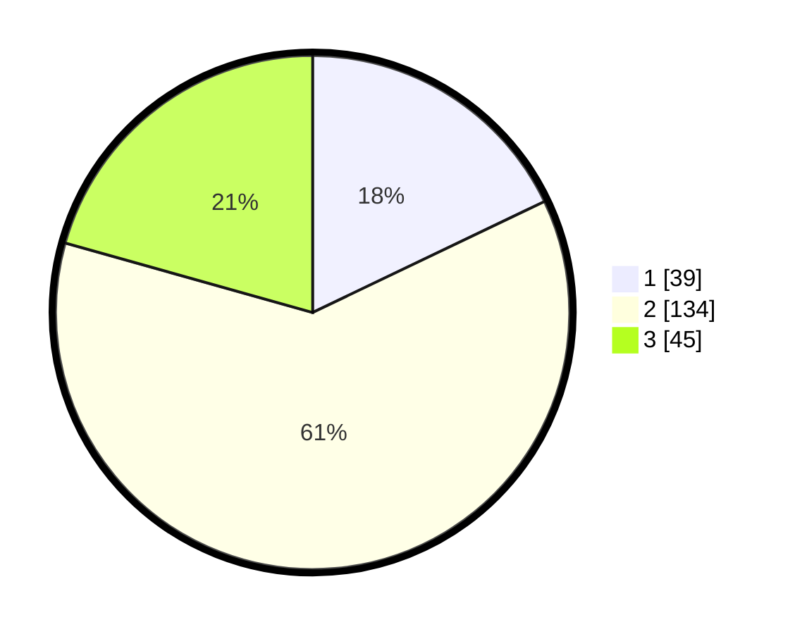

# Hasil

## Grafik

## Tabel

| No. | Nama Paslon    | Suara | Suara (raw) | Persentase |
|:--- |:-------------- | -----:| -----------:| ----------:|
| 1   | ANIES MUHAIMIN | 39    | [39][p-1]   | 17,89      |
| 2   | PRABOWO GIBRAN | 134   | [134][p-2]  | 61,47      |
| 3   | GANJAR MAHFUD  | 45    | [45][p-3]   | 20,64      |

[p-1]: https://github.com/gigit-pemilu/pemilu-2024/blob/main/pilpres/hitung-suara/sub/96-papua-barat-daya/sub/71-kota-sorong/sub/01-sorong/sub/1001-remu-utara/sub/003-tps/sub/paslon-1.txt
[p-2]: https://github.com/gigit-pemilu/pemilu-2024/blob/main/pilpres/hitung-suara/sub/96-papua-barat-daya/sub/71-kota-sorong/sub/01-sorong/sub/1001-remu-utara/sub/003-tps/sub/paslon-2.txt
[p-3]: https://github.com/gigit-pemilu/pemilu-2024/blob/main/pilpres/hitung-suara/sub/96-papua-barat-daya/sub/71-kota-sorong/sub/01-sorong/sub/1001-remu-utara/sub/003-tps/sub/paslon-3.txt

## Foto C Plano

https://sirekap-obj-formc.kpu.go.id/38da/pemilu/ppwp/96/71/01/10/01/9671011001003-20240215-100748--c5132163-1710-41ec-a4c4-f2bf4829a10e.jpg

https://sirekap-obj-formc.kpu.go.id/38da/pemilu/ppwp/96/71/01/10/01/9671011001003-20240215-072909--f987981c-338f-4016-ab61-72dbce511da8.jpg

https://sirekap-obj-formc.kpu.go.id/38da/pemilu/ppwp/96/71/01/10/01/9671011001003-20240215-073219--3a8c24c4-d396-4de6-8583-ce70f37b5ccf.jpg

## Metadata

| Key        | Value               |
| ---------- | ------------------- |
| Time Stamp | 2024-02-24 22:31:28 |

