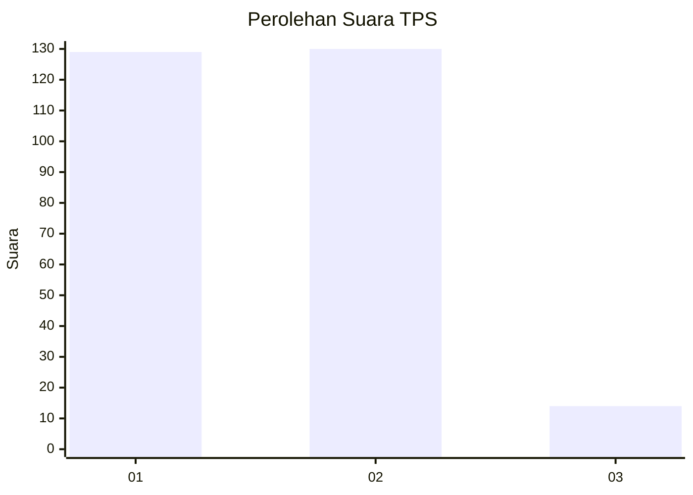
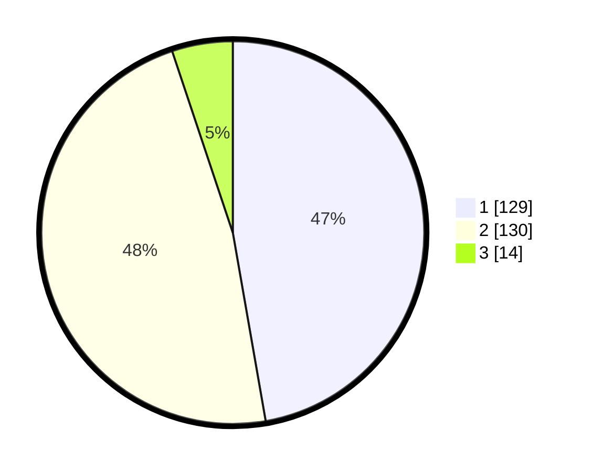

# Hasil

## Grafik

## Tabel

| No. | Nama Paslon    | Suara | Suara (raw) | Persentase |
|:--- |:-------------- | -----:| -----------:| ----------:|
| 1   | ANIES MUHAIMIN | 129   | [129][p-1]  | 47,25      |
| 2   | PRABOWO GIBRAN | 130   | [130][p-2]  | 47,62      |
| 3   | GANJAR MAHFUD  | 14    | [14][p-3]   | 5,13       |

[p-1]: https://github.com/gigit-pemilu/pemilu-2024-96-papua-barat-daya/blob/main/pilpres/hitung-suara/sub/96-papua-barat-daya/sub/71-kota-sorong/sub/01-sorong/sub/1001-remu-utara/sub/004-tps/sub/paslon-1.txt
[p-2]: https://github.com/gigit-pemilu/pemilu-2024-96-papua-barat-daya/blob/main/pilpres/hitung-suara/sub/96-papua-barat-daya/sub/71-kota-sorong/sub/01-sorong/sub/1001-remu-utara/sub/004-tps/sub/paslon-2.txt
[p-3]: https://github.com/gigit-pemilu/pemilu-2024-96-papua-barat-daya/blob/main/pilpres/hitung-suara/sub/96-papua-barat-daya/sub/71-kota-sorong/sub/01-sorong/sub/1001-remu-utara/sub/004-tps/sub/paslon-3.txt

## Foto C Plano

https://sirekap-obj-formc.kpu.go.id/4c17/pemilu/ppwp/96/71/01/10/01/9671011001004-20240214-230318--02872cf6-ec7b-457a-9a11-2585bbef8377.jpg

https://sirekap-obj-formc.kpu.go.id/4c17/pemilu/ppwp/96/71/01/10/01/9671011001004-20240214-230528--72490eb1-71f6-4c06-bab4-94b9a67c0ad2.jpg

https://sirekap-obj-formc.kpu.go.id/4c17/pemilu/ppwp/96/71/01/10/01/9671011001004-20240214-230753--a0cd8ca5-9bd6-447f-9be7-3327c416cc04.jpg

## Metadata

| Key        | Value               |
| ---------- | ------------------- |
| Time Stamp | 2024-02-15 15:00:29 |

## DATA PEMILIH TETAP

Jumlah pemilih dalam DPT: **267**.
 * L: **132**.
 * P: **135**.

## DATA PENGGUNA HAK PILIH

Jumlah pengguna hak pilih dalam DPT: **267**.
 * L: **132**.
 * P: **135**.

Jumlah pengguna hak pilih dalam DPTb: **4**.
 * L: **1**.
 * P: **3**.

Jumlah pengguna hak pilih dalam DPK: **2**.
 * L: **1**.
 * P: **1**.

Jumlah pengguna hak pilih: **273**.
 * L: **134**.
 * P: **139**.

## JUMLAH SUARA SAH DAN TIDAK SAH

JUMLAH SELURUH SUARA SAH: **273**.

JUMLAH SUARA TIDAK SAH: **0**.

JUMLAH SELURUH SUARA SAH DAN SUARA TIDAK SAH: **273**.

