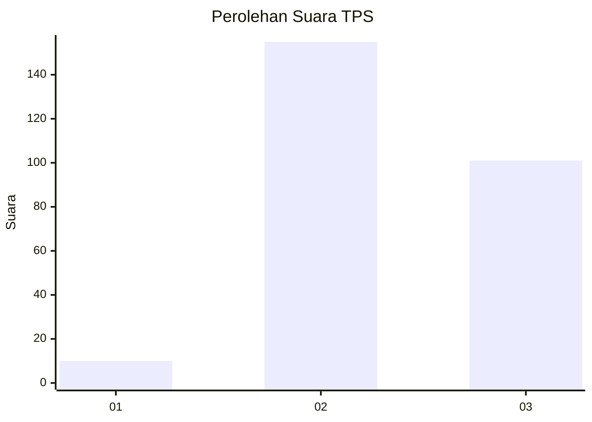
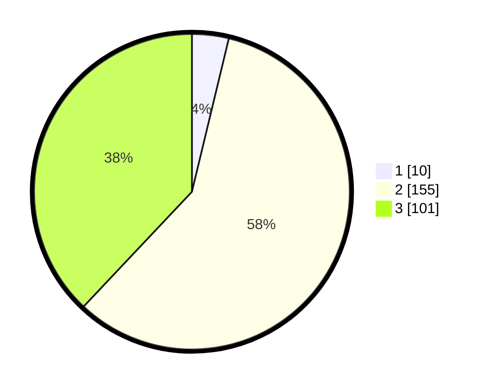

# Hasil

## Grafik

## Tabel

| No. | Nama Paslon    | Suara | Suara (raw) | Persentase |
|:--- |:-------------- | -----:| -----------:| ----------:|
| 1   | ANIES MUHAIMIN | 10    | [10][p-1]   | 3,76       |
| 2   | PRABOWO GIBRAN | 155   | [155][p-2]  | 58,27      |
| 3   | GANJAR MAHFUD  | 101   | [101][p-3]  | 37,97      |

[p-1]: https://github.com/gigit-pemilu/pemilu-2024-96-papua-barat-daya/blob/main/pilpres/hitung-suara/sub/96-papua-barat-daya/sub/71-kota-sorong/sub/01-sorong/sub/1002-klademak/sub/003-tps/sub/paslon-1.txt
[p-2]: https://github.com/gigit-pemilu/pemilu-2024-96-papua-barat-daya/blob/main/pilpres/hitung-suara/sub/96-papua-barat-daya/sub/71-kota-sorong/sub/01-sorong/sub/1002-klademak/sub/003-tps/sub/paslon-2.txt
[p-3]: https://github.com/gigit-pemilu/pemilu-2024-96-papua-barat-daya/blob/main/pilpres/hitung-suara/sub/96-papua-barat-daya/sub/71-kota-sorong/sub/01-sorong/sub/1002-klademak/sub/003-tps/sub/paslon-3.txt

## Foto C Plano

https://sirekap-obj-formc.kpu.go.id/ee36/pemilu/ppwp/96/71/01/10/02/9671011002003-20240215-183847--2eac7944-2894-4fa9-80b7-32a03fa1b95a.jpg

https://sirekap-obj-formc.kpu.go.id/ee36/pemilu/ppwp/96/71/01/10/02/9671011002003-20240215-184438--5d93d7de-0bb7-40a2-ab9c-940c35895cdf.jpg

https://sirekap-obj-formc.kpu.go.id/ee36/pemilu/ppwp/96/71/01/10/02/9671011002003-20240215-184647--cc959771-bc10-47e6-a9f0-aa6b80e507a4.jpg

## Metadata

| Key        | Value               |
| ---------- | ------------------- |
| Time Stamp | 2024-02-25 22:00:00 |

