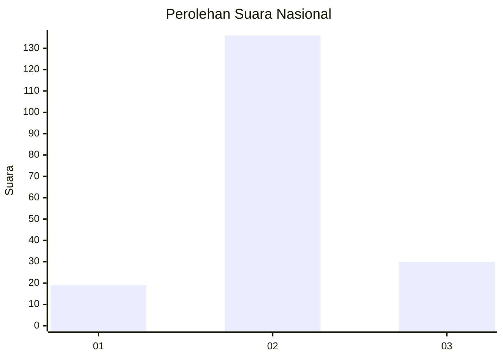
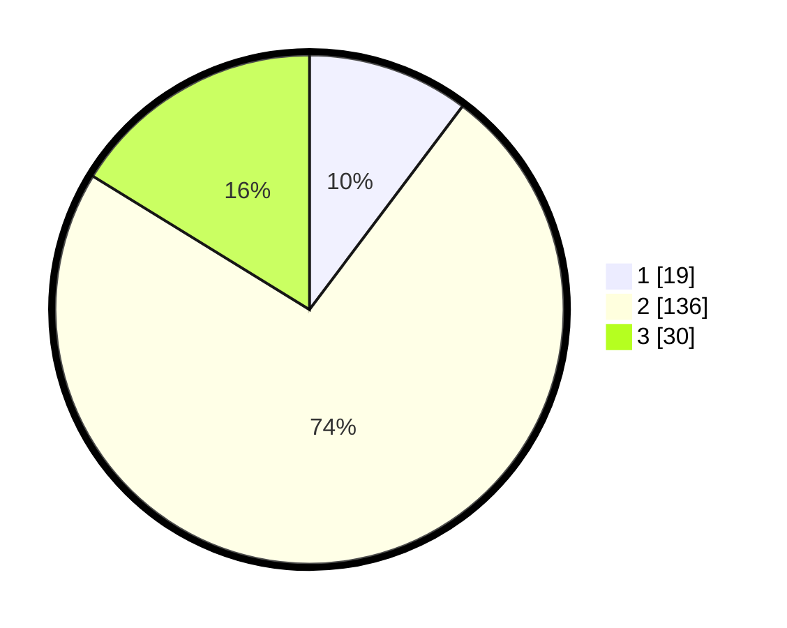

# Hasil

## Grafik

## Tabel

| No. | Nama Paslon    | Suara | Suara (raw) | Persentase |
|:--- |:-------------- | -----:| -----------:| ----------:|
| 1   | ANIES MUHAIMIN | 19    | [19][p-1]   | 10,27      |
| 2   | PRABOWO GIBRAN | 136   | [136][p-2]  | 73,51      |
| 3   | GANJAR MAHFUD  | 30    | [30][p-3]   | 16,22      |

[p-1]: https://github.com/gigit-pemilu/pemilu-2024/blob/main/pilpres/hitung-suara/sub/96-papua-barat-daya/sub/71-kota-sorong/sub/02-sorong-timur/sub/1008-klawalu/sub/007-tps/sub/paslon-1.txt
[p-2]: https://github.com/gigit-pemilu/pemilu-2024/blob/main/pilpres/hitung-suara/sub/96-papua-barat-daya/sub/71-kota-sorong/sub/02-sorong-timur/sub/1008-klawalu/sub/007-tps/sub/paslon-2.txt
[p-3]: https://github.com/gigit-pemilu/pemilu-2024/blob/main/pilpres/hitung-suara/sub/96-papua-barat-daya/sub/71-kota-sorong/sub/02-sorong-timur/sub/1008-klawalu/sub/007-tps/sub/paslon-3.txt

## Foto C Plano

https://sirekap-obj-formc.kpu.go.id/9af9/pemilu/ppwp/96/71/02/10/08/9671021008007-20240215-050517--b3808b0a-0736-47ce-b95b-a85349553931.jpg

https://sirekap-obj-formc.kpu.go.id/9af9/pemilu/ppwp/96/71/02/10/08/9671021008007-20240215-050720--502890ca-80ab-46cd-bf3b-a3c53356f9df.jpg

https://sirekap-obj-formc.kpu.go.id/9af9/pemilu/ppwp/96/71/02/10/08/9671021008007-20240215-051019--d81bcaa0-b8dc-42ef-ad12-ee26549a0321.jpg

## Metadata

| Key        | Value               |
| ---------- | ------------------- |
| Time Stamp | 2024-02-25 11:00:00 |

