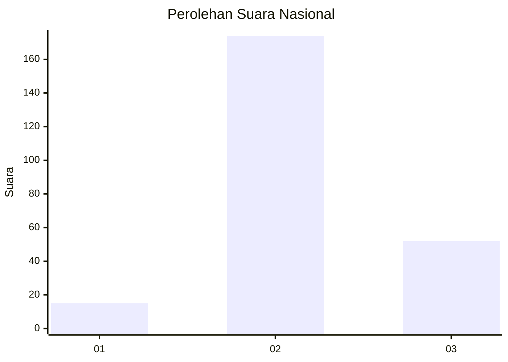

# Hasil

## Grafik

## Tabel

| No. | Nama Paslon    | Suara | Suara (raw) | Persentase |
|:--- |:-------------- | -----:| -----------:| ----------:|
| 1   | ANIES MUHAIMIN | 15    | [15][p-1]   | 6,22       |
| 2   | PRABOWO GIBRAN | 174   | [174][p-2]  | 72,20      |
| 3   | GANJAR MAHFUD  | 52    | [52][p-3]   | 21,58      |

[p-1]: https://github.com/gigit-pemilu/pemilu-2024/blob/main/pilpres/hitung-suara/sub/96-papua-barat-daya/sub/71-kota-sorong/sub/02-sorong-timur/sub/1008-klawalu/sub/015-tps/sub/paslon-1.txt
[p-2]: https://github.com/gigit-pemilu/pemilu-2024/blob/main/pilpres/hitung-suara/sub/96-papua-barat-daya/sub/71-kota-sorong/sub/02-sorong-timur/sub/1008-klawalu/sub/015-tps/sub/paslon-2.txt
[p-3]: https://github.com/gigit-pemilu/pemilu-2024/blob/main/pilpres/hitung-suara/sub/96-papua-barat-daya/sub/71-kota-sorong/sub/02-sorong-timur/sub/1008-klawalu/sub/015-tps/sub/paslon-3.txt

## Foto C Plano

https://sirekap-obj-formc.kpu.go.id/c5f4/pemilu/ppwp/96/71/02/10/08/9671021008015-20240215-125705--1c474491-3ac4-4092-80d2-c209b3e48236.jpg

https://sirekap-obj-formc.kpu.go.id/c5f4/pemilu/ppwp/96/71/02/10/08/9671021008015-20240215-125828--0b96b8c0-7182-4e7d-b6bf-b81796b2841a.jpg

https://sirekap-obj-formc.kpu.go.id/c5f4/pemilu/ppwp/96/71/02/10/08/9671021008015-20240215-125920--eb9e592f-612a-4d82-8cdc-038c4e16cdb8.jpg

## Metadata

| Key        | Value               |
| ---------- | ------------------- |
| Time Stamp | 2024-02-25 15:00:00 |

