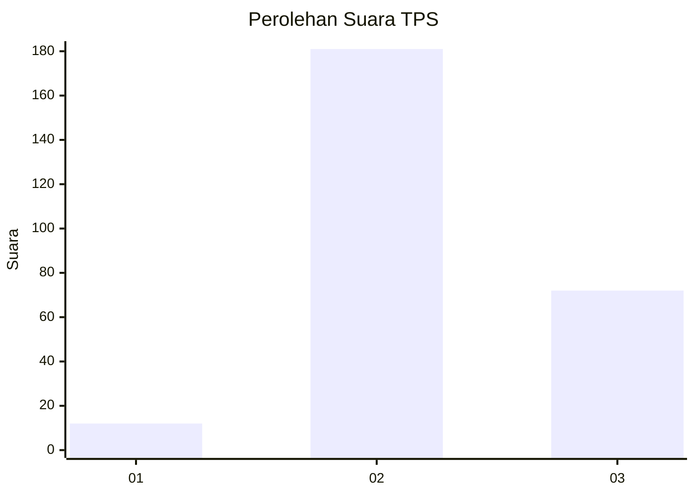

# Hasil

## Grafik

## Tabel

| No. | Nama Paslon    | Suara | Suara (raw) | Persentase |
|:--- |:-------------- | -----:| -----------:| ----------:|
| 1   | ANIES MUHAIMIN | 12    | [12][p-1]   | 4,53       |
| 2   | PRABOWO GIBRAN | 181   | [181][p-2]  | 68,30      |
| 3   | GANJAR MAHFUD  | 72    | [72][p-3]   | 27,17      |

[p-1]: https://github.com/gigit-pemilu/pemilu-2024-96-papua-barat-daya/blob/main/pilpres/hitung-suara/sub/96-papua-barat-daya/sub/71-kota-sorong/sub/02-sorong-timur/sub/1010-klamana/sub/001-tps/sub/paslon-1.txt
[p-2]: https://github.com/gigit-pemilu/pemilu-2024-96-papua-barat-daya/blob/main/pilpres/hitung-suara/sub/96-papua-barat-daya/sub/71-kota-sorong/sub/02-sorong-timur/sub/1010-klamana/sub/001-tps/sub/paslon-2.txt
[p-3]: https://github.com/gigit-pemilu/pemilu-2024-96-papua-barat-daya/blob/main/pilpres/hitung-suara/sub/96-papua-barat-daya/sub/71-kota-sorong/sub/02-sorong-timur/sub/1010-klamana/sub/001-tps/sub/paslon-3.txt

## Foto C Plano

https://sirekap-obj-formc.kpu.go.id/77a1/pemilu/ppwp/96/71/02/10/10/9671021010001-20240215-111935--cbc78d71-f1a4-4f1b-86e2-8984398f4852.jpg

https://sirekap-obj-formc.kpu.go.id/77a1/pemilu/ppwp/96/71/02/10/10/9671021010001-20240215-112027--01cf4416-bf4c-4e11-98fe-67dd2839813a.jpg

https://sirekap-obj-formc.kpu.go.id/77a1/pemilu/ppwp/96/71/02/10/10/9671021010001-20240215-112129--4304ec01-5608-4aa8-9141-8d0ba25f3976.jpg

## Metadata

| Key        | Value               |
| ---------- | ------------------- |
| Time Stamp | 2024-02-25 21:00:00 |

