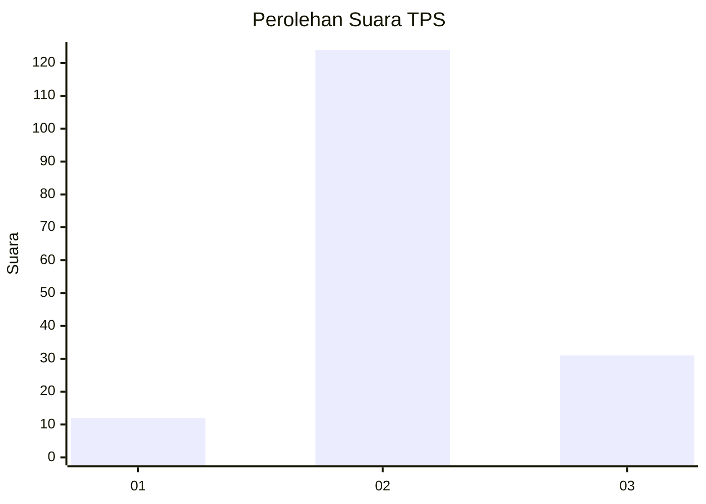
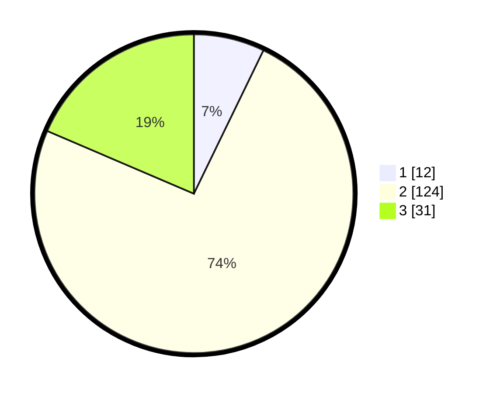

# Hasil

## Grafik

## Tabel

| No. | Nama Paslon    | Suara | Suara (raw) | Persentase |
|:--- |:-------------- | -----:| -----------:| ----------:|
| 1   | ANIES MUHAIMIN | 12    | [12][p-1]   | 7,19       |
| 2   | PRABOWO GIBRAN | 124   | [124][p-2]  | 74,25      |
| 3   | GANJAR MAHFUD  | 31    | [31][p-3]   | 18,56      |

[p-1]: https://github.com/gigit-pemilu/pemilu-2024-96-papua-barat-daya/blob/main/pilpres/hitung-suara/sub/96-papua-barat-daya/sub/71-kota-sorong/sub/02-sorong-timur/sub/1010-klamana/sub/003-tps/sub/paslon-1.txt
[p-2]: https://github.com/gigit-pemilu/pemilu-2024-96-papua-barat-daya/blob/main/pilpres/hitung-suara/sub/96-papua-barat-daya/sub/71-kota-sorong/sub/02-sorong-timur/sub/1010-klamana/sub/003-tps/sub/paslon-2.txt
[p-3]: https://github.com/gigit-pemilu/pemilu-2024-96-papua-barat-daya/blob/main/pilpres/hitung-suara/sub/96-papua-barat-daya/sub/71-kota-sorong/sub/02-sorong-timur/sub/1010-klamana/sub/003-tps/sub/paslon-3.txt

## Foto C Plano

https://sirekap-obj-formc.kpu.go.id/3d8b/pemilu/ppwp/96/71/02/10/10/9671021010003-20240215-020604--4c32d088-439c-40bd-b53d-8c6d7efe30a0.jpg

https://sirekap-obj-formc.kpu.go.id/3d8b/pemilu/ppwp/96/71/02/10/10/9671021010003-20240215-000032--b41f500a-90e2-4962-be9e-9c42538674d3.jpg

https://sirekap-obj-formc.kpu.go.id/3d8b/pemilu/ppwp/96/71/02/10/10/9671021010003-20240215-001619--f96cbe45-881a-4139-82fa-93742a325b91.jpg

## Metadata

| Key        | Value               |
| ---------- | ------------------- |
| Time Stamp | 2024-02-25 17:00:00 |

