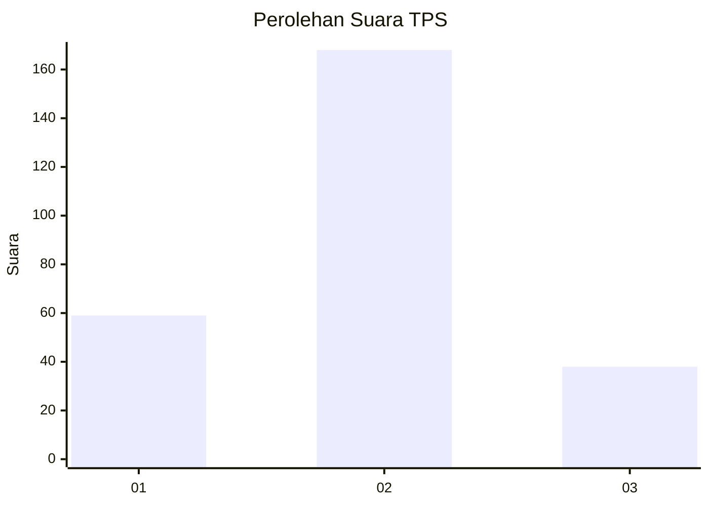
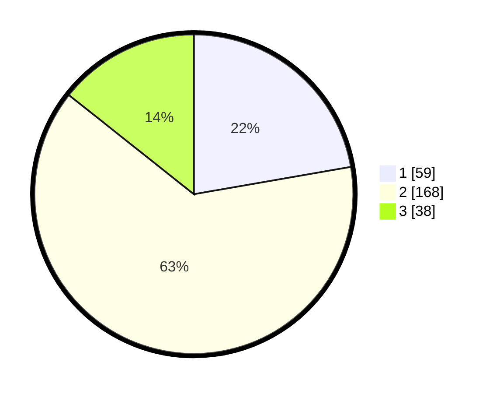

# Hasil

## Grafik

## Tabel

| No. | Nama Paslon    | Suara | Suara (raw) | Persentase |
|:--- |:-------------- | -----:| -----------:| ----------:|
| 1   | ANIES MUHAIMIN | 59    | [59][p-1]   | 22,26      |
| 2   | PRABOWO GIBRAN | 168   | [168][p-2]  | 63,40      |
| 3   | GANJAR MAHFUD  | 38    | [38][p-3]   | 14,34      |

[p-1]: https://github.com/gigit-pemilu/pemilu-2024-96-papua-barat-daya/blob/main/pilpres/hitung-suara/sub/96-papua-barat-daya/sub/71-kota-sorong/sub/02-sorong-timur/sub/1011-klawuyuk/sub/003-tps/sub/paslon-1.txt
[p-2]: https://github.com/gigit-pemilu/pemilu-2024-96-papua-barat-daya/blob/main/pilpres/hitung-suara/sub/96-papua-barat-daya/sub/71-kota-sorong/sub/02-sorong-timur/sub/1011-klawuyuk/sub/003-tps/sub/paslon-2.txt
[p-3]: https://github.com/gigit-pemilu/pemilu-2024-96-papua-barat-daya/blob/main/pilpres/hitung-suara/sub/96-papua-barat-daya/sub/71-kota-sorong/sub/02-sorong-timur/sub/1011-klawuyuk/sub/003-tps/sub/paslon-3.txt

## Foto C Plano

https://sirekap-obj-formc.kpu.go.id/e17e/pemilu/ppwp/96/71/02/10/11/9671021011003-20240215-085959--edf0eb73-47f4-40b6-ad47-8a2259775df7.jpg

https://sirekap-obj-formc.kpu.go.id/e17e/pemilu/ppwp/96/71/02/10/11/9671021011003-20240215-090124--69114b03-ff48-4e44-a505-35bc517f5a3a.jpg

https://sirekap-obj-formc.kpu.go.id/e17e/pemilu/ppwp/96/71/02/10/11/9671021011003-20240215-090226--38d0150d-b2c4-44d4-84e1-e1047797cbd5.jpg

## Metadata

| Key        | Value               |
| ---------- | ------------------- |
| Time Stamp | 2024-02-24 22:31:28 |

