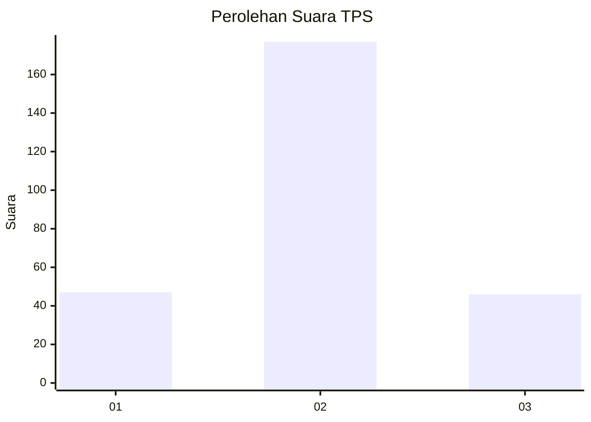
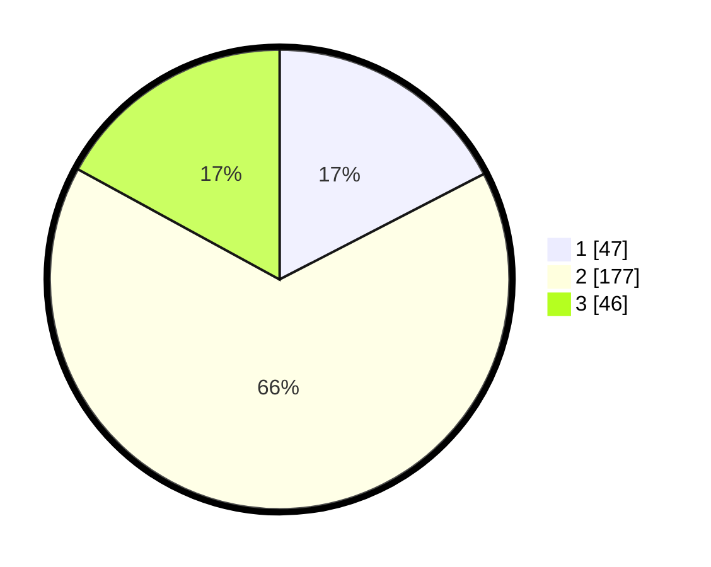

# Hasil

## Grafik

## Tabel

| No. | Nama Paslon    | Suara | Suara (raw) | Persentase |
|:--- |:-------------- | -----:| -----------:| ----------:|
| 1   | ANIES MUHAIMIN | 47    | [47][p-1]   | 17,41      |
| 2   | PRABOWO GIBRAN | 177   | [177][p-2]  | 65,56      |
| 3   | GANJAR MAHFUD  | 46    | [46][p-3]   | 17,04      |

[p-1]: https://github.com/gigit-pemilu/pemilu-2024-96-papua-barat-daya/blob/main/pilpres/hitung-suara/sub/96-papua-barat-daya/sub/71-kota-sorong/sub/02-sorong-timur/sub/1013-kladufu/sub/018-tps/sub/paslon-1.txt
[p-2]: https://github.com/gigit-pemilu/pemilu-2024-96-papua-barat-daya/blob/main/pilpres/hitung-suara/sub/96-papua-barat-daya/sub/71-kota-sorong/sub/02-sorong-timur/sub/1013-kladufu/sub/018-tps/sub/paslon-2.txt
[p-3]: https://github.com/gigit-pemilu/pemilu-2024-96-papua-barat-daya/blob/main/pilpres/hitung-suara/sub/96-papua-barat-daya/sub/71-kota-sorong/sub/02-sorong-timur/sub/1013-kladufu/sub/018-tps/sub/paslon-3.txt

## Foto C Plano

https://sirekap-obj-formc.kpu.go.id/a96c/pemilu/ppwp/96/71/02/10/13/9671021013018-20240215-015413--7ec91f40-e07c-4299-9dcc-58ca21762094.jpg

https://sirekap-obj-formc.kpu.go.id/a96c/pemilu/ppwp/96/71/02/10/13/9671021013018-20240215-044937--6b567383-ab9f-474d-be50-902735a6c9d8.jpg

https://sirekap-obj-formc.kpu.go.id/a96c/pemilu/ppwp/96/71/02/10/13/9671021013018-20240215-051613--65d01dbf-2d63-499a-99aa-b5f8cf1f5153.jpg

## Metadata

| Key        | Value               |
| ---------- | ------------------- |
| Time Stamp | 2024-02-15 21:01:18 |

