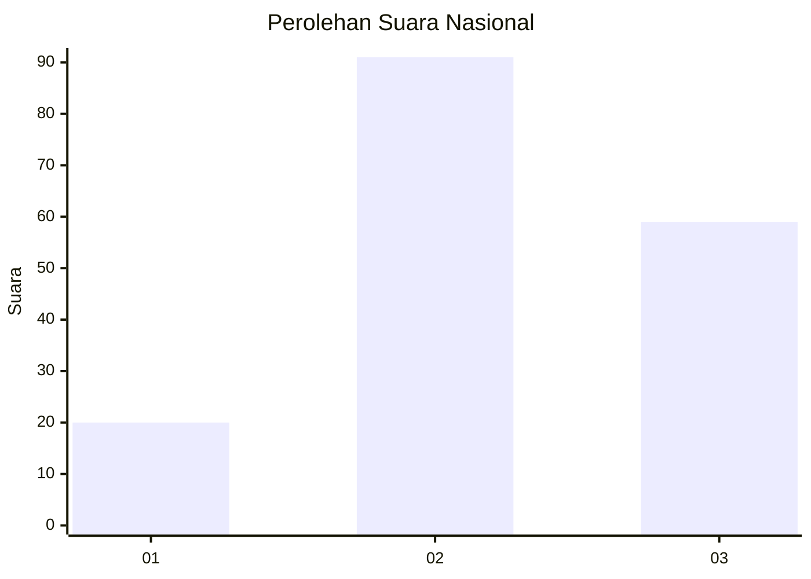
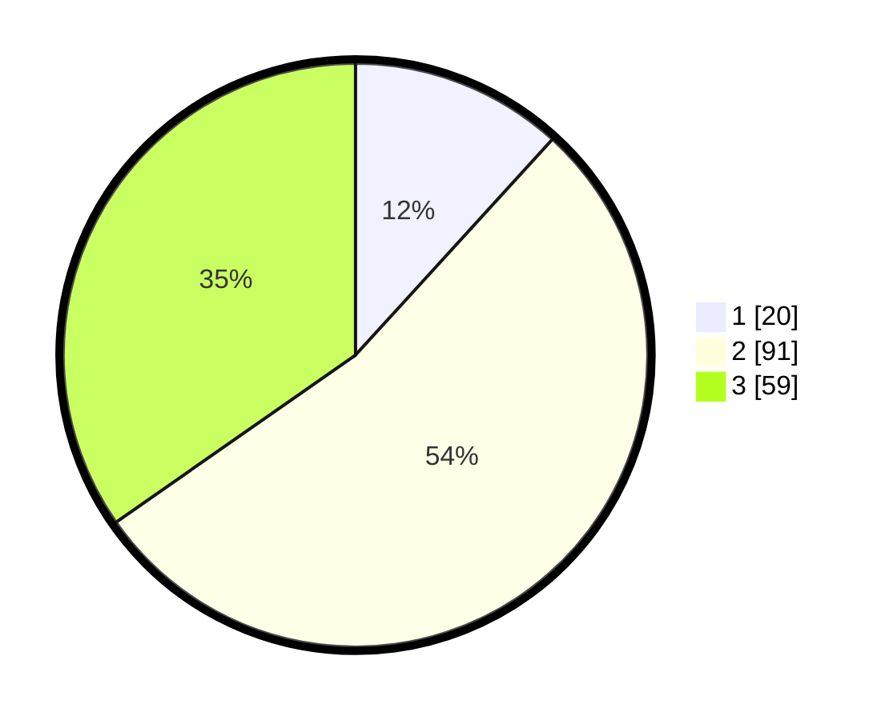

# Hasil

## Grafik

## Tabel

| No. | Nama Paslon    | Suara | Suara (raw) | Persentase |
|:--- |:-------------- | -----:| -----------:| ----------:|
| 1   | ANIES MUHAIMIN | 20    | [20][p-1]   | 11,76      |
| 2   | PRABOWO GIBRAN | 91    | [91][p-2]   | 53,53      |
| 3   | GANJAR MAHFUD  | 59    | [59][p-3]   | 34,71      |

[p-1]: https://github.com/gigit-pemilu/pemilu-2024/blob/main/pilpres/hitung-suara/sub/96-papua-barat-daya/sub/71-kota-sorong/sub/04-sorong-kepulauan/sub/1001-dum-barat/sub/005-tps/sub/paslon-1.txt
[p-2]: https://github.com/gigit-pemilu/pemilu-2024/blob/main/pilpres/hitung-suara/sub/96-papua-barat-daya/sub/71-kota-sorong/sub/04-sorong-kepulauan/sub/1001-dum-barat/sub/005-tps/sub/paslon-2.txt
[p-3]: https://github.com/gigit-pemilu/pemilu-2024/blob/main/pilpres/hitung-suara/sub/96-papua-barat-daya/sub/71-kota-sorong/sub/04-sorong-kepulauan/sub/1001-dum-barat/sub/005-tps/sub/paslon-3.txt

## Foto C Plano

https://sirekap-obj-formc.kpu.go.id/cb17/pemilu/ppwp/96/71/04/10/01/9671041001005-20240215-092505--5c102b72-fba2-419f-ae07-c23c871719af.jpg

https://sirekap-obj-formc.kpu.go.id/cb17/pemilu/ppwp/96/71/04/10/01/9671041001005-20240215-092909--84422377-ec51-43e8-8f89-39c0b48ff934.jpg

https://sirekap-obj-formc.kpu.go.id/cb17/pemilu/ppwp/96/71/04/10/01/9671041001005-20240215-093146--e53f9dd3-55f0-4594-b61e-c32dad45e227.jpg

## Metadata

| Key        | Value               |
| ---------- | ------------------- |
| Time Stamp | 2024-02-25 00:00:00 |

