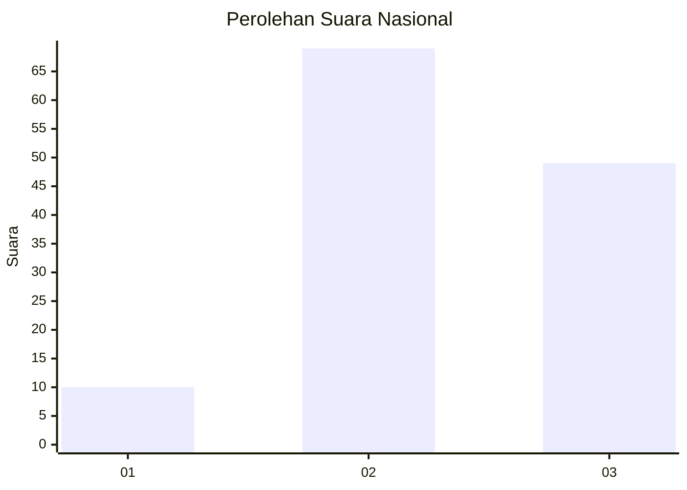
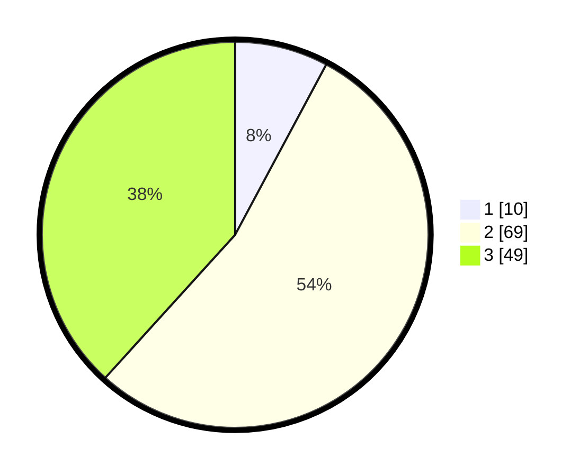

# Hasil

## Grafik

## Tabel

| No. | Nama Paslon    | Suara | Suara (raw) | Persentase |
|:--- |:-------------- | -----:| -----------:| ----------:|
| 1   | ANIES MUHAIMIN | 10    | [10][p-1]   | 7,81       |
| 2   | PRABOWO GIBRAN | 69    | [69][p-2]   | 53,91      |
| 3   | GANJAR MAHFUD  | 49    | [49][p-3]   | 38,28      |

[p-1]: https://github.com/gigit-pemilu/pemilu-2024/blob/main/pilpres/hitung-suara/sub/96-papua-barat-daya/sub/71-kota-sorong/sub/04-sorong-kepulauan/sub/1001-dum-barat/sub/010-tps/sub/paslon-1.txt
[p-2]: https://github.com/gigit-pemilu/pemilu-2024/blob/main/pilpres/hitung-suara/sub/96-papua-barat-daya/sub/71-kota-sorong/sub/04-sorong-kepulauan/sub/1001-dum-barat/sub/010-tps/sub/paslon-2.txt
[p-3]: https://github.com/gigit-pemilu/pemilu-2024/blob/main/pilpres/hitung-suara/sub/96-papua-barat-daya/sub/71-kota-sorong/sub/04-sorong-kepulauan/sub/1001-dum-barat/sub/010-tps/sub/paslon-3.txt

## Foto C Plano

https://sirekap-obj-formc.kpu.go.id/e4c0/pemilu/ppwp/96/71/04/10/01/9671041001010-20240215-073049--9dca261c-6141-41fe-9809-f6cb9e137a0e.jpg

https://sirekap-obj-formc.kpu.go.id/e4c0/pemilu/ppwp/96/71/04/10/01/9671041001010-20240215-073310--853b5e64-a6e9-4aae-b68d-d0cbd949472f.jpg

https://sirekap-obj-formc.kpu.go.id/e4c0/pemilu/ppwp/96/71/04/10/01/9671041001010-20240215-073413--0415c262-8f61-43ad-8158-35b999e71a4a.jpg

## Metadata

| Key        | Value               |
| ---------- | ------------------- |
| Time Stamp | 2024-02-24 22:31:28 |

