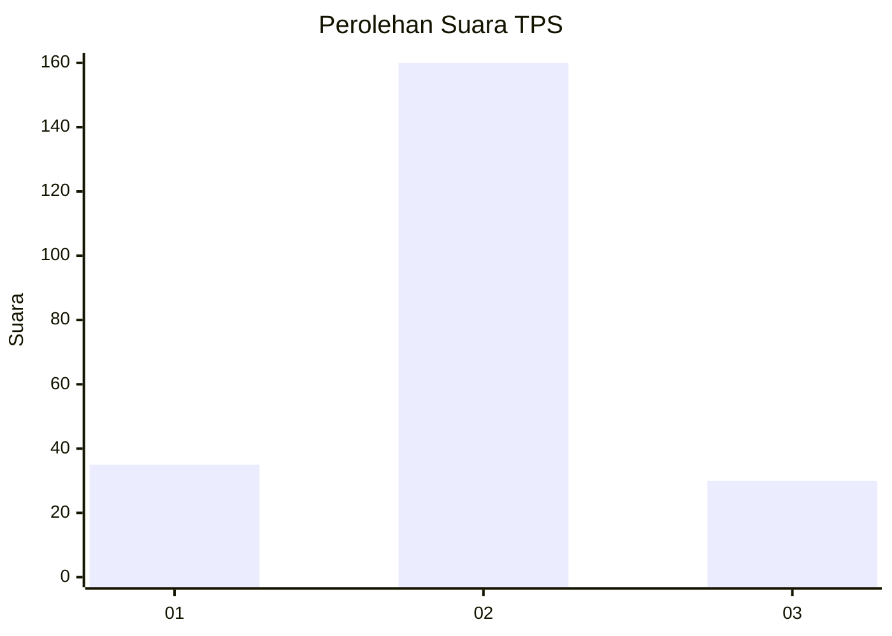
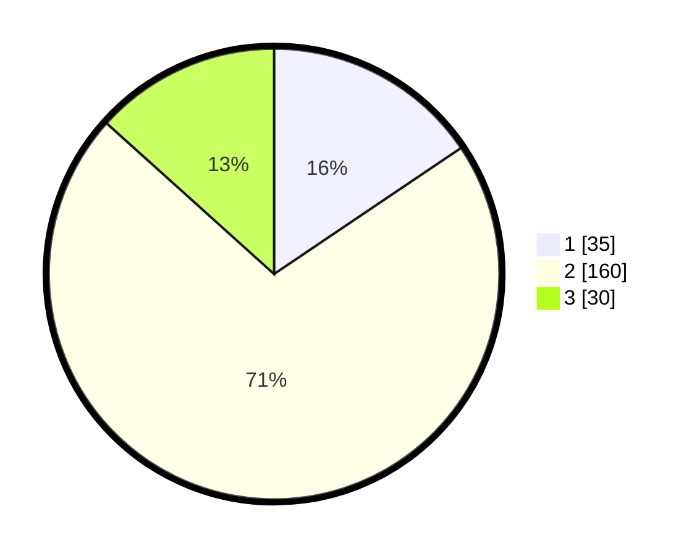

# Hasil

## Grafik

## Tabel

| No. | Nama Paslon    | Suara | Suara (raw) | Persentase |
|:--- |:-------------- | -----:| -----------:| ----------:|
| 1   | ANIES MUHAIMIN | 35    | [35][p-1]   | 15,56      |
| 2   | PRABOWO GIBRAN | 160   | [160][p-2]  | 71,11      |
| 3   | GANJAR MAHFUD  | 30    | [30][p-3]   | 13,33      |

[p-1]: https://github.com/gigit-pemilu/pemilu-2024-96-papua-barat-daya/blob/main/pilpres/hitung-suara/sub/96-papua-barat-daya/sub/71-kota-sorong/sub/05-sorong-utara/sub/1002-malanu/sub/003-tps/sub/paslon-1.txt
[p-2]: https://github.com/gigit-pemilu/pemilu-2024-96-papua-barat-daya/blob/main/pilpres/hitung-suara/sub/96-papua-barat-daya/sub/71-kota-sorong/sub/05-sorong-utara/sub/1002-malanu/sub/003-tps/sub/paslon-2.txt
[p-3]: https://github.com/gigit-pemilu/pemilu-2024-96-papua-barat-daya/blob/main/pilpres/hitung-suara/sub/96-papua-barat-daya/sub/71-kota-sorong/sub/05-sorong-utara/sub/1002-malanu/sub/003-tps/sub/paslon-3.txt

## Foto C Plano

https://sirekap-obj-formc.kpu.go.id/89a0/pemilu/ppwp/96/71/05/10/02/9671051002003-20240215-200113--d7bab3d2-77dd-4656-972d-88d5715cc51f.jpg

https://sirekap-obj-formc.kpu.go.id/89a0/pemilu/ppwp/96/71/05/10/02/9671051002003-20240215-200130--bafba0d9-e2b5-4ad6-bdfb-a0a9c68855a2.jpg

https://sirekap-obj-formc.kpu.go.id/89a0/pemilu/ppwp/96/71/05/10/02/9671051002003-20240215-200140--e42cced7-65f2-41a3-add0-7c809a1931d7.jpg

## Metadata

| Key        | Value               |
| ---------- | ------------------- |
| Time Stamp | 2024-02-25 18:00:00 |

