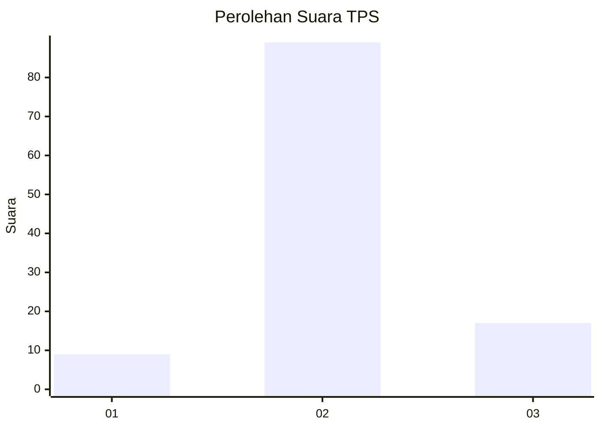

# Hasil

## Grafik

## Tabel

| No. | Nama Paslon    | Suara | Suara (raw) | Persentase |
|:--- |:-------------- | -----:| -----------:| ----------:|
| 1   | ANIES MUHAIMIN | 9     | [9][p-1]    | 7,83       |
| 2   | PRABOWO GIBRAN | 89    | [89][p-2]   | 77,39      |
| 3   | GANJAR MAHFUD  | 17    | [17][p-3]   | 14,78      |

[p-1]: https://github.com/gigit-pemilu/pemilu-2024-96-papua-barat-daya/blob/main/pilpres/hitung-suara/sub/96-papua-barat-daya/sub/71-kota-sorong/sub/05-sorong-utara/sub/1002-malanu/sub/005-tps/sub/paslon-1.txt
[p-2]: https://github.com/gigit-pemilu/pemilu-2024-96-papua-barat-daya/blob/main/pilpres/hitung-suara/sub/96-papua-barat-daya/sub/71-kota-sorong/sub/05-sorong-utara/sub/1002-malanu/sub/005-tps/sub/paslon-2.txt
[p-3]: https://github.com/gigit-pemilu/pemilu-2024-96-papua-barat-daya/blob/main/pilpres/hitung-suara/sub/96-papua-barat-daya/sub/71-kota-sorong/sub/05-sorong-utara/sub/1002-malanu/sub/005-tps/sub/paslon-3.txt

## Foto C Plano

https://sirekap-obj-formc.kpu.go.id/54ed/pemilu/ppwp/96/71/05/10/02/9671051002005-20240215-120610--6222c7e1-eae8-4d4d-a50f-233d0292be9b.jpg

https://sirekap-obj-formc.kpu.go.id/54ed/pemilu/ppwp/96/71/05/10/02/9671051002005-20240215-120743--fbdd7b7b-dbe5-4e37-9f50-adcb1d6d66fc.jpg

https://sirekap-obj-formc.kpu.go.id/54ed/pemilu/ppwp/96/71/05/10/02/9671051002005-20240215-120839--2e54acdb-e761-4ed2-b94b-6928247db99f.jpg

## Metadata

| Key        | Value               |
| ---------- | ------------------- |
| Time Stamp | 2024-02-24 22:31:28 |

