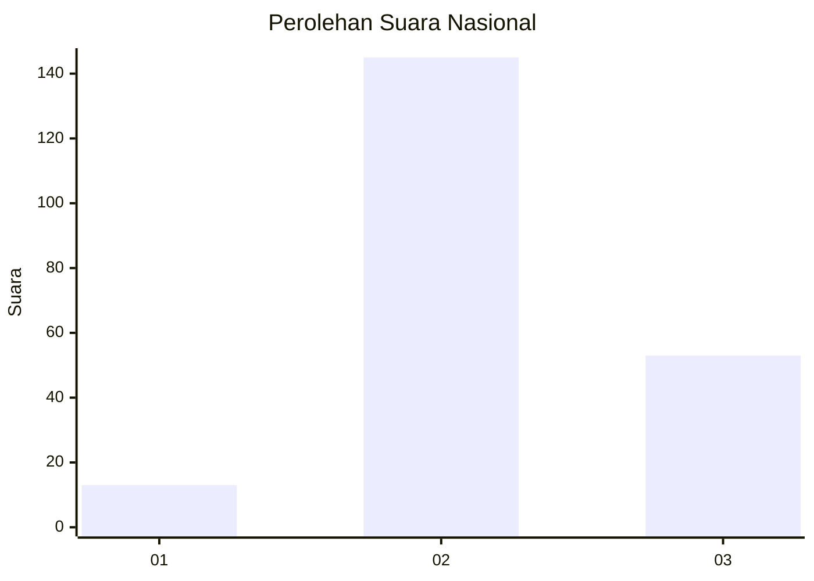
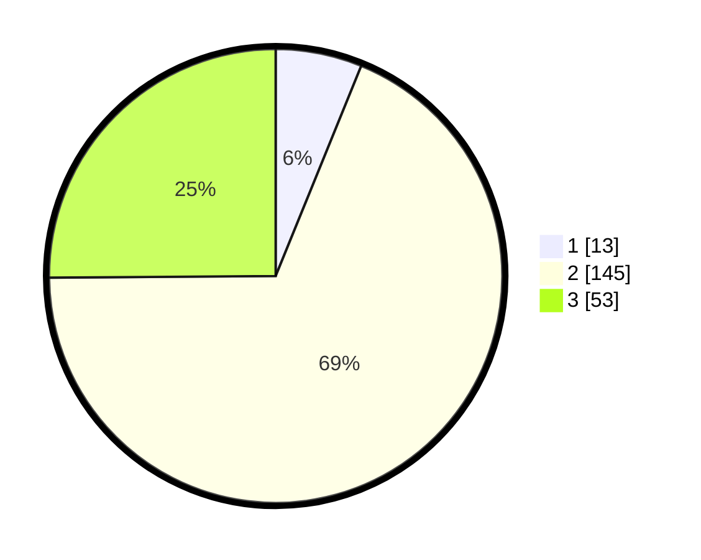

# Hasil

## Grafik

## Tabel

| No. | Nama Paslon    | Suara | Suara (raw) | Persentase |
|:--- |:-------------- | -----:| -----------:| ----------:|
| 1   | ANIES MUHAIMIN | 13    | [13][p-1]   | 6,16       |
| 2   | PRABOWO GIBRAN | 145   | [145][p-2]  | 68,72      |
| 3   | GANJAR MAHFUD  | 53    | [53][p-3]   | 25,12      |

[p-1]: https://github.com/gigit-pemilu/pemilu-2024/blob/main/pilpres/hitung-suara/sub/96-papua-barat-daya/sub/71-kota-sorong/sub/05-sorong-utara/sub/1002-malanu/sub/011-tps/sub/paslon-1.txt
[p-2]: https://github.com/gigit-pemilu/pemilu-2024/blob/main/pilpres/hitung-suara/sub/96-papua-barat-daya/sub/71-kota-sorong/sub/05-sorong-utara/sub/1002-malanu/sub/011-tps/sub/paslon-2.txt
[p-3]: https://github.com/gigit-pemilu/pemilu-2024/blob/main/pilpres/hitung-suara/sub/96-papua-barat-daya/sub/71-kota-sorong/sub/05-sorong-utara/sub/1002-malanu/sub/011-tps/sub/paslon-3.txt

## Foto C Plano

https://sirekap-obj-formc.kpu.go.id/c1ce/pemilu/ppwp/96/71/05/10/02/9671051002011-20240215-122855--46090068-f242-4e15-a4c1-187b1d878902.jpg

https://sirekap-obj-formc.kpu.go.id/c1ce/pemilu/ppwp/96/71/05/10/02/9671051002011-20240215-123225--af9b439f-890e-462d-a2ae-47619eebc63d.jpg

https://sirekap-obj-formc.kpu.go.id/c1ce/pemilu/ppwp/96/71/05/10/02/9671051002011-20240215-123335--e4583ba0-fff3-42d8-a1f2-67f79b6fb652.jpg

## Metadata

| Key        | Value               |
| ---------- | ------------------- |
| Time Stamp | 2024-02-25 14:00:00 |

