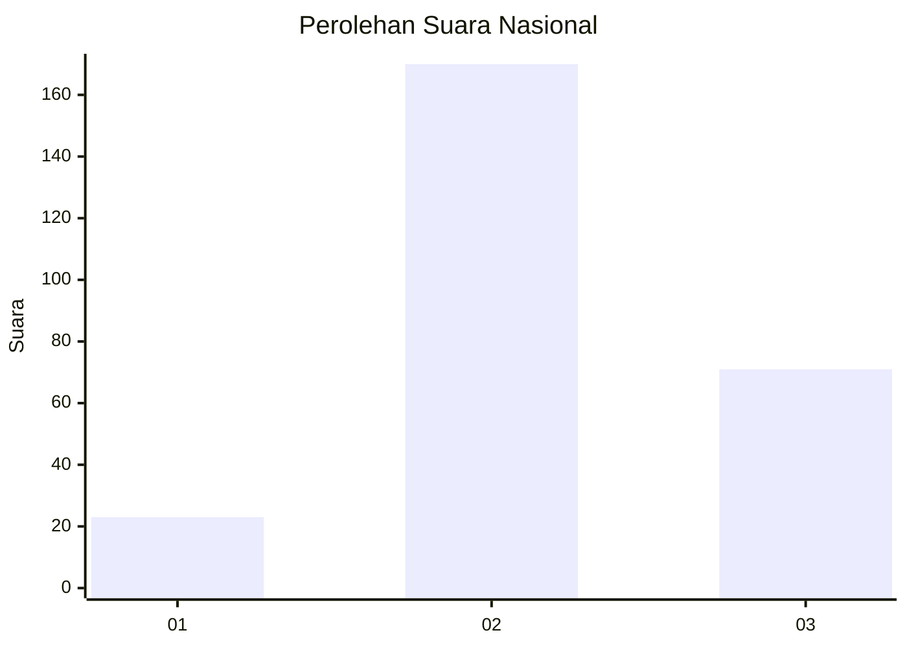
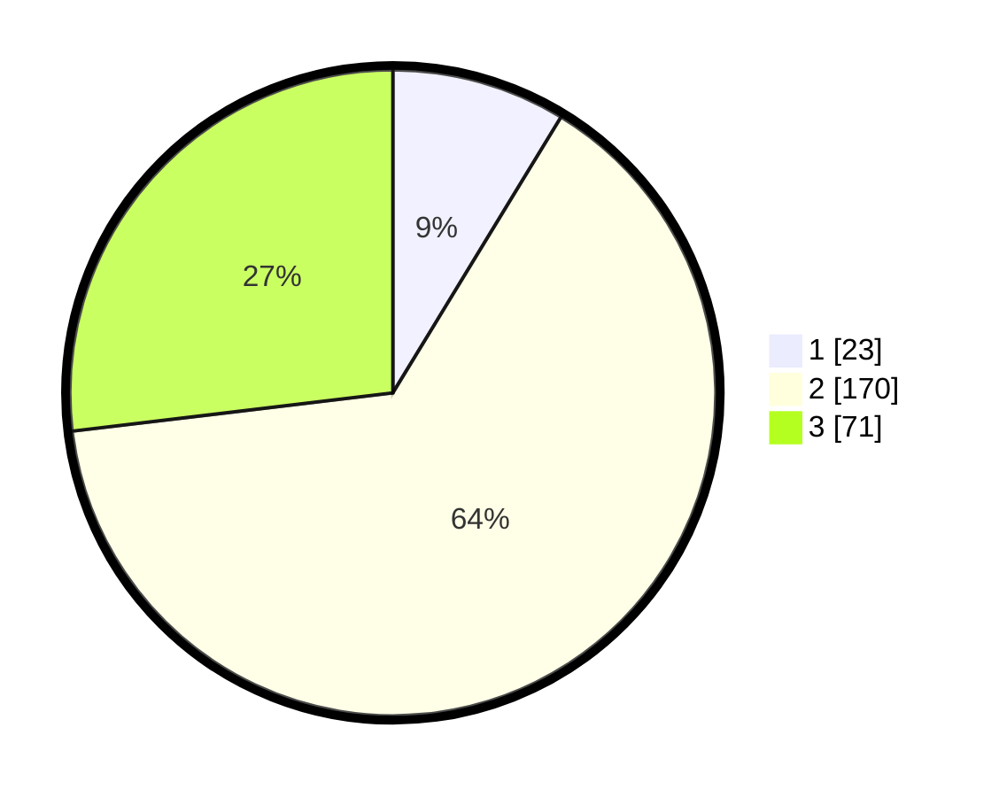

# Hasil

## Grafik

## Tabel

| No. | Nama Paslon    | Suara | Suara (raw) | Persentase |
|:--- |:-------------- | -----:| -----------:| ----------:|
| 1   | ANIES MUHAIMIN | 23    | [23][p-1]   | 8,71       |
| 2   | PRABOWO GIBRAN | 170   | [170][p-2]  | 64,39      |
| 3   | GANJAR MAHFUD  | 71    | [71][p-3]   | 26,89      |

[p-1]: https://github.com/gigit-pemilu/pemilu-2024/blob/main/pilpres/hitung-suara/sub/96-papua-barat-daya/sub/71-kota-sorong/sub/05-sorong-utara/sub/1007-malasilen/sub/008-tps/sub/paslon-1.txt
[p-2]: https://github.com/gigit-pemilu/pemilu-2024/blob/main/pilpres/hitung-suara/sub/96-papua-barat-daya/sub/71-kota-sorong/sub/05-sorong-utara/sub/1007-malasilen/sub/008-tps/sub/paslon-2.txt
[p-3]: https://github.com/gigit-pemilu/pemilu-2024/blob/main/pilpres/hitung-suara/sub/96-papua-barat-daya/sub/71-kota-sorong/sub/05-sorong-utara/sub/1007-malasilen/sub/008-tps/sub/paslon-3.txt

## Foto C Plano

https://sirekap-obj-formc.kpu.go.id/3c30/pemilu/ppwp/96/71/05/10/07/9671051007008-20240215-084537--fa4ab626-7cf3-4fa5-b4b4-5b123582bc33.jpg

https://sirekap-obj-formc.kpu.go.id/3c30/pemilu/ppwp/96/71/05/10/07/9671051007008-20240215-084659--2fbf63e4-df97-404d-9702-cd72b8e84d4c.jpg

https://sirekap-obj-formc.kpu.go.id/3c30/pemilu/ppwp/96/71/05/10/07/9671051007008-20240215-085033--c4beaaea-08b6-40c7-81b7-03dc18840f66.jpg

## Metadata

| Key        | Value               |
| ---------- | ------------------- |
| Time Stamp | 2024-02-25 12:00:00 |

