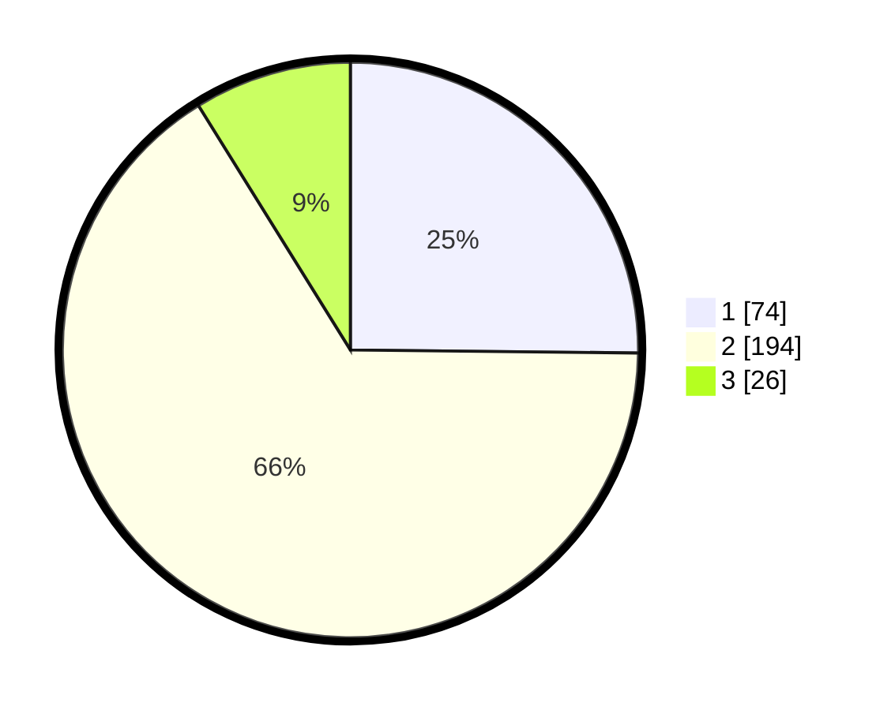

# Hasil

## Grafik

## Tabel

| No. | Nama Paslon    | Suara | Suara (raw) | Persentase |
|:--- |:-------------- | -----:| -----------:| ----------:|
| 1   | ANIES MUHAIMIN | 74    | [74][p-1]   | 25,17      |
| 2   | PRABOWO GIBRAN | 194   | [194][p-2]  | 65,99      |
| 3   | GANJAR MAHFUD  | 26    | [26][p-3]   | 8,84       |

[p-1]: https://github.com/gigit-pemilu/pemilu-2024-96-papua-barat-daya/blob/main/pilpres/hitung-suara/sub/96-papua-barat-daya/sub/71-kota-sorong/sub/05-sorong-utara/sub/1010-matalamagi/sub/018-tps/sub/paslon-1.txt
[p-2]: https://github.com/gigit-pemilu/pemilu-2024-96-papua-barat-daya/blob/main/pilpres/hitung-suara/sub/96-papua-barat-daya/sub/71-kota-sorong/sub/05-sorong-utara/sub/1010-matalamagi/sub/018-tps/sub/paslon-2.txt
[p-3]: https://github.com/gigit-pemilu/pemilu-2024-96-papua-barat-daya/blob/main/pilpres/hitung-suara/sub/96-papua-barat-daya/sub/71-kota-sorong/sub/05-sorong-utara/sub/1010-matalamagi/sub/018-tps/sub/paslon-3.txt

## Foto C Plano

https://sirekap-obj-formc.kpu.go.id/52d1/pemilu/ppwp/96/71/05/10/10/9671051010018-20240214-223335--8e61a22c-8557-4733-b470-a38bfd59d105.jpg

https://sirekap-obj-formc.kpu.go.id/52d1/pemilu/ppwp/96/71/05/10/10/9671051010018-20240215-010130--056cf266-9ec7-45ef-b64d-6faa44192c59.jpg

https://sirekap-obj-formc.kpu.go.id/52d1/pemilu/ppwp/96/71/05/10/10/9671051010018-20240215-010249--db917685-75af-479a-ab69-cf6dad24af96.jpg

## Metadata

| Key        | Value               |
| ---------- | ------------------- |
| Time Stamp | 2024-02-25 13:00:00 |

