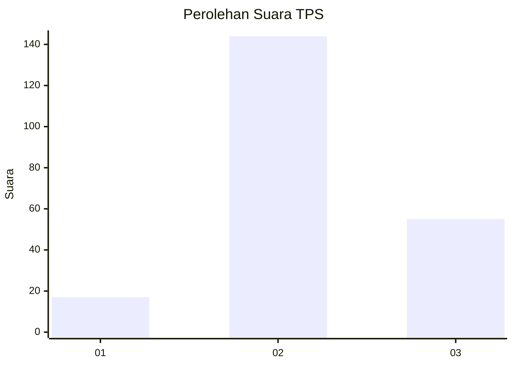
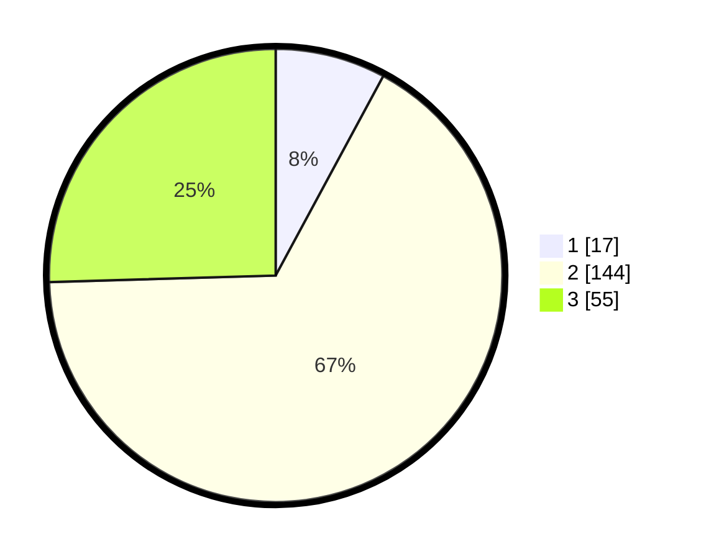

# Hasil

## Grafik

## Tabel

| No. | Nama Paslon    | Suara | Suara (raw) | Persentase |
|:--- |:-------------- | -----:| -----------:| ----------:|
| 1   | ANIES MUHAIMIN | 17    | [17][p-1]   | 7,87       |
| 2   | PRABOWO GIBRAN | 144   | [144][p-2]  | 66,67      |
| 3   | GANJAR MAHFUD  | 55    | [55][p-3]   | 25,46      |

[p-1]: https://github.com/gigit-pemilu/pemilu-2024-96-papua-barat-daya/blob/main/pilpres/hitung-suara/sub/96-papua-barat-daya/sub/71-kota-sorong/sub/06-sorong-manoi/sub/1001-klaligi/sub/001-tps/sub/paslon-1.txt
[p-2]: https://github.com/gigit-pemilu/pemilu-2024-96-papua-barat-daya/blob/main/pilpres/hitung-suara/sub/96-papua-barat-daya/sub/71-kota-sorong/sub/06-sorong-manoi/sub/1001-klaligi/sub/001-tps/sub/paslon-2.txt
[p-3]: https://github.com/gigit-pemilu/pemilu-2024-96-papua-barat-daya/blob/main/pilpres/hitung-suara/sub/96-papua-barat-daya/sub/71-kota-sorong/sub/06-sorong-manoi/sub/1001-klaligi/sub/001-tps/sub/paslon-3.txt

## Foto C Plano

https://sirekap-obj-formc.kpu.go.id/c739/pemilu/ppwp/96/71/06/10/01/9671061001001-20240215-092422--7a4bf802-a820-4cf4-a987-d42013386c06.jpg

https://sirekap-obj-formc.kpu.go.id/c739/pemilu/ppwp/96/71/06/10/01/9671061001001-20240215-092633--ec617fc3-9965-408f-80df-bd4a69fd8c99.jpg

https://sirekap-obj-formc.kpu.go.id/c739/pemilu/ppwp/96/71/06/10/01/9671061001001-20240215-092917--1bba963f-a832-446e-a57a-20d86e19e0f9.jpg

## Metadata

| Key        | Value               |
| ---------- | ------------------- |
| Time Stamp | 2024-02-24 22:31:28 |

