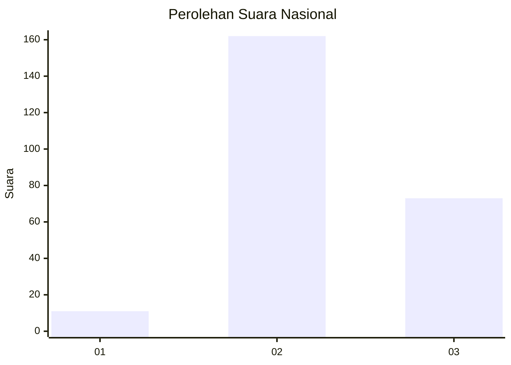

# Hasil

## Grafik

## Tabel

| No. | Nama Paslon    | Suara | Suara (raw) | Persentase |
|:--- |:-------------- | -----:| -----------:| ----------:|
| 1   | ANIES MUHAIMIN | 11    | [11][p-1]   | 4,47       |
| 2   | PRABOWO GIBRAN | 162   | [162][p-2]  | 65,85      |
| 3   | GANJAR MAHFUD  | 73    | [73][p-3]   | 29,67      |

[p-1]: https://github.com/gigit-pemilu/pemilu-2024/blob/main/pilpres/hitung-suara/sub/96-papua-barat-daya/sub/71-kota-sorong/sub/06-sorong-manoi/sub/1001-klaligi/sub/004-tps/sub/paslon-1.txt
[p-2]: https://github.com/gigit-pemilu/pemilu-2024/blob/main/pilpres/hitung-suara/sub/96-papua-barat-daya/sub/71-kota-sorong/sub/06-sorong-manoi/sub/1001-klaligi/sub/004-tps/sub/paslon-2.txt
[p-3]: https://github.com/gigit-pemilu/pemilu-2024/blob/main/pilpres/hitung-suara/sub/96-papua-barat-daya/sub/71-kota-sorong/sub/06-sorong-manoi/sub/1001-klaligi/sub/004-tps/sub/paslon-3.txt

## Foto C Plano

https://sirekap-obj-formc.kpu.go.id/8655/pemilu/ppwp/96/71/06/10/01/9671061001004-20240215-042537--e39cf660-368a-49ea-9d8e-20b39025a361.jpg

https://sirekap-obj-formc.kpu.go.id/8655/pemilu/ppwp/96/71/06/10/01/9671061001004-20240215-043414--bef019ad-1639-4903-9ca0-59fcbb6fdde7.jpg

https://sirekap-obj-formc.kpu.go.id/8655/pemilu/ppwp/96/71/06/10/01/9671061001004-20240215-043528--e918330f-94c9-41e8-8222-e49c2b2408ee.jpg

## Metadata

| Key        | Value               |
| ---------- | ------------------- |
| Time Stamp | 2024-02-24 22:31:28 |

