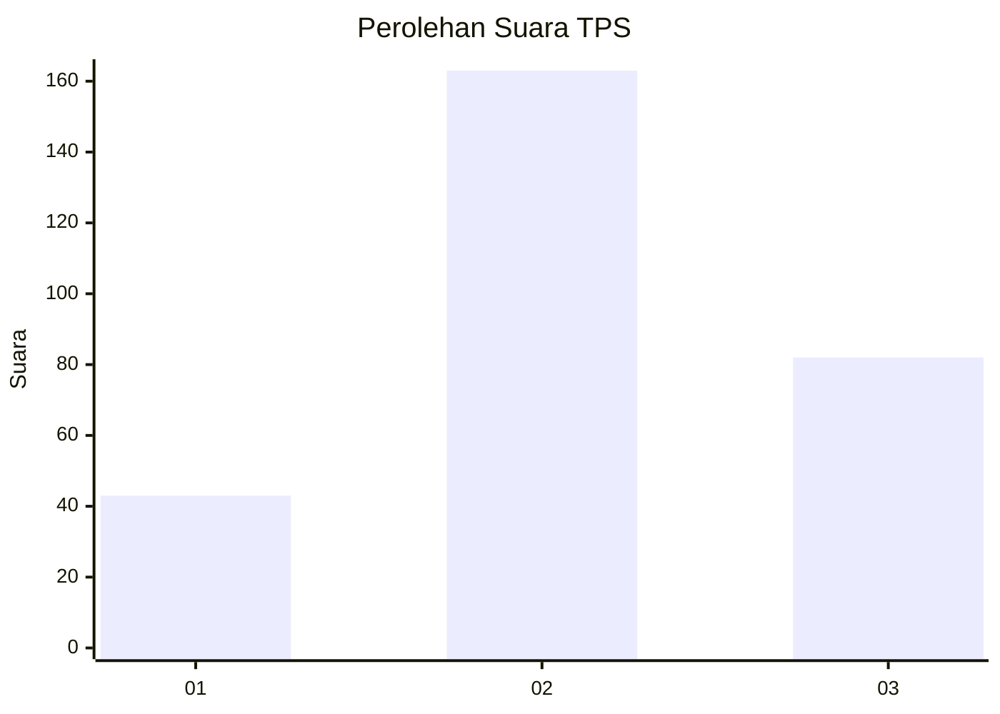
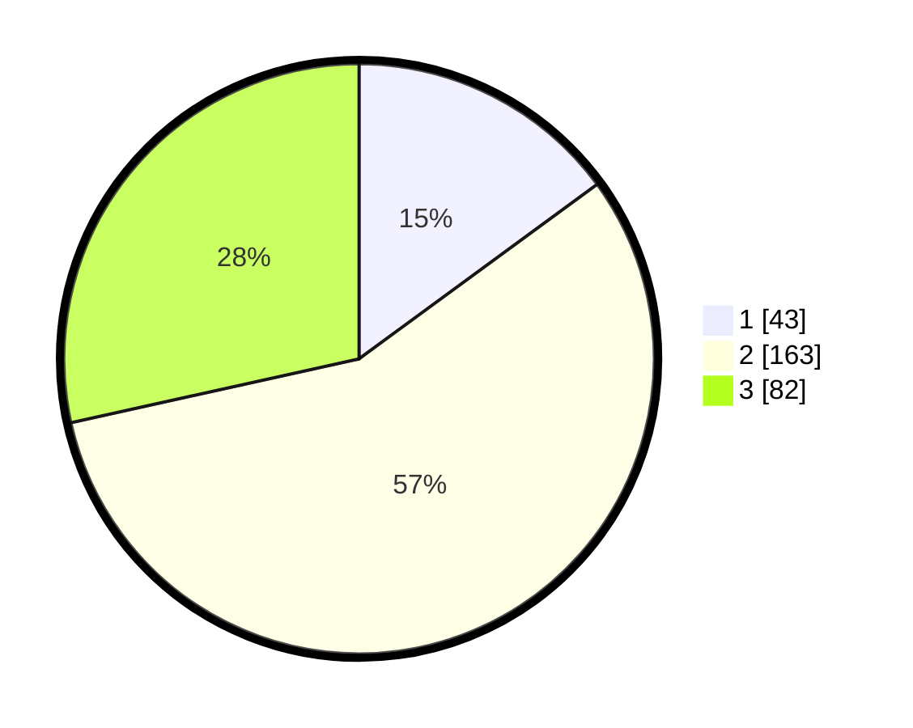

# Hasil

## Grafik

## Tabel

| No. | Nama Paslon    | Suara | Suara (raw) | Persentase |
|:--- |:-------------- | -----:| -----------:| ----------:|
| 1   | ANIES MUHAIMIN | 43    | [43][p-1]   | 14,93      |
| 2   | PRABOWO GIBRAN | 163   | [163][p-2]  | 56,60      |
| 3   | GANJAR MAHFUD  | 82    | [82][p-3]   | 28,47      |

[p-1]: https://github.com/gigit-pemilu/pemilu-2024-96-papua-barat-daya/blob/main/pilpres/hitung-suara/sub/96-papua-barat-daya/sub/71-kota-sorong/sub/06-sorong-manoi/sub/1001-klaligi/sub/014-tps/sub/paslon-1.txt
[p-2]: https://github.com/gigit-pemilu/pemilu-2024-96-papua-barat-daya/blob/main/pilpres/hitung-suara/sub/96-papua-barat-daya/sub/71-kota-sorong/sub/06-sorong-manoi/sub/1001-klaligi/sub/014-tps/sub/paslon-2.txt
[p-3]: https://github.com/gigit-pemilu/pemilu-2024-96-papua-barat-daya/blob/main/pilpres/hitung-suara/sub/96-papua-barat-daya/sub/71-kota-sorong/sub/06-sorong-manoi/sub/1001-klaligi/sub/014-tps/sub/paslon-3.txt

## Foto C Plano

https://sirekap-obj-formc.kpu.go.id/5191/pemilu/ppwp/96/71/06/10/01/9671061001014-20240215-062152--cca9e77b-a818-4f76-ad51-04c31e4f1979.jpg

https://sirekap-obj-formc.kpu.go.id/5191/pemilu/ppwp/96/71/06/10/01/9671061001014-20240215-062453--68ec75dd-2d14-45ab-bf89-1fe55844eb18.jpg

https://sirekap-obj-formc.kpu.go.id/5191/pemilu/ppwp/96/71/06/10/01/9671061001014-20240215-062554--fa4c90e8-95d1-464f-b3f0-76548959beb1.jpg

## Metadata

| Key        | Value               |
| ---------- | ------------------- |
| Time Stamp | 2024-02-24 22:31:28 |

