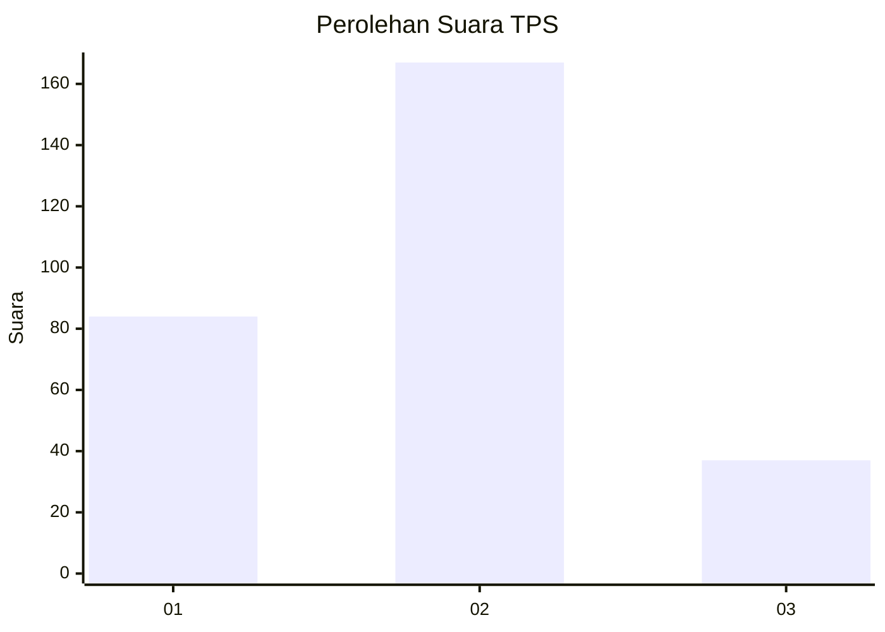
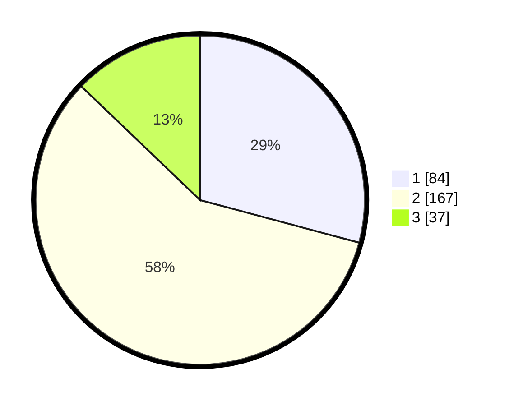

# Hasil

## Grafik

## Tabel

| No. | Nama Paslon    | Suara | Suara (raw) | Persentase |
|:--- |:-------------- | -----:| -----------:| ----------:|
| 1   | ANIES MUHAIMIN | 84    | [84][p-1]   | 29,17      |
| 2   | PRABOWO GIBRAN | 167   | [167][p-2]  | 57,99      |
| 3   | GANJAR MAHFUD  | 37    | [37][p-3]   | 12,85      |

[p-1]: https://github.com/gigit-pemilu/pemilu-2024-96-papua-barat-daya/blob/main/pilpres/hitung-suara/sub/96-papua-barat-daya/sub/71-kota-sorong/sub/06-sorong-manoi/sub/1002-malawei/sub/032-tps/sub/paslon-1.txt
[p-2]: https://github.com/gigit-pemilu/pemilu-2024-96-papua-barat-daya/blob/main/pilpres/hitung-suara/sub/96-papua-barat-daya/sub/71-kota-sorong/sub/06-sorong-manoi/sub/1002-malawei/sub/032-tps/sub/paslon-2.txt
[p-3]: https://github.com/gigit-pemilu/pemilu-2024-96-papua-barat-daya/blob/main/pilpres/hitung-suara/sub/96-papua-barat-daya/sub/71-kota-sorong/sub/06-sorong-manoi/sub/1002-malawei/sub/032-tps/sub/paslon-3.txt

## Foto C Plano

https://sirekap-obj-formc.kpu.go.id/a4e7/pemilu/ppwp/96/71/06/10/02/9671061002032-20240215-171222--f9a9afb2-949c-400a-9bea-21423a70ee5f.jpg

https://sirekap-obj-formc.kpu.go.id/a4e7/pemilu/ppwp/96/71/06/10/02/9671061002032-20240215-172530--cac228ab-03a5-434d-b50b-9ec1225fac27.jpg

https://sirekap-obj-formc.kpu.go.id/a4e7/pemilu/ppwp/96/71/06/10/02/9671061002032-20240215-172757--6927b6ee-76ef-4de4-ba7d-7f6a1fa4ba0f.jpg

## Metadata

| Key        | Value               |
| ---------- | ------------------- |
| Time Stamp | 2024-02-25 15:00:00 |

