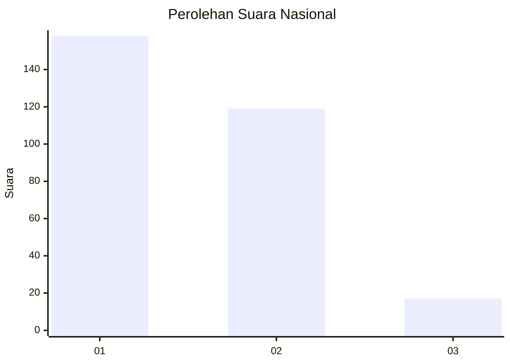
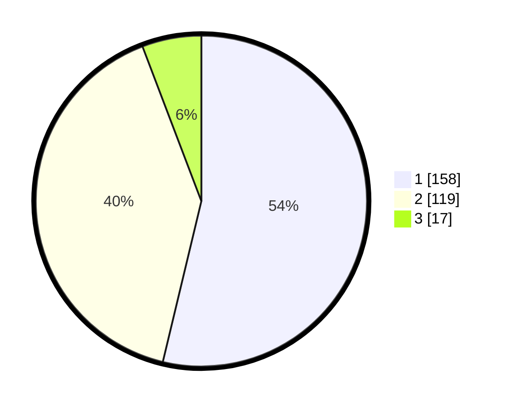

# Hasil

## Grafik

## Tabel

| No. | Nama Paslon    | Suara | Suara (raw) | Persentase |
|:--- |:-------------- | -----:| -----------:| ----------:|
| 1   | ANIES MUHAIMIN | 158   | [158][p-1]  | 53,74      |
| 2   | PRABOWO GIBRAN | 119   | [119][p-2]  | 40,48      |
| 3   | GANJAR MAHFUD  | 17    | [17][p-3]   | 5,78       |

[p-1]: https://github.com/gigit-pemilu/pemilu-2024/blob/main/pilpres/hitung-suara/sub/96-papua-barat-daya/sub/71-kota-sorong/sub/06-sorong-manoi/sub/1002-malawei/sub/033-tps/sub/paslon-1.txt
[p-2]: https://github.com/gigit-pemilu/pemilu-2024/blob/main/pilpres/hitung-suara/sub/96-papua-barat-daya/sub/71-kota-sorong/sub/06-sorong-manoi/sub/1002-malawei/sub/033-tps/sub/paslon-2.txt
[p-3]: https://github.com/gigit-pemilu/pemilu-2024/blob/main/pilpres/hitung-suara/sub/96-papua-barat-daya/sub/71-kota-sorong/sub/06-sorong-manoi/sub/1002-malawei/sub/033-tps/sub/paslon-3.txt

## Foto C Plano

https://sirekap-obj-formc.kpu.go.id/b18f/pemilu/ppwp/96/71/06/10/02/9671061002033-20240214-214006--41da996d-5026-46ac-8296-ab69abfb57f3.jpg

https://sirekap-obj-formc.kpu.go.id/b18f/pemilu/ppwp/96/71/06/10/02/9671061002033-20240214-214206--a73a60a2-100f-4b42-9706-3d988a282d84.jpg

https://sirekap-obj-formc.kpu.go.id/b18f/pemilu/ppwp/96/71/06/10/02/9671061002033-20240214-214535--d74a1d20-df21-4e17-a534-9d02a3d7a025.jpg

## Metadata

| Key        | Value               |
| ---------- | ------------------- |
| Time Stamp | 2024-02-24 22:31:28 |

