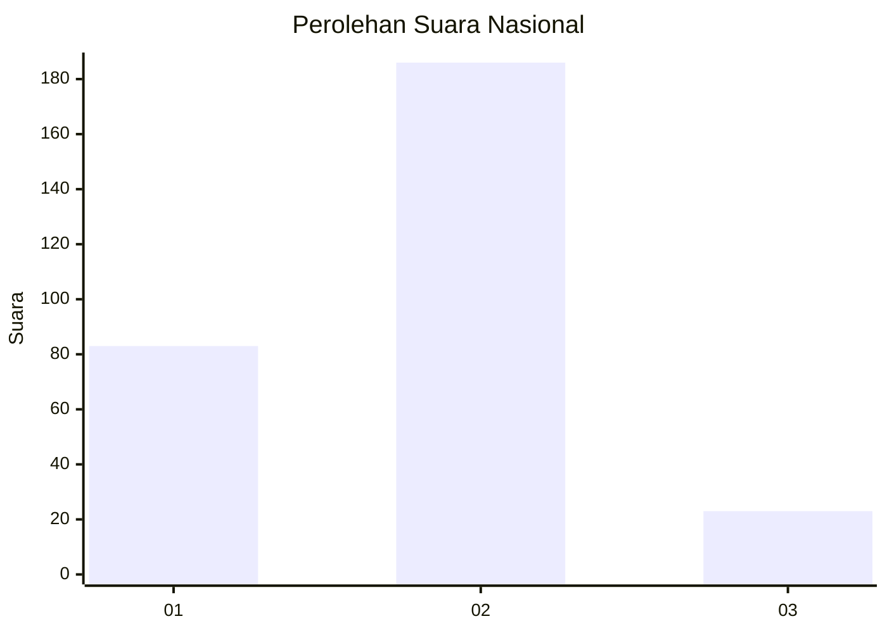
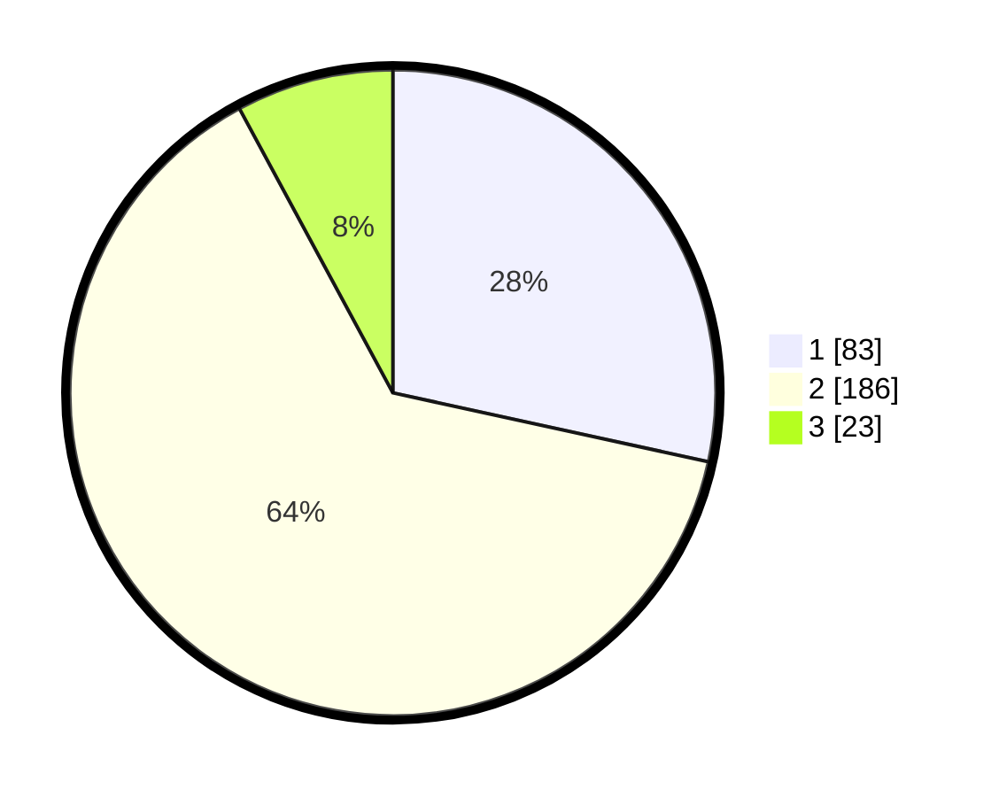

# Hasil

## Grafik

## Tabel

| No. | Nama Paslon    | Suara | Suara (raw) | Persentase |
|:--- |:-------------- | -----:| -----------:| ----------:|
| 1   | ANIES MUHAIMIN | 83    | [83][p-1]   | 28,42      |
| 2   | PRABOWO GIBRAN | 186   | [186][p-2]  | 63,70      |
| 3   | GANJAR MAHFUD  | 23    | [23][p-3]   | 7,88       |

[p-1]: https://github.com/gigit-pemilu/pemilu-2024/blob/main/pilpres/hitung-suara/sub/96-papua-barat-daya/sub/71-kota-sorong/sub/06-sorong-manoi/sub/1005-klasabi/sub/011-tps/sub/paslon-1.txt
[p-2]: https://github.com/gigit-pemilu/pemilu-2024/blob/main/pilpres/hitung-suara/sub/96-papua-barat-daya/sub/71-kota-sorong/sub/06-sorong-manoi/sub/1005-klasabi/sub/011-tps/sub/paslon-2.txt
[p-3]: https://github.com/gigit-pemilu/pemilu-2024/blob/main/pilpres/hitung-suara/sub/96-papua-barat-daya/sub/71-kota-sorong/sub/06-sorong-manoi/sub/1005-klasabi/sub/011-tps/sub/paslon-3.txt

## Foto C Plano

https://sirekap-obj-formc.kpu.go.id/d0ab/pemilu/ppwp/96/71/06/10/05/9671061005011-20240215-064557--2d9c21e2-2c38-45cc-8c18-ba11e146fe43.jpg

https://sirekap-obj-formc.kpu.go.id/d0ab/pemilu/ppwp/96/71/06/10/05/9671061005011-20240215-065534--029f7bc5-7bb8-4de0-b53c-47ec7b459ac1.jpg

https://sirekap-obj-formc.kpu.go.id/d0ab/pemilu/ppwp/96/71/06/10/05/9671061005011-20240215-073838--210c0a61-2ae5-4e19-9d22-789ee76847cd.jpg

## Metadata

| Key        | Value               |
| ---------- | ------------------- |
| Time Stamp | 2024-02-24 23:00:00 |

