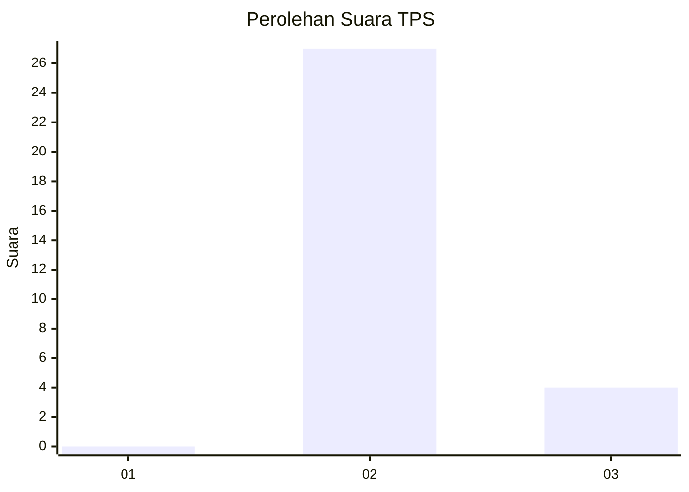
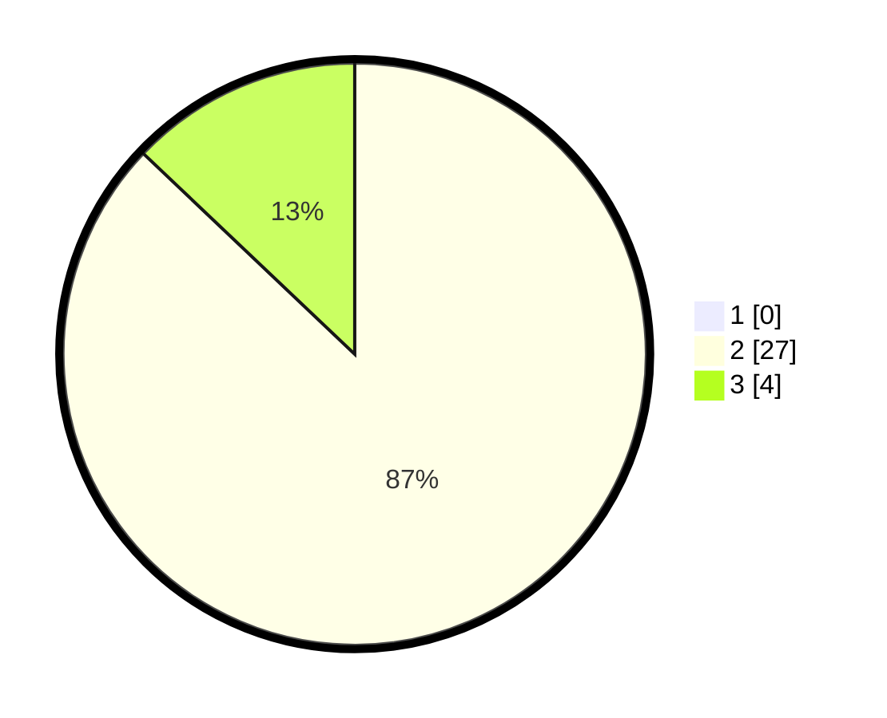

# Hasil

## Grafik

## Tabel

| No. | Nama Paslon    | Suara | Suara (raw) | Persentase |
|:--- |:-------------- | -----:| -----------:| ----------:|
| 1   | ANIES MUHAIMIN | 0     | [0][p-1]    | 0,00       |
| 2   | PRABOWO GIBRAN | 27    | [27][p-2]   | 87,10      |
| 3   | GANJAR MAHFUD  | 4     | [4][p-3]    | 12,90      |

[p-1]: https://github.com/gigit-pemilu/pemilu-2024-96-papua-barat-daya/blob/main/pilpres/hitung-suara/sub/96-papua-barat-daya/sub/71-kota-sorong/sub/08-klaurung/sub/1001-klasuat/sub/002-tps/sub/paslon-1.txt
[p-2]: https://github.com/gigit-pemilu/pemilu-2024-96-papua-barat-daya/blob/main/pilpres/hitung-suara/sub/96-papua-barat-daya/sub/71-kota-sorong/sub/08-klaurung/sub/1001-klasuat/sub/002-tps/sub/paslon-2.txt
[p-3]: https://github.com/gigit-pemilu/pemilu-2024-96-papua-barat-daya/blob/main/pilpres/hitung-suara/sub/96-papua-barat-daya/sub/71-kota-sorong/sub/08-klaurung/sub/1001-klasuat/sub/002-tps/sub/paslon-3.txt

## Foto C Plano

https://sirekap-obj-formc.kpu.go.id/2198/pemilu/ppwp/96/71/08/10/01/9671081001002-20240214-233520--de489eda-a165-4a14-a999-0479a55e1dc5.jpg

https://sirekap-obj-formc.kpu.go.id/2198/pemilu/ppwp/96/71/08/10/01/9671081001002-20240214-234207--5c49c0b1-a908-4b51-9414-91c64f115b56.jpg

https://sirekap-obj-formc.kpu.go.id/2198/pemilu/ppwp/96/71/08/10/01/9671081001002-20240215-000324--f45debac-7cb5-4171-a55d-fa2616f61ec3.jpg

## Metadata

| Key        | Value               |
| ---------- | ------------------- |
| Time Stamp | 2024-02-24 22:31:28 |

