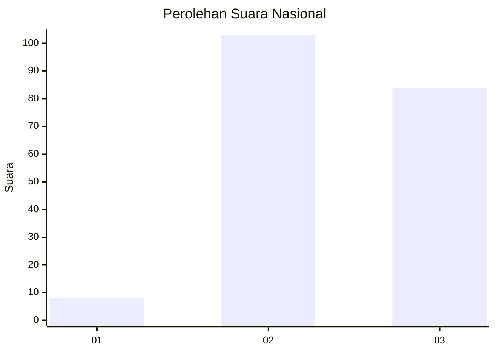
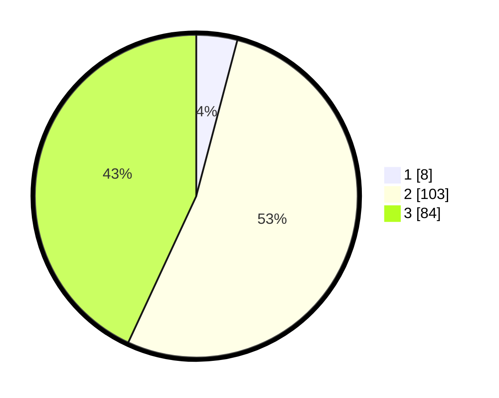

# Hasil

## Grafik

## Tabel

| No. | Nama Paslon    | Suara | Suara (raw) | Persentase |
|:--- |:-------------- | -----:| -----------:| ----------:|
| 1   | ANIES MUHAIMIN | 8     | [8][p-1]    | 4,10       |
| 2   | PRABOWO GIBRAN | 103   | [103][p-2]  | 52,82      |
| 3   | GANJAR MAHFUD  | 84    | [84][p-3]   | 43,08      |

[p-1]: https://github.com/gigit-pemilu/pemilu-2024/blob/main/pilpres/hitung-suara/sub/96-papua-barat-daya/sub/71-kota-sorong/sub/08-klaurung/sub/1002-klablim/sub/003-tps/sub/paslon-1.txt
[p-2]: https://github.com/gigit-pemilu/pemilu-2024/blob/main/pilpres/hitung-suara/sub/96-papua-barat-daya/sub/71-kota-sorong/sub/08-klaurung/sub/1002-klablim/sub/003-tps/sub/paslon-2.txt
[p-3]: https://github.com/gigit-pemilu/pemilu-2024/blob/main/pilpres/hitung-suara/sub/96-papua-barat-daya/sub/71-kota-sorong/sub/08-klaurung/sub/1002-klablim/sub/003-tps/sub/paslon-3.txt

## Foto C Plano

https://sirekap-obj-formc.kpu.go.id/eef1/pemilu/ppwp/96/71/08/10/02/9671081002003-20240215-010504--68f91293-f521-4fca-87cc-0a6f290ce5b9.jpg

https://sirekap-obj-formc.kpu.go.id/eef1/pemilu/ppwp/96/71/08/10/02/9671081002003-20240214-155918--5e60e3fe-6187-4dca-a72f-6b1bcea35ff5.jpg

https://sirekap-obj-formc.kpu.go.id/eef1/pemilu/ppwp/96/71/08/10/02/9671081002003-20240215-010020--9506d4c9-67f0-42bf-a4d6-6e26eaf740b1.jpg

## Metadata

| Key        | Value               |
| ---------- | ------------------- |
| Time Stamp | 2024-02-21 22:00:00 |

