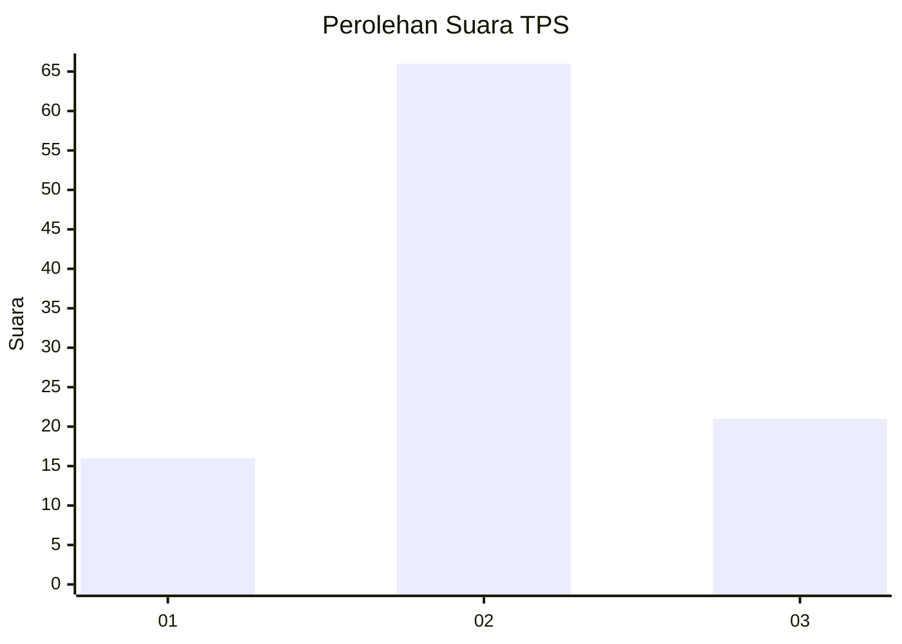
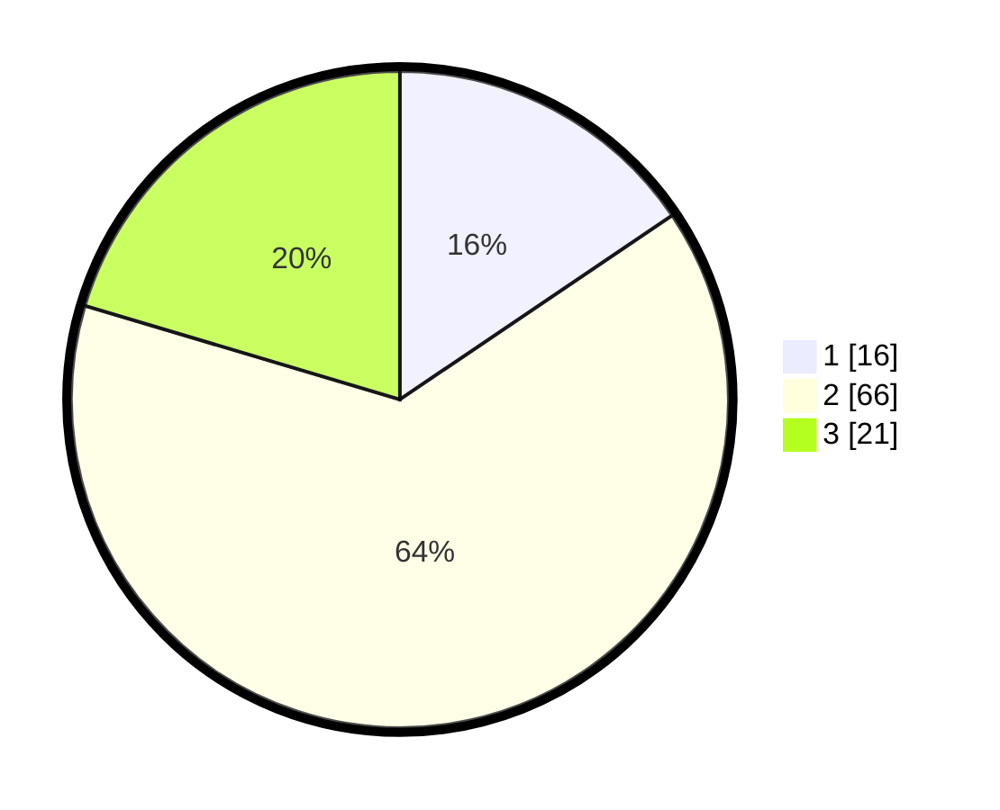

# Hasil

## Grafik

## Tabel

| No. | Nama Paslon    | Suara | Suara (raw) | Persentase |
|:--- |:-------------- | -----:| -----------:| ----------:|
| 1   | ANIES MUHAIMIN | 16    | [16][p-1]   | 15,53      |
| 2   | PRABOWO GIBRAN | 66    | [66][p-2]   | 64,08      |
| 3   | GANJAR MAHFUD  | 21    | [21][p-3]   | 20,39      |

[p-1]: https://github.com/gigit-pemilu/pemilu-2024-96-papua-barat-daya/blob/main/pilpres/hitung-suara/sub/96-papua-barat-daya/sub/71-kota-sorong/sub/08-klaurung/sub/1003-klasaman/sub/003-tps/sub/paslon-1.txt
[p-2]: https://github.com/gigit-pemilu/pemilu-2024-96-papua-barat-daya/blob/main/pilpres/hitung-suara/sub/96-papua-barat-daya/sub/71-kota-sorong/sub/08-klaurung/sub/1003-klasaman/sub/003-tps/sub/paslon-2.txt
[p-3]: https://github.com/gigit-pemilu/pemilu-2024-96-papua-barat-daya/blob/main/pilpres/hitung-suara/sub/96-papua-barat-daya/sub/71-kota-sorong/sub/08-klaurung/sub/1003-klasaman/sub/003-tps/sub/paslon-3.txt

## Foto C Plano

https://sirekap-obj-formc.kpu.go.id/bc72/pemilu/ppwp/96/71/08/10/03/9671081003003-20240215-113450--ec5a65cb-eb73-4461-a68f-ffb445363461.jpg

https://sirekap-obj-formc.kpu.go.id/bc72/pemilu/ppwp/96/71/08/10/03/9671081003003-20240215-113710--651371b1-8e16-467b-9fe8-a59ba1a6e638.jpg

https://sirekap-obj-formc.kpu.go.id/bc72/pemilu/ppwp/96/71/08/10/03/9671081003003-20240215-113811--0c434db1-7ffa-4f6f-a3ae-105696c05df7.jpg

## Metadata

| Key        | Value               |
| ---------- | ------------------- |
| Time Stamp | 2024-02-24 22:31:28 |

