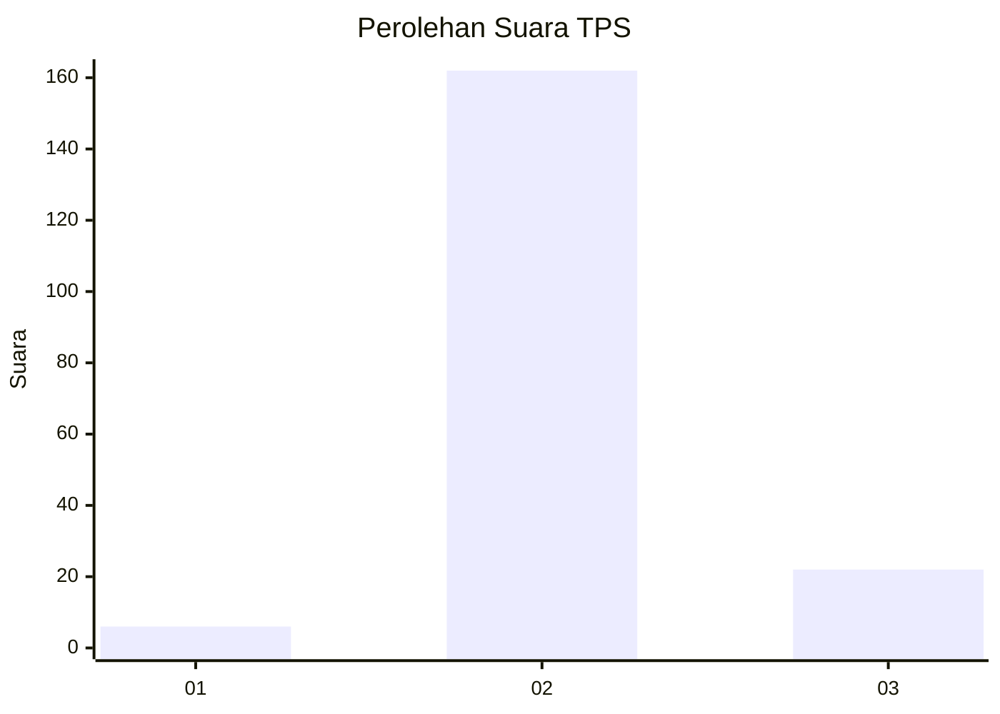
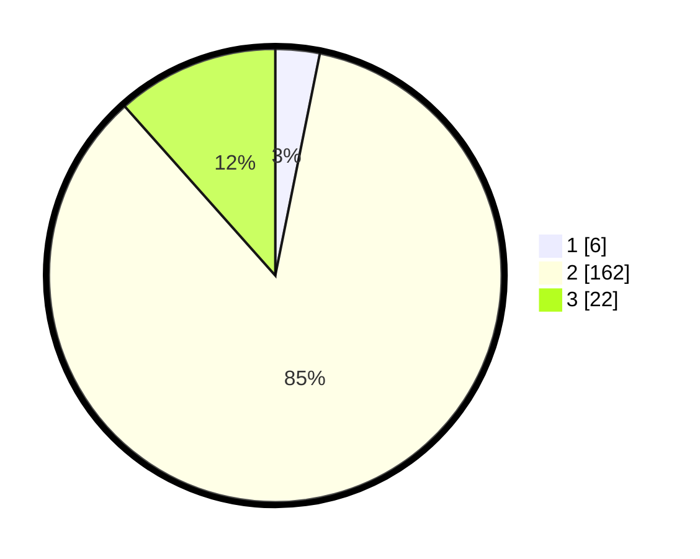

# Hasil

## Grafik

## Tabel

| No. | Nama Paslon    | Suara | Suara (raw) | Persentase |
|:--- |:-------------- | -----:| -----------:| ----------:|
| 1   | ANIES MUHAIMIN | 6     | [6][p-1]    | 3,16       |
| 2   | PRABOWO GIBRAN | 162   | [162][p-2]  | 85,26      |
| 3   | GANJAR MAHFUD  | 22    | [22][p-3]   | 11,58      |

[p-1]: https://github.com/gigit-pemilu/pemilu-2024-96-papua-barat-daya/blob/main/pilpres/hitung-suara/sub/96-papua-barat-daya/sub/71-kota-sorong/sub/09-malaimsimsa/sub/1001-klagete/sub/001-tps/sub/paslon-1.txt
[p-2]: https://github.com/gigit-pemilu/pemilu-2024-96-papua-barat-daya/blob/main/pilpres/hitung-suara/sub/96-papua-barat-daya/sub/71-kota-sorong/sub/09-malaimsimsa/sub/1001-klagete/sub/001-tps/sub/paslon-2.txt
[p-3]: https://github.com/gigit-pemilu/pemilu-2024-96-papua-barat-daya/blob/main/pilpres/hitung-suara/sub/96-papua-barat-daya/sub/71-kota-sorong/sub/09-malaimsimsa/sub/1001-klagete/sub/001-tps/sub/paslon-3.txt

## Foto C Plano

https://sirekap-obj-formc.kpu.go.id/7095/pemilu/ppwp/96/71/09/10/01/9671091001001-20240215-055103--46671d9b-75d7-4908-bf1d-b0beef7bf00c.jpg

https://sirekap-obj-formc.kpu.go.id/7095/pemilu/ppwp/96/71/09/10/01/9671091001001-20240215-055243--2c9fdda9-0aaa-41a2-842f-640017ff4b16.jpg

https://sirekap-obj-formc.kpu.go.id/7095/pemilu/ppwp/96/71/09/10/01/9671091001001-20240215-055503--100e8cb4-0fb2-4b2c-87e4-055a8fcf6be6.jpg

## Metadata

| Key        | Value               |
| ---------- | ------------------- |
| Time Stamp | 2024-02-25 14:00:00 |

