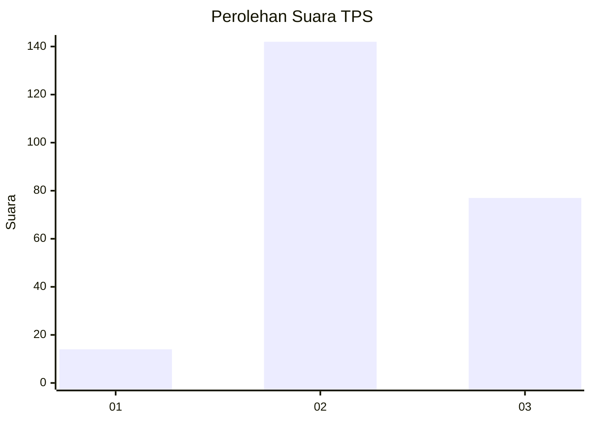
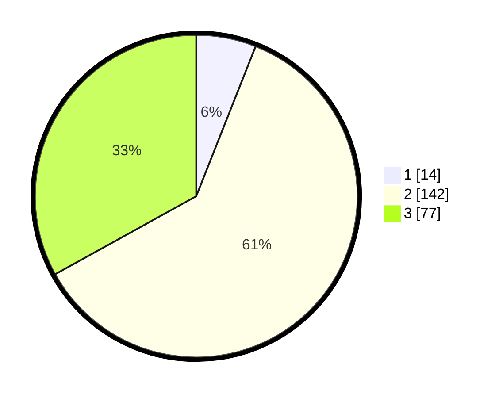

# Hasil

## Grafik

## Tabel

| No. | Nama Paslon    | Suara | Suara (raw) | Persentase |
|:--- |:-------------- | -----:| -----------:| ----------:|
| 1   | ANIES MUHAIMIN | 14    | [14][p-1]   | 6,01       |
| 2   | PRABOWO GIBRAN | 142   | [142][p-2]  | 60,94      |
| 3   | GANJAR MAHFUD  | 77    | [77][p-3]   | 33,05      |

[p-1]: https://github.com/gigit-pemilu/pemilu-2024-96-papua-barat-daya/blob/main/pilpres/hitung-suara/sub/96-papua-barat-daya/sub/71-kota-sorong/sub/09-malaimsimsa/sub/1001-klagete/sub/008-tps/sub/paslon-1.txt
[p-2]: https://github.com/gigit-pemilu/pemilu-2024-96-papua-barat-daya/blob/main/pilpres/hitung-suara/sub/96-papua-barat-daya/sub/71-kota-sorong/sub/09-malaimsimsa/sub/1001-klagete/sub/008-tps/sub/paslon-2.txt
[p-3]: https://github.com/gigit-pemilu/pemilu-2024-96-papua-barat-daya/blob/main/pilpres/hitung-suara/sub/96-papua-barat-daya/sub/71-kota-sorong/sub/09-malaimsimsa/sub/1001-klagete/sub/008-tps/sub/paslon-3.txt

## Foto C Plano

https://sirekap-obj-formc.kpu.go.id/90a6/pemilu/ppwp/96/71/09/10/01/9671091001008-20240215-085325--e4769b23-0e30-4b12-adbc-3334cfb7f09b.jpg

https://sirekap-obj-formc.kpu.go.id/90a6/pemilu/ppwp/96/71/09/10/01/9671091001008-20240215-090114--24ee0e74-24aa-475e-bdab-45d5a219ed08.jpg

https://sirekap-obj-formc.kpu.go.id/90a6/pemilu/ppwp/96/71/09/10/01/9671091001008-20240215-090621--201ef8f0-8cc2-4c5d-aa76-714146e76ff9.jpg

## Metadata

| Key        | Value               |
| ---------- | ------------------- |
| Time Stamp | 2024-02-26 14:00:00 |

