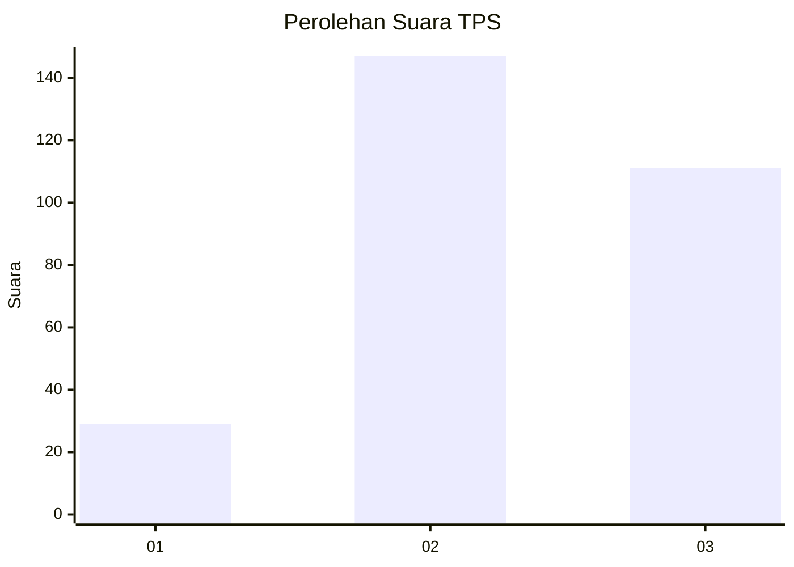
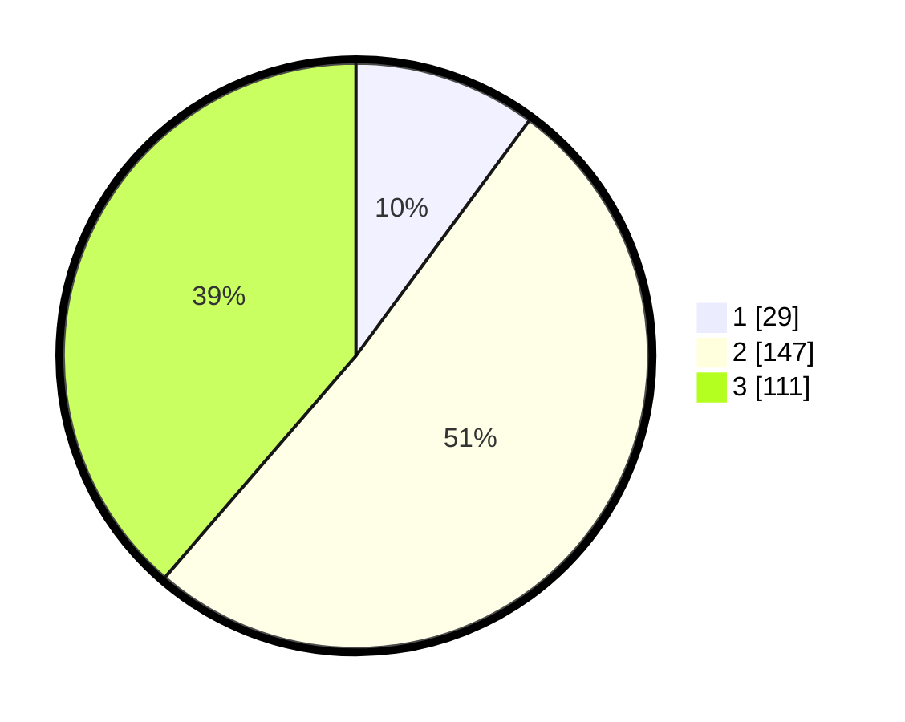

# Hasil

## Grafik

## Tabel

| No. | Nama Paslon    | Suara | Suara (raw) | Persentase |
|:--- |:-------------- | -----:| -----------:| ----------:|
| 1   | ANIES MUHAIMIN | 29    | [29][p-1]   | 10,10      |
| 2   | PRABOWO GIBRAN | 147   | [147][p-2]  | 51,22      |
| 3   | GANJAR MAHFUD  | 111   | [111][p-3]  | 38,68      |

[p-1]: https://github.com/gigit-pemilu/pemilu-2024-96-papua-barat-daya/blob/main/pilpres/hitung-suara/sub/96-papua-barat-daya/sub/71-kota-sorong/sub/09-malaimsimsa/sub/1005-malamso/sub/004-tps/sub/paslon-1.txt
[p-2]: https://github.com/gigit-pemilu/pemilu-2024-96-papua-barat-daya/blob/main/pilpres/hitung-suara/sub/96-papua-barat-daya/sub/71-kota-sorong/sub/09-malaimsimsa/sub/1005-malamso/sub/004-tps/sub/paslon-2.txt
[p-3]: https://github.com/gigit-pemilu/pemilu-2024-96-papua-barat-daya/blob/main/pilpres/hitung-suara/sub/96-papua-barat-daya/sub/71-kota-sorong/sub/09-malaimsimsa/sub/1005-malamso/sub/004-tps/sub/paslon-3.txt

## Foto C Plano

https://sirekap-obj-formc.kpu.go.id/ee7f/pemilu/ppwp/96/71/09/10/05/9671091005004-20240214-230410--35320bd5-d538-4c4c-b132-e8b4493b5229.jpg

https://sirekap-obj-formc.kpu.go.id/ee7f/pemilu/ppwp/96/71/09/10/05/9671091005004-20240214-230054--34f370b0-11f2-4afb-aca5-21d103f10414.jpg

https://sirekap-obj-formc.kpu.go.id/ee7f/pemilu/ppwp/96/71/09/10/05/9671091005004-20240214-225848--5fffa161-1c6a-44a6-bf1e-a85432b32e03.jpg

## Metadata

| Key        | Value               |
| ---------- | ------------------- |
| Time Stamp | 2024-02-24 22:31:28 |

