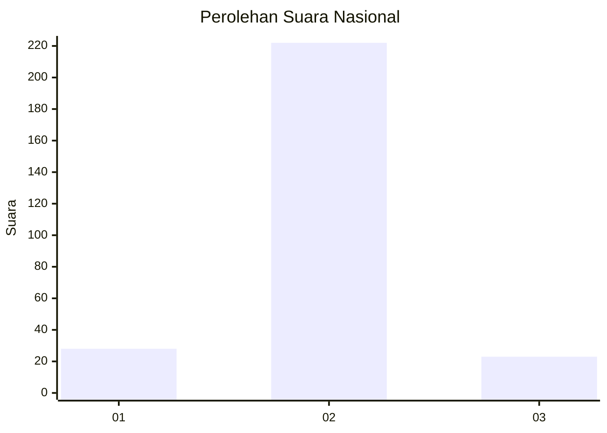
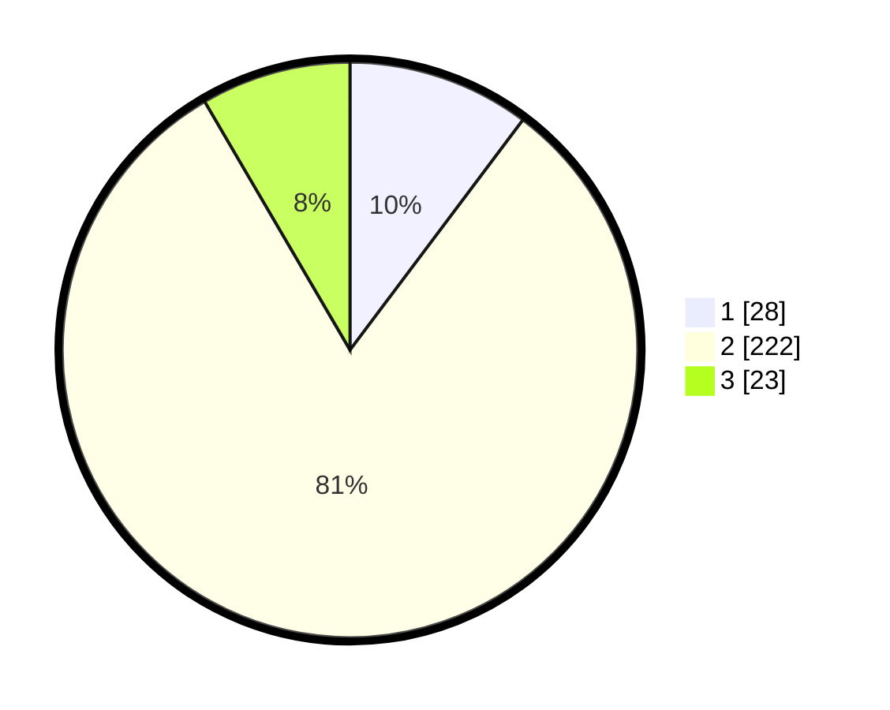

# Hasil

## Grafik

## Tabel

| No. | Nama Paslon    | Suara | Suara (raw) | Persentase |
|:--- |:-------------- | -----:| -----------:| ----------:|
| 1   | ANIES MUHAIMIN | 28    | [28][p-1]   | 10,26      |
| 2   | PRABOWO GIBRAN | 222   | [222][p-2]  | 81,32      |
| 3   | GANJAR MAHFUD  | 23    | [23][p-3]   | 8,42       |

[p-1]: https://github.com/gigit-pemilu/pemilu-2024/blob/main/pilpres/hitung-suara/sub/96-papua-barat-daya/sub/71-kota-sorong/sub/09-malaimsimsa/sub/1006-klabulu/sub/024-tps/sub/paslon-1.txt
[p-2]: https://github.com/gigit-pemilu/pemilu-2024/blob/main/pilpres/hitung-suara/sub/96-papua-barat-daya/sub/71-kota-sorong/sub/09-malaimsimsa/sub/1006-klabulu/sub/024-tps/sub/paslon-2.txt
[p-3]: https://github.com/gigit-pemilu/pemilu-2024/blob/main/pilpres/hitung-suara/sub/96-papua-barat-daya/sub/71-kota-sorong/sub/09-malaimsimsa/sub/1006-klabulu/sub/024-tps/sub/paslon-3.txt

## Foto C Plano

https://sirekap-obj-formc.kpu.go.id/f391/pemilu/ppwp/96/71/09/10/06/9671091006024-20240214-220223--df224be8-14e3-41c2-899c-3bf904abb5ba.jpg

https://sirekap-obj-formc.kpu.go.id/f391/pemilu/ppwp/96/71/09/10/06/9671091006024-20240214-221008--b2fde028-62a2-445f-8dcf-06ea8c52205e.jpg

https://sirekap-obj-formc.kpu.go.id/f391/pemilu/ppwp/96/71/09/10/06/9671091006024-20240214-221240--f82ae06d-6e59-45b2-8eba-7737436a02ad.jpg

## Metadata

| Key        | Value               |
| ---------- | ------------------- |
| Time Stamp | 2024-02-15 15:00:29 |

