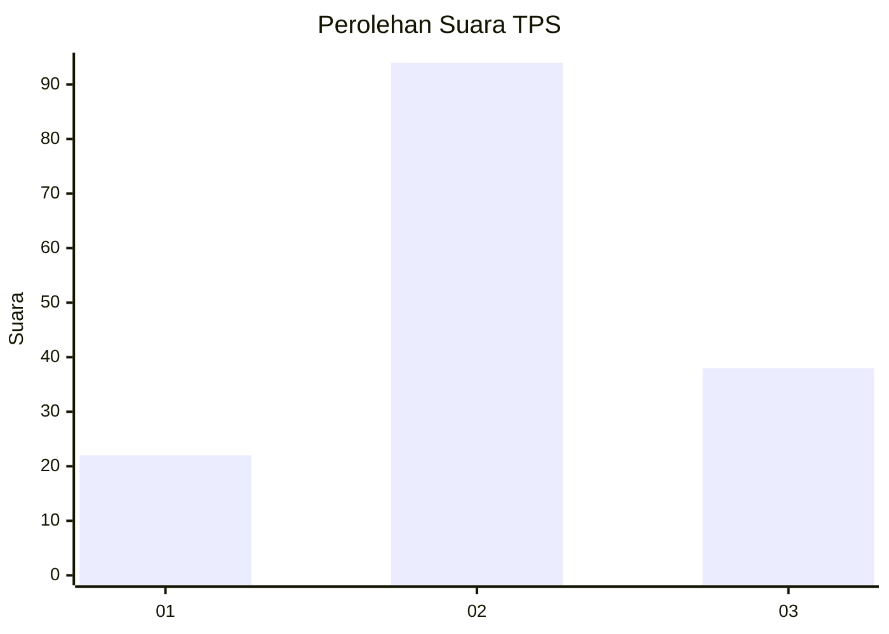
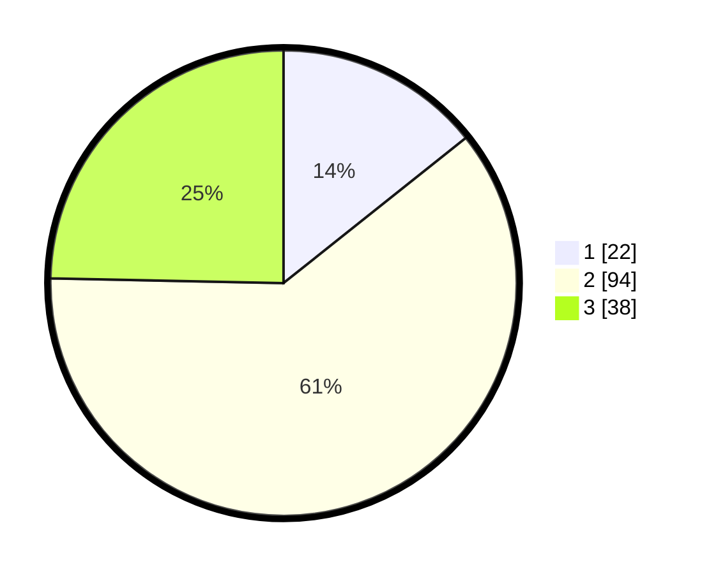

# Hasil

## Grafik

## Tabel

| No. | Nama Paslon    | Suara | Suara (raw) | Persentase |
|:--- |:-------------- | -----:| -----------:| ----------:|
| 1   | ANIES MUHAIMIN | 22    | [22][p-1]   | 14,29      |
| 2   | PRABOWO GIBRAN | 94    | [94][p-2]   | 61,04      |
| 3   | GANJAR MAHFUD  | 38    | [38][p-3]   | 24,68      |

[p-1]: https://github.com/gigit-pemilu/pemilu-2024-96-papua-barat-daya/blob/main/pilpres/hitung-suara/sub/96-papua-barat-daya/sub/71-kota-sorong/sub/10-maladum-mes/sub/1001-suprau/sub/003-tps/sub/paslon-1.txt
[p-2]: https://github.com/gigit-pemilu/pemilu-2024-96-papua-barat-daya/blob/main/pilpres/hitung-suara/sub/96-papua-barat-daya/sub/71-kota-sorong/sub/10-maladum-mes/sub/1001-suprau/sub/003-tps/sub/paslon-2.txt
[p-3]: https://github.com/gigit-pemilu/pemilu-2024-96-papua-barat-daya/blob/main/pilpres/hitung-suara/sub/96-papua-barat-daya/sub/71-kota-sorong/sub/10-maladum-mes/sub/1001-suprau/sub/003-tps/sub/paslon-3.txt

## Foto C Plano

https://sirekap-obj-formc.kpu.go.id/a5d7/pemilu/ppwp/96/71/10/10/01/9671101001003-20240215-143738--468c7d95-bb62-4d02-a264-9d922b3a147c.jpg

https://sirekap-obj-formc.kpu.go.id/a5d7/pemilu/ppwp/96/71/10/10/01/9671101001003-20240215-142549--44b76b5d-3172-4812-ab48-13786c66a689.jpg

https://sirekap-obj-formc.kpu.go.id/a5d7/pemilu/ppwp/96/71/10/10/01/9671101001003-20240215-141623--cea1e683-21c0-43e1-942a-2d078ef53f2e.jpg

## Metadata

| Key        | Value               |
| ---------- | ------------------- |
| Time Stamp | 2024-02-25 13:00:00 |

