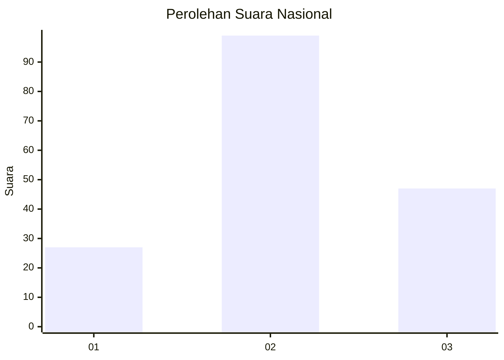
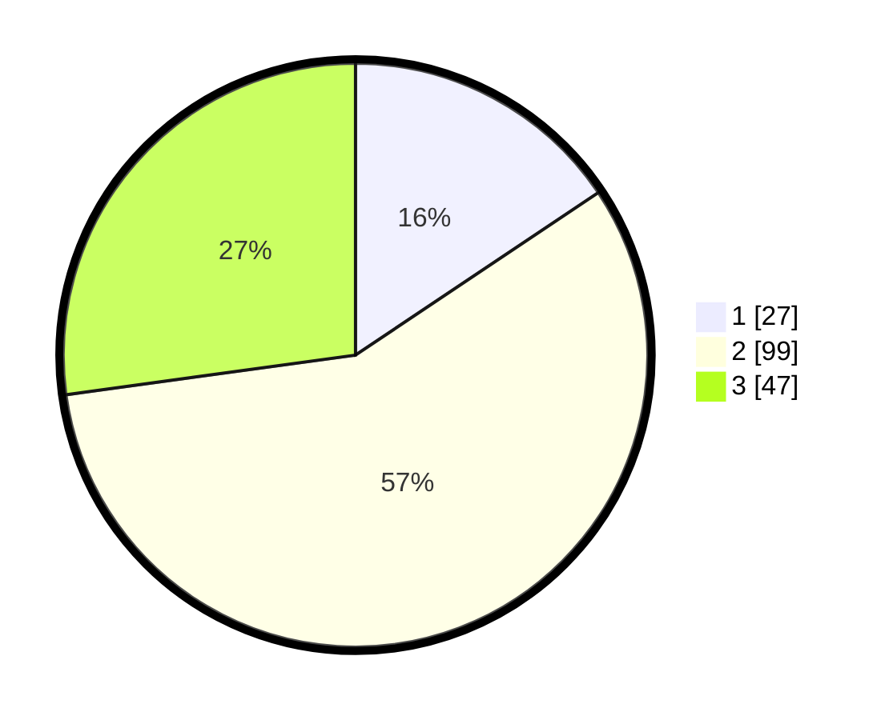

# Hasil

## Grafik

## Tabel

| No. | Nama Paslon    | Suara | Suara (raw) | Persentase |
|:--- |:-------------- | -----:| -----------:| ----------:|
| 1   | ANIES MUHAIMIN | 27    | [27][p-1]   | 15,61      |
| 2   | PRABOWO GIBRAN | 99    | [99][p-2]   | 57,23      |
| 3   | GANJAR MAHFUD  | 47    | [47][p-3]   | 27,17      |

[p-1]: https://github.com/gigit-pemilu/pemilu-2024/blob/main/pilpres/hitung-suara/sub/96-papua-barat-daya/sub/71-kota-sorong/sub/10-maladum-mes/sub/1001-suprau/sub/005-tps/sub/paslon-1.txt
[p-2]: https://github.com/gigit-pemilu/pemilu-2024/blob/main/pilpres/hitung-suara/sub/96-papua-barat-daya/sub/71-kota-sorong/sub/10-maladum-mes/sub/1001-suprau/sub/005-tps/sub/paslon-2.txt
[p-3]: https://github.com/gigit-pemilu/pemilu-2024/blob/main/pilpres/hitung-suara/sub/96-papua-barat-daya/sub/71-kota-sorong/sub/10-maladum-mes/sub/1001-suprau/sub/005-tps/sub/paslon-3.txt

## Foto C Plano

https://sirekap-obj-formc.kpu.go.id/d4e1/pemilu/ppwp/96/71/10/10/01/9671101001005-20240215-125535--af91ccb8-12f0-47ca-87aa-dc068ffb38f9.jpg

https://sirekap-obj-formc.kpu.go.id/d4e1/pemilu/ppwp/96/71/10/10/01/9671101001005-20240215-125541--669fed64-e039-4301-b27e-12533e0565a6.jpg

https://sirekap-obj-formc.kpu.go.id/d4e1/pemilu/ppwp/96/71/10/10/01/9671101001005-20240215-125546--05cd9516-393e-4d40-87b9-35cf7e4aef7b.jpg

## Metadata

| Key        | Value               |
| ---------- | ------------------- |
| Time Stamp | 2024-02-25 18:00:00 |

