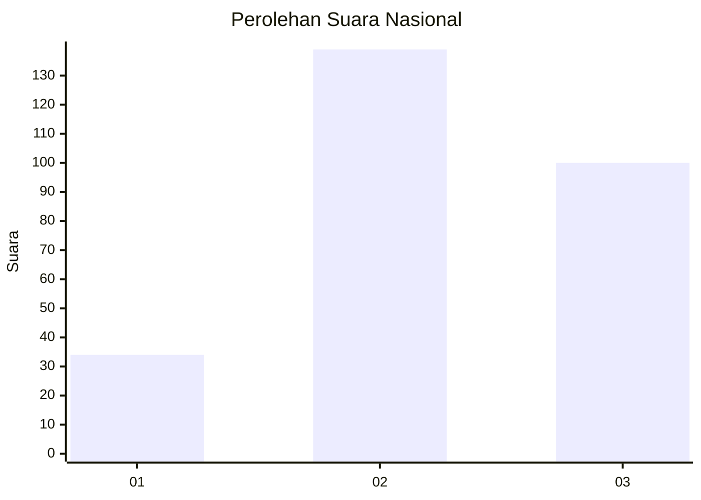
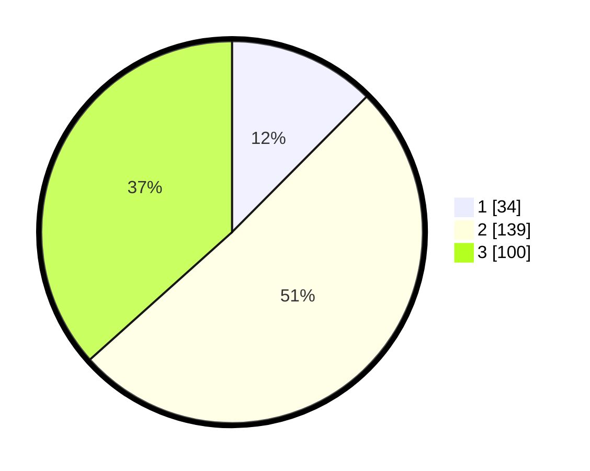

# Hasil

## Grafik

## Tabel

| No. | Nama Paslon    | Suara | Suara (raw) | Persentase |
|:--- |:-------------- | -----:| -----------:| ----------:|
| 1   | ANIES MUHAIMIN | 34    | [34][p-1]   | 12,45      |
| 2   | PRABOWO GIBRAN | 139   | [139][p-2]  | 50,92      |
| 3   | GANJAR MAHFUD  | 100   | [100][p-3]  | 36,63      |

[p-1]: https://github.com/gigit-pemilu/pemilu-2024/blob/main/pilpres/hitung-suara/sub/96-papua-barat-daya/sub/71-kota-sorong/sub/10-maladum-mes/sub/1001-suprau/sub/006-tps/sub/paslon-1.txt
[p-2]: https://github.com/gigit-pemilu/pemilu-2024/blob/main/pilpres/hitung-suara/sub/96-papua-barat-daya/sub/71-kota-sorong/sub/10-maladum-mes/sub/1001-suprau/sub/006-tps/sub/paslon-2.txt
[p-3]: https://github.com/gigit-pemilu/pemilu-2024/blob/main/pilpres/hitung-suara/sub/96-papua-barat-daya/sub/71-kota-sorong/sub/10-maladum-mes/sub/1001-suprau/sub/006-tps/sub/paslon-3.txt

## Foto C Plano

https://sirekap-obj-formc.kpu.go.id/cb78/pemilu/ppwp/96/71/10/10/01/9671101001006-20240215-010558--a70d857d-bdaa-4e8f-90e1-6fd615c811ba.jpg

https://sirekap-obj-formc.kpu.go.id/cb78/pemilu/ppwp/96/71/10/10/01/9671101001006-20240215-010730--067f84cc-41ea-4632-ac9f-b93197062ffe.jpg

https://sirekap-obj-formc.kpu.go.id/cb78/pemilu/ppwp/96/71/10/10/01/9671101001006-20240215-010846--2f2b59f6-eb3e-42df-9567-503d35dbdec7.jpg

## Metadata

| Key        | Value               |
| ---------- | ------------------- |
| Time Stamp | 2024-02-24 22:31:28 |

